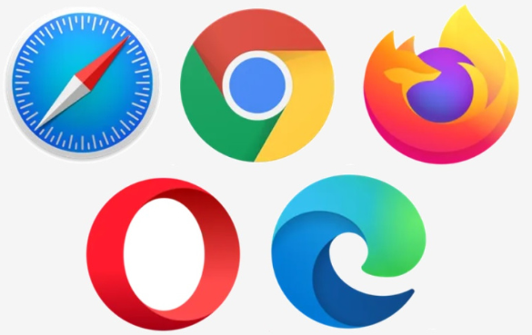
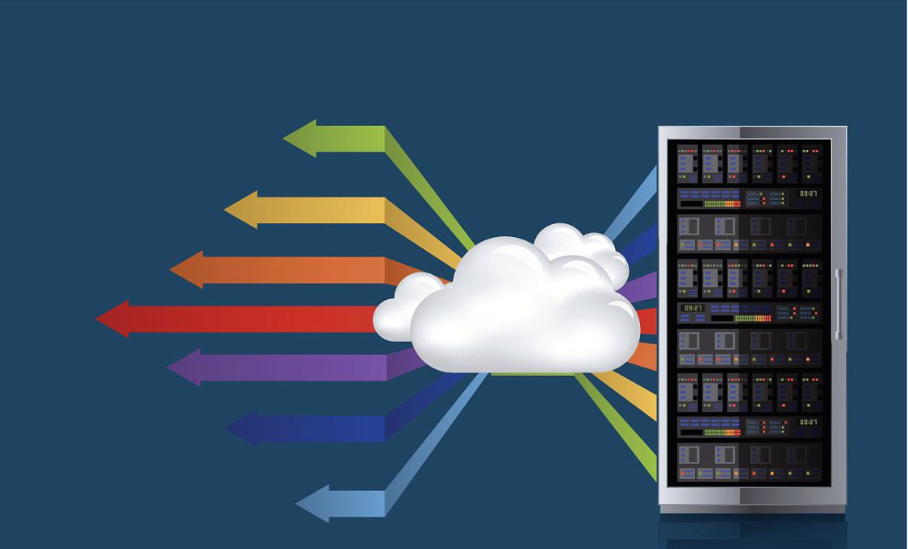
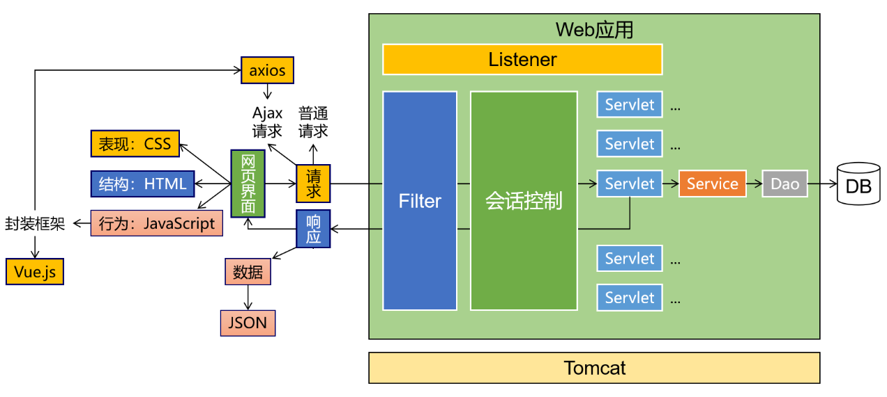
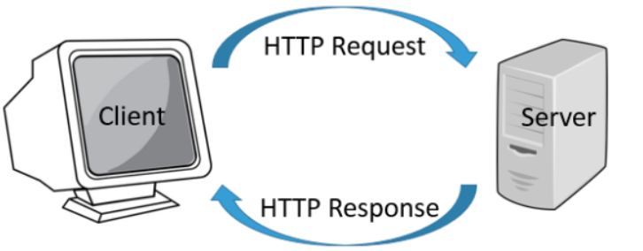
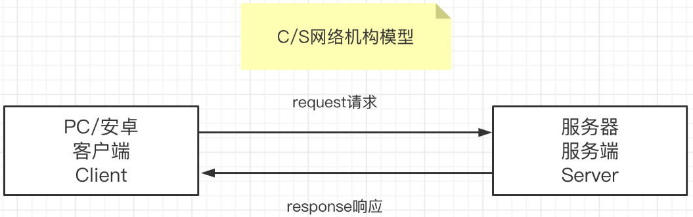
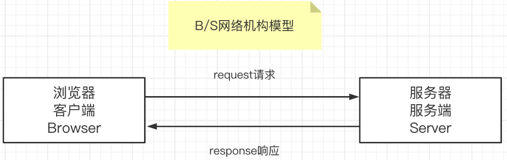
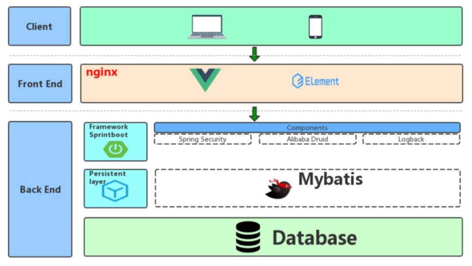

# Chapter 1 WEB Overview

## 1.1 Introduction to JAVAWEB

> Using Java technology to solve the technology stack in related web Internet fields. Using the JAVAEE technology system to develop enterprise-level Internet projects. The project scale and architectural pattern are very different from the JAVASE stage. Under Internet projects, it is first necessary to understand the concepts of client and server.

> Client: Interacts with the user, used to receive user input (operations), display server-side data, and transmit data to the server.

+ Mobile APP

+ WeChat Mini Program

+ PC Program

+ PC Browser

+ Other Devices

> Server: Interacts with the client, receives data from the client, processes specific business logic, and transmits the required data to the client.

+ "Server" is a very broad concept. **In terms of hardware:** A server is a type of computer that runs faster, handles higher loads, and is more expensive than ordinary computers. Servers provide computing or application services to other clients (such as PCs, smartphones, ATMs, and even large equipment like train systems) in a network. **In terms of software:** A server is actually a piece of software installed on a computer. Depending on its role, it can be divided into various types of servers, such as application servers, database servers, Redis servers, DNS servers, ftp servers, and so on.

**In summary:** To summarize in our own words, a server is actually a high-performance computer (or a cluster) installed with server software.

## 1.2 JAVAWEB Technology Stack

> Front-end Part

HTML CSS  JavaScript ES6 Nodejs npm vite vue3 router pinia  axios  element-plus ...

> Back-end Part

HTTP xml Tomcat  Servlet   Request   Response  Cookie  Sesssion  Filter Listener MySQL JDBC  Druid  Jackson lombok jwt ...

> Illustration

## 1.3 JAVAWEB Interaction Mode

> Request

One of the main ways the client transmits data to the server. The client actively sends a request to the server, which can carry data and hand it over to the server for processing. Requests can only go from the client to the server.

> Response

One of the main ways the server transmits data to the client. After receiving the request, it begins processing the data and feeds the results back to the client for use. Responses can only go from the server to the client.

## 1.4 CS and BS Modes of JAVAWEB

Depending on the client, we can divide the operation mode of JAVA Internet projects into CS mode and BS mode.

> CS Mode (Client-Server Mode), the characteristics of this mode are as follows:

1. The program is divided into two parts: one part is the program that needs to be installed on the client, and the other part is the program to be deployed on the server.
2. Users need to download and install a specific client program on their hardware device or operating system before they can use it.
3. The pressure of running the program is shared by both the client and the server.
4. It can leverage the client's computing resources to further process data, generally providing better picture quality and display effects.
5. When the program is updated, both the client and the server usually need to be updated simultaneously.
6. Cross-platform performance is average; different platforms may not always have corresponding client programs.
7. Development costs are relatively high, as different client programs must be developed for different clients.

> BS Mode (Browser-Server Mode)

1. The program has only one part, which just needs to be deployed on the server.
2. No matter what device or operating system the user uses, they only need to have any browser installed.
3. The pressure of running the program is mainly borne by the server.
4. The computing pressure borne by the client is small, and it can perform simple further processing of data, but unlike CS mode, it cannot achieve high picture quality and display effects.
5. When the program is updated, only the server part needs to be updated.
6. Excellent cross-platform performance; as long as there is a browser, it can be used anywhere.
7. Development costs are slightly lower, as there is no need to develop different client programs for different clients.

> Mode Selection

+ For us JAVA programmers, we develop server-side code, so no matter what type of front-end the client uses, we just need to develop back-end functions according to the requirements of the API documentation. Especially in the current era dominated by the front-end and back-end separation development pattern, we can complete development with almost no contact with the front-end.

## 1.5 Implementing Front-end and Back-end Separation in JAVAWEB

> Non-Separation of Front-end and Back-end

+ 1. Non-separated development: Programmers have to write both back-end code and modify or even write front-end code, putting significant pressure on them.
+ 2. Non-separated deployment: Using back-end dynamic page technologies (JSP, Thymeleaf, etc.), the front-end code cannot be separated from the back-end server environment and must be deployed together.

> Separation of Front-end and Back-end

+ 1. Separated development: Back-end programmers only need to write back-end code according to the API documentation, without needing to write or care about front-end code, reducing the pressure on both front-end and back-end programmers.
+ 2. Separated deployment: The front-end uses front-end dynamic page technologies and engineering projects through frameworks like VUE. The front-end project can be deployed on an independent server.

