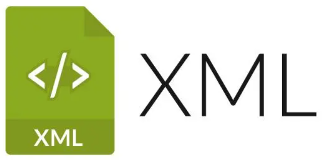

以下是将该文件内容翻译成英文并保持相同格式的Markdown文档：
# Chapter 4 XML_Tomcat10_HTTP

# I. XML



> XML is the abbreviation for EXtensible Markup Language. Obviously, like HTML, XML is a markup language, meaning their basic syntax consists of tags.

+ The word **extensible** superficially means that XML allows custom formats. However, this does not mean you can write whatever you want.
+ Based on the basic syntax specifications of XML, the third-party applications and frameworks you use will forcefully dictate what can be written and how to write it in the configuration files through XML constraints.
+ The positioning of the knowledge point of XML basic syntax is: we do not need to write an XML document line by line from scratch. Instead, we modify it based on the configuration files already provided by third-party applications and frameworks. What to change depends on your needs, and how to change it depends on the XML basic syntax and specific XML constraints.

## 1.1 Common Configuration File Types

1.  `properties` files, for example, the Druid connection pool uses properties files as configuration files.
2.  `XML` files, for example, Tomcat uses XML files as configuration files.
3.  `YAML` files, for example, SpringBoot uses YAML as configuration files.
4.  `json` files, usually used for data transmission, and can also be used as configuration files for front-end or mobile applications.
5.  And so on...

### 1.1.1 properties Configuration File

> Example

```properties
atguigu.jdbc.url=jdbc:mysql://localhost:3306/atguigu
atguigu.jdbc.driver=com.mysql.cj.jdbc.Driver
atguigu.jdbc.username=root
atguigu.jdbc.password=root

```

> Syntax Specifications

* Composed of key-value pairs.
* The symbol between the key and the value is an equal sign (=).
* Each line must be written without indentation, and there cannot be other symbols like spaces at the beginning.

### 1.1.2 XML Configuration File

> Example

```xml
<?xml version="1.0" encoding="UTF-8"?>
<students>
    <student>
        <name>Zhang San</name>
        <age>18</age>
    </student>
    <student>
        <name>Li Si</name>
        <age>20</age>
    </student>
</students>

```

> Basic Syntax of XML

* The basic syntax of XML and HTML are practically identical. Actually, this is no accident; XML basic syntax + HTML constraints = HTML syntax. Logically, HTML is indeed a subset of XML.

* XML Document Declaration: This part is basically a fixed format. Note that the document declaration must start from the first line and the first column.

```xml
<?xml version="1.0" encoding="UTF-8"?>

```

* Root tag
* There must be one and only one root tag.


* Tag closure
* Paired tags: Start tags and end tags must appear in pairs.
* Unpaired tags: Unpaired tags are closed within the tag itself.


* Tag nesting
* Tags can be nested, but cannot cross-nest.


* Comments cannot be nested.
* It is recommended to use lowercase letters for tag names and attribute names.
* Attributes
* Attributes must have values.
* Attribute values must be enclosed in quotes (either single or double quotes are fine).


> XML Constraints (Brief Understanding)

In the future, we will mainly write XML configuration files according to the regulations in XML constraints, and these constraints will prompt us while we write XML. XML constraints mainly include two types: DTD and Schema.

* DTD
* Schema

Schema constraints require that all tags and all attributes in an XML document must be explicitly defined within the constraints.

Below we use the constraint declaration of `web.xml` as an example for illustration:

```xml
<web-app xmlns="[http://xmlns.jcp.org/xml/ns/javaee](http://xmlns.jcp.org/xml/ns/javaee)"
         xmlns:xsi="[http://www.w3.org/2001/XMLSchema-instance](http://www.w3.org/2001/XMLSchema-instance)"
         xsi:schemaLocation="[http://xmlns.jcp.org/xml/ns/javaee](http://xmlns.jcp.org/xml/ns/javaee) [http://xmlns.jcp.org/xml/ns/javaee/web-app_4_0.xsd](http://xmlns.jcp.org/xml/ns/javaee/web-app_4_0.xsd)"
         version="4.0">

```

## 1.2 XML Parsing with DOM4J

### 1.2.1 Steps to Use DOM4J

1. Import the jar package `dom4j.jar`.
2. Create a parser object (`SAXReader`).
3. Parse the XML to obtain a `Document` object.
4. Get the root node `RootElement`.
5. Get the child nodes under the root node.

### 1.2.2 Introduction to DOM4J API


1. Create a `SAXReader` object

```java
SAXReader saxReader = new SAXReader();

```

2. Parse the XML to get the `Document` object: You need to pass in the byte input stream of the XML file to be parsed.

```java
Document document = reader.read(inputStream);

```

3. Get the root tag of the document.

```java
Element rootElement = documen.getRootElement()

```

4. Get the child tags of a tag.

```java
// Get all child tags
List<Element> sonElementList = rootElement.elements();
// Get child tags with a specified tag name
List<Element> sonElementList = rootElement.elements("tagName");

```

5. Get the text within the tag body.

```java
String text = element.getText();

```

6. Get the value of a specific attribute of a tag.

```java
String value = element.attributeValue("attributeName");

```

```

```