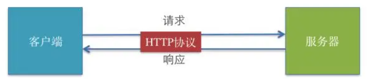
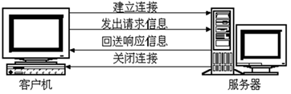
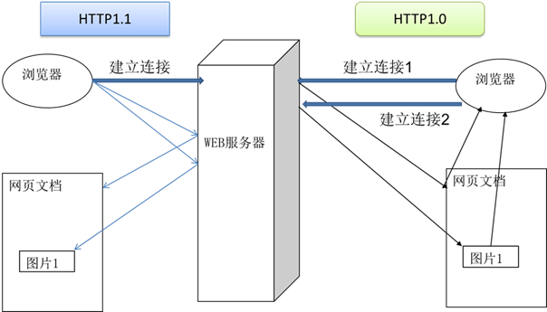
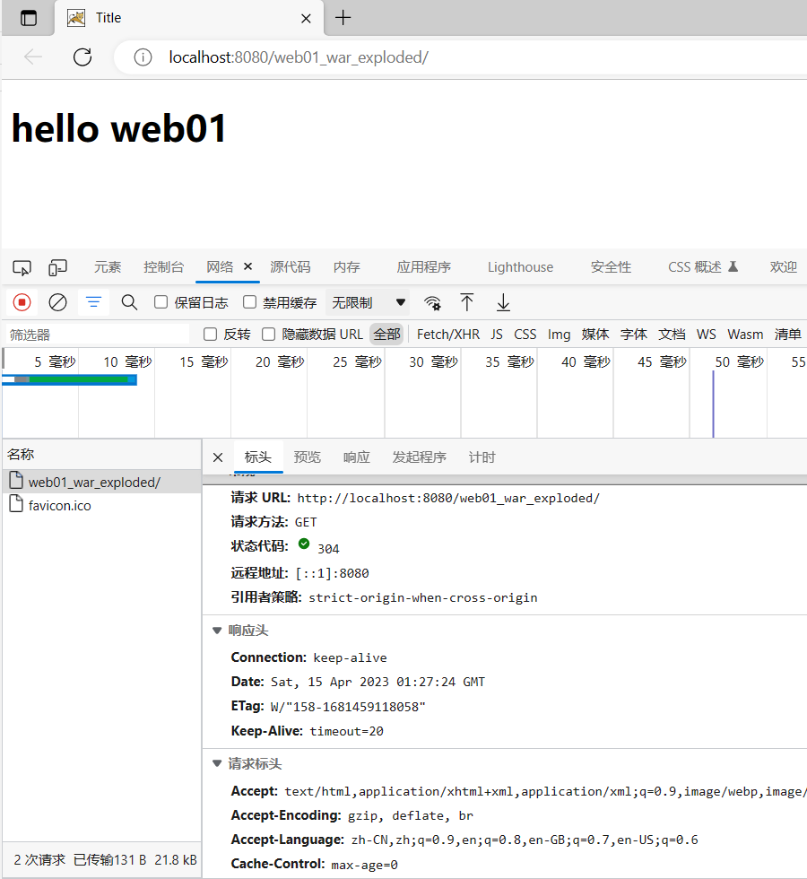
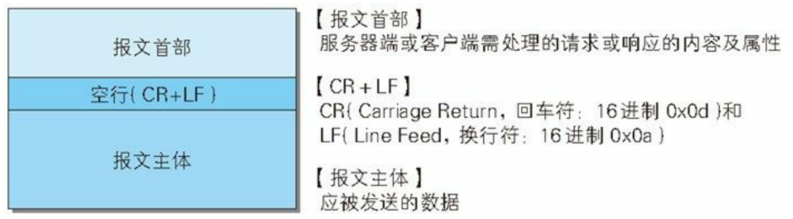
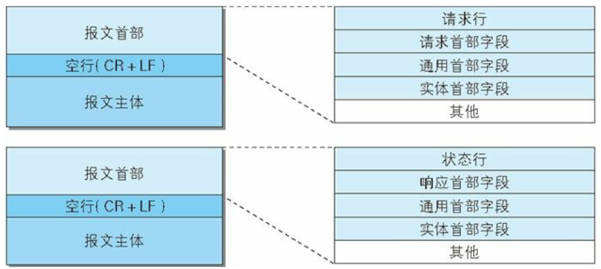
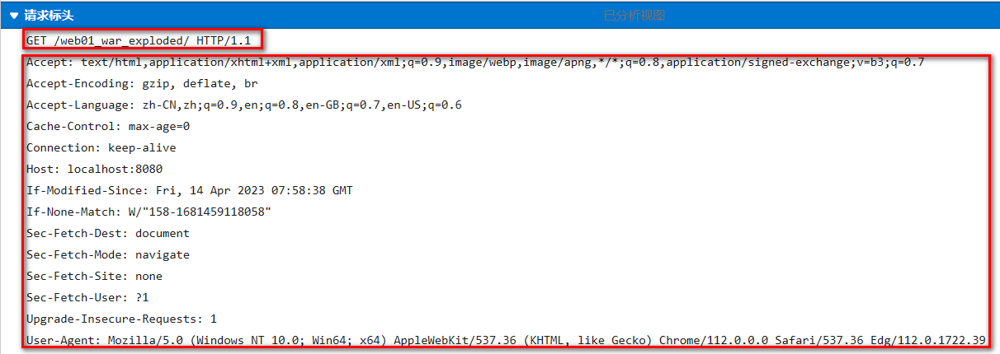

# III. HTTP Protocol

## 3.1 Introduction to HTTP




> **HTTP Hypertext Transfer Protocol** (HTTP-Hyper Text transfer protocol) is an object-oriented protocol belonging to the application layer. Due to its concise and fast manner, it is suitable for distributed hypermedia information systems. It was proposed in 1990 and has been continuously improved and expanded after more than ten years of use and development. **It is a rule that specifies in detail the mutual communication between browsers and World Wide Web servers**, acting as a data transfer protocol for transmitting World Wide Web documents over the Internet. The content transmitted during the communication between the client and the server is what we call a **message**. **The HTTP protocol is what dictates the format of the message.** HTTP is a communication rule; this rule specifies the format of the message sent by the client to the server, and also specifies the format of the message sent by the server to the client. In practice, what we need to learn are these two types of messages. **The one sent by the client to the server is called the "request message"**, and **the one sent by the server to the client is called the "response message"**.

### 3.1.1 Development History

> HTTP/0.9

+ Tim Berners-Lee is a British computer scientist and the inventor of the World Wide Web. He created the single-line HTTP protocol in 1989. It merely returned a web page. This protocol was named HTTP/0.9 in 1991.

> HTTP/1.0

+ In 1996, HTTP/1.0 was released. The specification was significantly expanded, supporting three request methods: GET, HEAD, and POST.
+ Improvements of HTTP/1.0 over HTTP/0.9 are as follows:
    + The HTTP version is attached to each request.
    + A status code is sent at the beginning of the response.
    + Both requests and responses contain HTTP message headers.
    + The content type enables the transmission of documents other than HTML files.
+ However, HTTP/1.0 is not an official standard.

> HTTP/1.1

+ The first standardized version of HTTP, HTTP/1.1 (RFC 2068), was released in early 1997, supporting seven request methods: OPTIONS, GET, HEAD, POST, PUT, DELETE, and TRACE.
+ HTTP/1.1 is an enhancement of HTTP 1.0:
    + Virtual hosting allows multiple domains to be served from a single IP address.
    + Persistent connections and pipelined connections allow web browsers to send multiple requests over a single persistent connection.
    + Caching support saves bandwidth and makes responses faster.
+ HTTP/1.1 would remain very stable for the next 15 years or so.
+ During this period, HTTPS (Secure Hypertext Transfer Protocol) emerged. It is a secure version of HTTP that uses SSL/TLS for secure encrypted communication.

> HTTP/2

+ Released by IETF in 2015. HTTP/2 aims to improve Web performance, reduce latency, increase security, and make Web applications faster, more efficient, and more reliable.
- Multiplexing: HTTP/2 allows multiple requests and responses to be sent simultaneously, instead of processing them one by one like HTTP/1.1. This can reduce latency, improve efficiency, and increase network throughput.
- Binary transfer: HTTP/2 uses a binary protocol, which is different from the text protocol used by HTTP/1.1. Binary protocols can be parsed faster, transmit data more efficiently, and reduce overhead and latency during transmission.
- Header compression: HTTP/2 uses the HPACK algorithm to compress HTTP headers, reducing the amount of data transmitted in the headers, thereby reducing network latency.
- Server push: HTTP/2 supports server push, allowing the server to push resources before the client requests them, in order to improve performance.
- Improved security: HTTP/2 uses TLS (Transport Layer Security) encrypted data transmission by default, improving security.
- Compatible with HTTP/1.1: HTTP/2 can coexist with HTTP/1.1, and servers can support both HTTP/1.1 and HTTP/2 simultaneously. If the client does not support HTTP/2, the server can fall back to HTTP/1.1.

> HTTP/3

+ Released on May 27, 2021, HTTP/3 is a new, fast, reliable, and secure protocol suitable for all forms of devices. Instead of using TCP, HTTP/3 uses QUIC, a new protocol developed by Google in 2012.
+ HTTP/3 is the third major revision following HTTP/1.1 and HTTP/2.
+ HTTP/3 brings revolutionary changes to improve Web performance and security. Setting up an HTTP/3 website requires server and browser support.
+ Currently, Google Cloud, Cloudflare, and Fastly support HTTP/3. Chrome, Firefox, Edge, Opera, and some mobile browsers support HTTP/3.

### 3.1.2 Session Method of the HTTP Protocol

> The communication process between the browser and the server involves four steps



- The connection process between the browser and the WEB server is brief, and each connection only processes one request and response. For every page access, the browser and the WEB server must establish a separate connection.
- All communications between the browser and the WEB server are completely independent and separate request and response pairs.

### 3.1.3 Differences between HTTP 1.0 and HTTP 1.1

> In the HTTP 1.0 version, when a browser requests a webpage with an image, it will open a new connection with the server due to downloading the image; however, in the HTTP 1.1 version, the browser is allowed to disconnect only after obtaining all the resources corresponding to the current request, improving efficiency.



### 3.1.4 Capturing Request and Response Message Packets via F12 Tool in Browser

> Almost all PC browsers support the F12 developer tools, although the displayed windows may vary across different browser tools.



## 3.2 Request and Response Messages

### 3.2.1 Message Format

> It is mainly divided into a message header and a message body, separated by a blank line in the middle.



> The message header can be further subdivided into "lines" and "headers".



### 3.2.2 Request Message

> The message sent by the client to the server.

+ Request message format
    - First line of the request (**request line**); GET/POST resource_path?parameters HTTP/1.1
    - Request header information (**request headers**);
    - Blank line;
    - Request body; Only POST requests have a request body.

> Viewing request packets under the F12 Network tab in the browser



> Characteristics of GET requests sent by form tags

1. Because the request parameters are already carried in the first line of the request, there is no request body, nor a request blank line.
2. Request parameters are spliced into the URL address, visible in the address bar `[url?name1=value1&name2=value2]`, which is insecure.
3. Because parameters are carried in the address bar, they are restricted by size limits `[the address bar data size is generally limited to 4k]` and can only carry plain text.
4. GET request parameters can only upload text data.
5. There is no request body. Therefore, encapsulation and parsing are fast and efficient. By default, the requests submitted by the browser are GET requests, such as: pressing Enter in the address bar, hyperlinks, and the default submission method of forms.

> Viewing the GET request line, request headers, and request body

+ Components of the request line
    + Request method: GET
    + Resource path accessing the server: `?parameter1=value1&parameter2=value2 ... ...`
    + Protocol and version: HTTP/1.1

``` http
GET /05_web_tomcat/login_success.html?username=admin&password=123213 HTTP/1.1

```

* Request headers

```http
- Host virtual address
Host: localhost:8080   
- Persistent connection
Connection: keep-alive 
- Automatic upgrade of request protocol [the HTTP request is sent, but the server uses HTTPS; the browser will automatically upgrade the request protocol to HTTPS]
Upgrade-Insecure-Requests: 1  
- User system information
User-Agent: Mozilla/5.0 (Windows NT 6.1; WOW64) AppleWebKit/537.36 (KHTML, like Gecko) Chrome/68.0.3440.75 Safari/537.36
- File types supported by the browser
Accept:text/html,application/xhtml+xml,application/xml;q=0.9,image/webp,image/apng,*/*;q=0.8
- The path of the previous page of the current page [which page was used to jump to the current page]: Can be used to jump back to the previous page, for ad billing, and to prevent hotlinking
Referer: http://localhost:8080/05_web_tomcat/login.html
- Compression formats supported by the browser
Accept-Encoding: gzip, deflate, br
- Languages supported by the browser
Accept-Language: zh-CN,zh;q=0.9,en-US;q=0.8,en;q=0.7

```

* Request blank line
* Request body
* GET request data is not placed in the request body.


> Characteristics of POST requests sent by form tags

1. POST requests have a request body, while GET requests do not have a request body.
2. POST request data is carried in the request body. There is no size limit for the request body data, and it can be used to upload all types of content `[files, text]`.
3. You can only use POST requests to upload files.
4. The POST request message has additional configuration related to the request body `[request headers]`.
5. Parameters in the address bar are not visible, making it relatively safe.
6. POST efficiency is lower than GET.

* A POST request requires setting the `method` attribute of the `form` tag to `post`.

> Viewing the POST request line, request headers, and request body

* Components of the request line
* Request method: POST
* Resource path accessing the server: `?parameter1=value1&parameter2=value2 ... ...`
* Protocol and version: HTTP/1.1


```http
POST /05_web_tomcat/login_success.html HTTP/1.1

```

* Request headers

```http
Host: localhost:8080
Connection: keep-alive
Content-Length: 31     - Length of the request body content
Cache-Control: max-age=0  - No cache
Origin: http://localhost:8080
Upgrade-Insecure-Requests: 1  - Automatic upgrade of the protocol
Content-Type: application/x-www-form-urlencoded   - Content type of the request body [the server parses the request body parameters based on the type]
User-Agent: Mozilla/5.0 (Windows NT 6.1; WOW64) AppleWebKit/537.36 (KHTML, like Gecko) Chrome/68.0.3440.75 Safari/537.36
Accept:text/html,application/xhtml+xml,application/xml;q=0.9,image/webp,image/apng,*/*;q=0.8
Referer: http://localhost:8080/05_web_tomcat/login.html
Accept-Encoding: gzip, deflate, br
Accept-Language: zh-CN,zh;q=0.9,en-US;q=0.8,en;q=0.7
Cookie:JSESSIONID-

```

* Request blank line
* Request body: The data submitted by the browser to the server.

```http
username=admin&password=1232131

```

### 3.2.3 Response Message

> Response message format

* First line of the response (**response line**); Protocol/Version Status_Code Status_Code_Description
* Response header information (**response headers**);
* Blank line;
* Response body;

* Components of the response line
* Protocol and version: HTTP/1.1
* Response status code: 200
* Status description: OK (default)


```http
HTTP/1.1 200 OK
Description: The response protocol is HTTP/1.1, the response status code is 200, indicating that the request is successful; 

```

* Response headers

```http
Server: Apache-Coyote/1.1   Version information of the server
Accept-Ranges: bytes
ETag: W/"157-1534126125811"
Last-Modified: Mon, 13 Aug 2018 02:08:45 GMT
Content-Type: text/html    Type of the response body data [the browser parses the response body data based on this type]
Content-Length: 157   Number of bytes in the response body content
Date: Mon, 13 Aug 2018 02:47:57 GMT  The time of the response, there might be an 8-hour time zone difference

```

* Response body

```html
<!DOCTYPE html>
<html>
  <head>
    <meta charset="UTF-8">
    <title>Insert title here</title>
  </head>
  <body>
    Congratulations, login successful...
  </body>
</html>

```

> Response status codes: Status codes are very important to the browser; they tell the browser the result of the response. The more representative response codes are as follows:

* **200:** Request successful, the browser will display the response body content (usually HTML) in the browser;
* **302:** Redirect, when the response code is 302, it indicates that the server asks the browser to send another request again. The server will send a `Location` response header specifying the URL address of the new request;
* **304:** Local cache is used;
* **404:** The requested resource is not found, indicating that the client mistakenly requested a non-existent resource;
* **405:** The request method is not allowed;
* **500:** The requested resource is found, but an internal error occurred on the server;

> More response status codes

| Status Code | English Description | Meaning |
| --- | --- | --- |
| 1** |  |  |
| 100 | Continue | Continue. The client should continue with its request. |
| 101 | Switching Protocols | Switching Protocols. The server switches protocols according to the client's request. It can only switch to a higher-level protocol, for example, switching to a new version of the HTTP protocol. |
| 2** |  |  |
| 200 | OK | Request successful. Generally used for GET and POST requests. |
| 201 | Created | Created. The request was successful and a new resource was created. |
| 202 | Accepted | Accepted. The request has been accepted but processing has not been completed. |
| 203 | Non-Authoritative Information | Non-Authoritative Information. Request successful. However, the returned meta-information is not from the original server but a copy. |
| 204 | No Content | No Content. The server successfully processed the request, but is not returning any content. Without updating the webpage, it ensures the browser continues to display the current document. |
| 205 | Reset Content | Reset Content. The server successfully processed the request, and the user terminal (e.g., browser) should reset the document view. This return code can be used to clear browser form fields. |
| 206 | Partial Content | Partial Content. The server successfully processed a partial GET request. |
| 3** |  |  |
| 300 | Multiple Choices | Multiple Choices. The requested resource may include multiple locations, and the response may return a list of resource characteristics and addresses for the user terminal (e.g., browser) to choose from. |
| 301 | Moved Permanently | Moved Permanently. The requested resource has been permanently moved to a new URI; the returned information will include the new URI, and the browser will automatically redirect to the new URI. Any new requests in the future should use the new URI instead. |
| 302 | Found | Temporary move. Similar to 301. But the resource is only temporarily moved. The client should continue to use the original URI. |
| 303 | See Other | View other address. Similar to 301. Use GET and POST requests to view. |
| 304 | Not Modified | Not Modified. The requested resource has not been modified; when the server returns this status code, it will not return any resource. The client usually caches visited resources and provides header information to indicate that the client hopes to only return resources modified after a specified date. |
| 305 | Use Proxy | Use Proxy. The requested resource must be accessed through a proxy. |
| 306 | Unused | HTTP status code that is no longer used. |
| 307 | Temporary Redirect | Temporary Redirect. Similar to 302. Use a GET request to redirect. |
| 4** |  |  |
| 400 | Bad Request | Syntax error in the client request; the server cannot understand it. |
| 401 | Unauthorized | The request requires user authentication. |
| 402 | Payment Required | Reserved for future use. |
| 403 | Forbidden | The server understood the client's request but refused to execute it. |
| 404 | Not Found | The server cannot find the resource (web page) based on the client's request. Through this code, web designers can set a personalized "The resource you requested could not be found" page. |
| 405 | Method Not Allowed | The method in the client's request is forbidden. |
| 406 | Not Acceptable | The server cannot complete the request according to the content characteristics of the client's request. |
| 407 | Proxy Authentication Required | The request requires proxy authentication, similar to 401, but the requester should use a proxy for authorization. |
| 408 | Request Time-out | The server waited too long for the client to send a request, resulting in a timeout. |
| 409 | Conflict | The server may return this code when completing the client's PUT request if a conflict occurred while processing the request. |
| 410 | Gone | The resource requested by the client no longer exists. 410 is different from 404; if a resource existed before but is now permanently deleted, the 410 code can be used, and web designers can specify a new location for the resource via the 301 code. |
| 411 | Length Required | The server cannot process the request message sent by the client without a Content-Length. |
| 412 | Precondition Failed | A precondition in the client's request message failed. |
| 413 | Request Entity Too Large | Because the request entity is too large, the server cannot process it and therefore rejects the request. To prevent continuous requests from the client, the server may close the connection. If the server is only temporarily unable to process it, a Retry-After response message will be included. |
| 414 | Request-URI Too Large | The request URI is too long (URI is usually a URL), and the server cannot process it. |
| 415 | Unsupported Media Type | The server cannot process the media format attached to the request. |
| 416 | Requested range not satisfiable | The range requested by the client is invalid. |
| 417 | Expectation Failed | The server cannot meet the Expect request header information. |
| 5** |  |  |
| 500 | Internal Server Error | Internal server error; unable to complete the request. |
| 501 | Not Implemented | The server does not support the functionality required to fulfill the request. |
| 502 | Bad Gateway | The server, while acting as a gateway or proxy, received an invalid response from the upstream server it accessed in attempting to fulfill the request. |
| 503 | Service Unavailable | The server is temporarily unable to handle the client's request due to overloading or maintenance of the server. The length of the delay may be contained in the server's Retry-After header. |
| 504 | Gateway Time-out | The server, acting as a gateway or proxy, did not receive a timely request from the upstream server. |
| 505 | HTTP Version not supported | The server does not support the version of the HTTP protocol used in the request, unable to complete the processing. |
