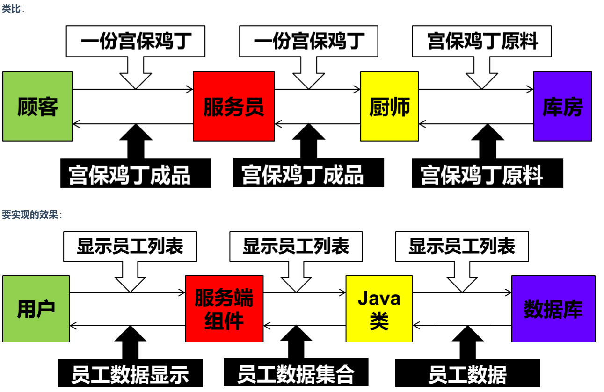
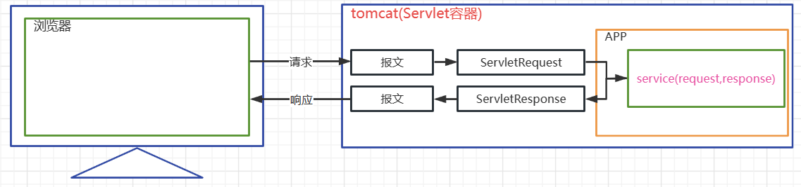
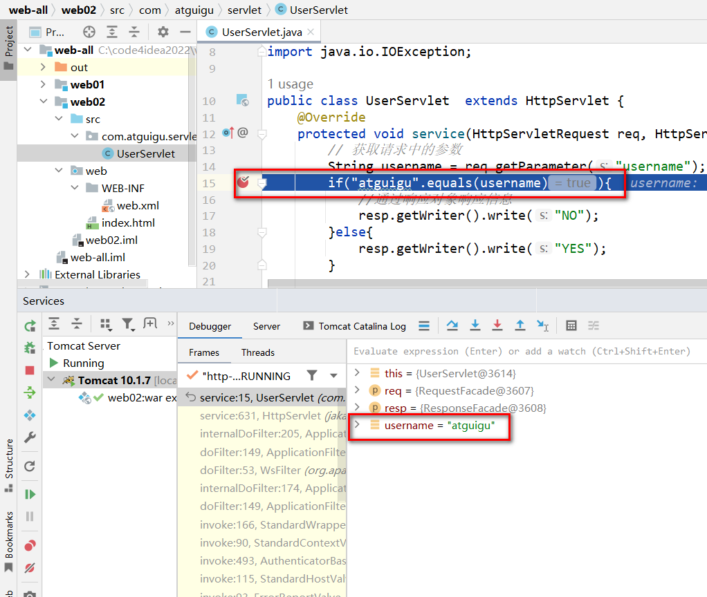

# Chapter 5 Servlet

# I. Introduction to Servlet

## 1.1 Dynamic Resources and Static Resources

> Static Resources

+ Resources that do not need to be generated by running code during program execution; they are written before the program runs. For example: html, css, js, img, audio files, and video files.

> Dynamic Resources 

+ Resources that need to be generated dynamically by running code during program execution. The data cannot be determined before the program runs and is generated dynamically at runtime, such as Servlet, Thymeleaf, etc.
+ Dynamic resources do not refer to animation effects or simple human-computer interaction effects on the view.

> Real-life Example

+ Going to a bakery to buy a cake
    + Buying a ready-made one directly from the counter: Static resource
    + Having it made on the spot after telling the clerk your requirements: Dynamic resource

## 1.2 Introduction to Servlet

> Servlet (server applet) is a small Java program running on the server (Tomcat). It is a set of specifications provided by Sun Microsystems for defining dynamic resources; from a code perspective, a Servlet is an interface.

+ It is used to receive and process client requests and respond to the browser with dynamic resources. In an entire Web application, the Servlet is primarily responsible for receiving and processing requests, coordinating and scheduling functions, and responding with data. We can refer to the Servlet as the **controller** in a Web application.



+ Not all JAVA classes can be used to handle client requests. The set of technical standards that can handle client requests and make responses is Servlet.
+ Servlets run on the server side, so Servlets must be developed within WEB projects and run in a service container like Tomcat.

> Correspondence between Requests/Responses and HttpServletRequest/HttpServletResponse



# II. Servlet Development Process

## 2.1 Goal

> Verify whether the username is taken during registration. Send a request carrying the username to a Servlet via the client. If the username is 'atguigu', respond to the client with "NO"; if it is anything else, respond with "YES".

## 2.2 Development Process

> Step 1: Develop a web-type module 

+ The process is the same as before.

> Step 2: Develop a UserServlet

``` java
public class UserServlet  extends HttpServlet {
    @Override
    protected void service(HttpServletRequest req, HttpServletResponse resp) throws ServletException, IOException {
        // Get parameters from the request
        String username = req.getParameter("username");
        if("atguigu".equals(username)){
            // Respond with information via the response object
            resp.getWriter().write("NO");
        }else{
            resp.getWriter().write("YES");
        }

    }
}

```

* Customize a class that inherits from the `HttpServlet` class.
* Override the `service` method, which is the primary service method used to process user requests.
* `HttpServletRequest` represents the request object, which is converted from the request message by Tomcat. Through this object, you can obtain information from the request.
* `HttpServletResponse` represents the response object, which is converted by Tomcat into the response message. Through this object, you can set the information in the response.
* The lifecycle of the Servlet object (creation, initialization, service processing, destruction) is managed by Tomcat; we do not need to `new` it ourselves.
* The `HttpServletRequest` and `HttpServletResponse` objects are also converted by Tomcat and passed to us when the `service` method is called.

> Step 3: Configure the request mapping path for UserServlet in web.xml

```xml
<?xml version="1.0" encoding="UTF-8"?>
<web-app xmlns="[https://jakarta.ee/xml/ns/jakartaee](https://jakarta.ee/xml/ns/jakartaee)"
         xmlns:xsi="[http://www.w3.org/2001/XMLSchema-instance](http://www.w3.org/2001/XMLSchema-instance)"
         xsi:schemaLocation="[https://jakarta.ee/xml/ns/jakartaee](https://jakarta.ee/xml/ns/jakartaee) [https://jakarta.ee/xml/ns/jakartaee/web-app_5_0.xsd](https://jakarta.ee/xml/ns/jakartaee/web-app_5_0.xsd)"
         version="5.0">

    <servlet>
        <servlet-name>userServlet</servlet-name>
        <servlet-class>com.atguigu.servlet.UserServlet</servlet-class>
    </servlet>


    <servlet-mapping>
        <servlet-name>userServlet</servlet-name>
        <url-pattern>/userServlet</url-pattern>
       </servlet-mapping>

</web-app>

```

* A Servlet is not an actual file or directory in the file system, so in order to be able to request this resource, we need to configure a mapping path for it.
* The request mapping path of the servlet is configured in `web.xml`.
* `servlet-name` serves as an alias for the servlet. It can be defined arbitrarily, ideally with a meaningful name.
* The `url-pattern` tag is used to define the request mapping path of the Servlet.
* One servlet can correspond to multiple different `url-pattern`s.
* Multiple servlets cannot use the same `url-pattern`.
* Wildcards can be used in `url-pattern`:
* `/`        matches all resources, excluding jsp files.
* `/*`       matches all resources, including jsp files.
* `/a/*`     matches all mapping paths prefixed with 'a'.
* `*.action` matches all mapping paths suffixed with 'action'.


> Step 4: Develop a form to send a GET request to the servlet carrying the username parameter

```html
<!DOCTYPE html>
<html lang="en">
<head>
    <meta charset="UTF-8">
    <title>Title</title>
</head>
<body>
    <form action="userServlet">
        Please enter username: <input type="text" name="username" /> <br>
        <input type="submit" value="Verify">
    </form>
</body>
</html>

```

> Start the project, access index.html, and submit the form for testing

* Use debug mode to run the test



> Mapping Relationship Diagram

# III. Servlet Annotation Configuration

## 3.1 Source Code of @WebServlet Annotation

> Official JAVAEE API Documentation Download Address

* [Java EE - Technologies (oracle.com)](https://www.oracle.com/java/technologies/javaee/javaeetechnologies.html#javaee8)
* Reading the source code of the @WebServlet annotation

```java
package jakarta.servlet.annotation;

import java.lang.annotation.Documented;
import java.lang.annotation.ElementType;
import java.lang.annotation.Retention;
import java.lang.annotation.RetentionPolicy;
import java.lang.annotation.Target;

/**
 * @since Servlet 3.0
 */
@Target({ ElementType.TYPE })
@Retention(RetentionPolicy.RUNTIME)
@Documented
public @interface WebServlet {

    /**
     * The name of the servlet
     * Equivalent to servlet-name
     * @return the name of the servlet
     */
    String name() default "";

    /**
     * The URL patterns of the servlet
     * If you only configure one url-pattern, you can use this attribute; it is mutually exclusive with the urlPatterns attribute.
     * @return the URL patterns of the servlet
     */
    String[] value() default {};

    /**
     * The URL patterns of the servlet
     * If you want to configure multiple url-patterns, you need to use this attribute; it is mutually exclusive with the value attribute.
     * @return the URL patterns of the servlet
     */
    String[] urlPatterns() default {};

    /**
     * The load-on-startup order of the servlet
     * Configures whether the Servlet is instantiated when the project loads.
     * @return the load-on-startup order of the servlet
     */
    int loadOnStartup() default -1;

    /**
     * The init parameters of the servlet
     * Configures initialization parameters.
     * @return the init parameters of the servlet
     */
    WebInitParam[] initParams() default {};

    /**
     * Declares whether the servlet supports asynchronous operation mode.
     *
     * @return {@code true} if the servlet supports asynchronous operation mode
     * @see jakarta.servlet.ServletRequest#startAsync
     * @see jakarta.servlet.ServletRequest#startAsync( jakarta.servlet.ServletRequest,jakarta.servlet.ServletResponse)
     */
    boolean asyncSupported() default false;

    /**
     * The small-icon of the servlet
     *
     * @return the small-icon of the servlet
     */
    String smallIcon() default "";

    /**
     * The large-icon of the servlet
     *
     * @return the large-icon of the servlet
     */
    String largeIcon() default "";

    /**
     * The description of the servlet
     *
     * @return the description of the servlet
     */
    String description() default "";

    /**
     * The display name of the servlet
     *
     * @return the display name of the servlet
     */
    String displayName() default "";

}

```

## 3.2 Usage of @WebServlet Annotation

> Use the @WebServlet annotation to replace Servlet configuration

```java
@WebServlet(
        name = "userServlet",
        //value = "/user",
        urlPatterns = {"/userServlet1","/userServlet2","/userServlet"},
        initParams = {@WebInitParam(name = "encoding",value = "UTF-8")},
        loadOnStartup = 6
)
public class UserServlet  extends HttpServlet {
    @Override
    protected void service(HttpServletRequest req, HttpServletResponse resp) throws ServletException, IOException {
        String encoding = getServletConfig().getInitParameter("encoding");
        System.out.println(encoding);
        // Get parameters from the request
        String username = req.getParameter("username");
        if("atguigu".equals(username)){
            // Respond with information via the response object
            resp.getWriter().write("NO");
        }else{
            resp.getWriter().write("YES");
        }
    }
}

```

# IV. Servlet Lifecycle

## 4.1 Introduction to Lifecycle

> What is the lifecycle of a Servlet?

* Objects in an application not only have hierarchical relationships in space, but also exhibit different states and behaviors due to being in different stages during the program's execution over time—this is the lifecycle of an object.
* Simply put, the lifecycle is the process of an object in the container from its creation to its destruction.

> Servlet Container

* The Servlet object is created by the Servlet container, and the lifecycle methods are all called by the container (currently we use Tomcat). This is very different from the code we have written before. In future learning, we will see that more and more objects are handed over to the container or framework for creation, and more and more methods are called by the container or framework, allowing developers to focus as much as possible on the implementation of business logic.

> Execution characteristics of the main lifecycle of a Servlet

| Lifecycle Stage | Corresponding Method | Execution Timing | Execution Count |
| --- | --- | --- | --- |
| Object Creation | Constructor | First request or upon container startup | 1 |
| Initialization | init() | After construction is complete | 1 |
| Service Processing | service(HttpServletRequest req,HttpServletResponse resp) | Every request | Multiple |
| Destruction | destory() | Container shutdown | 1 |

## 4.2 Lifecycle Testing

> Develop servlet code

```java
package com.atguigu.servlet;
import jakarta.servlet.ServletException;
import jakarta.servlet.http.HttpServlet;
import jakarta.servlet.http.HttpServletRequest;
import jakarta.servlet.http.HttpServletResponse;

import java.io.IOException;

public class ServletLifeCycle  extends HttpServlet {
    public ServletLifeCycle(){
        System.out.println("Constructor");
    }

    @Override
    public void init() throws ServletException {
        System.out.println("Initialization method");
    }

    @Override
    protected void service(HttpServletRequest req, HttpServletResponse resp) throws ServletException, IOException {
        System.out.println("service method");
    }

    @Override
    public void destroy() {
        System.out.println("Destruction method");
    }
}


```

> Configure Servlet

```xml
  
    <servlet>
        <servlet-name>servletLifeCycle</servlet-name>
        <servlet-class>com.atguigu.servlet.ServletLifeCycle</servlet-class>
        <load-on-startup>1</load-on-startup>
    </servlet>
    <servlet-mapping>
        <servlet-name>servletLifeCycle</servlet-name>
        <url-pattern>/servletLiftCycle</url-pattern>
    </servlet-mapping>

```

* Request Servlet testing

Omitted

## 4.3 Lifecycle Summary

1. Through lifecycle testing, we found that the Servlet object is a singleton in the container.
2. The container can handle concurrent user requests; each request starts a thread in the container.
3. Multiple threads may use the same Servlet object, so we should not easily define member variables in the Servlet that are prone to frequent modification.
4. The positive integer defined in `load-on-startup` indicates the instantiation order. If numbers are duplicated, the container will resolve the instantiation order itself, but duplication should be avoided.
5. In the Tomcat container, some servlets instantiated upon system startup have already been defined, so the `load-on-startup` of our custom servlets should preferably not occupy the numbers 1-5.

# V. Servlet Inheritance Structure

## 5.1 Servlet Interface

> Source Code and Function Explanation

* View through IDEA: Omitted here

> Interface and Method Description

* The Servlet specification interface, which all Servlets must implement.
* `public void init(ServletConfig config) throws ServletException;`
* Initialization method. A method automatically called by the container after constructing the servlet object. The container is responsible for instantiating a ServletConfig object and passing it in when calling this method.
* The ServletConfig object can provide initialization parameters for the Servlet.


* `public ServletConfig getServletConfig();`
* Method to get the ServletConfig object. Later, this object can be used to obtain Servlet initialization parameters.


* `public void service(ServletRequest req, ServletResponse res) throws ServletException, IOException;`
* Service method that processes requests and makes responses. Called by the container every time a request is generated.
* The container creates a ServletRequest object and a ServletResponse object, and passes these two objects when calling the `service` method.


* `public String getServletInfo();`
* Method to get ServletInfo information.


* `public void destroy();`
* Method called before the Servlet instance is destroyed.


## 5.2 GenericServlet Abstract Class

> Source Code

* View through IDEA: Omitted here

> Source Code Explanation

* The `GenericServlet` abstract class is a basic implementation of some fixed functions of the Servlet interface, a re-abstracted declaration of the `service` method, and defines some other related functional methods.
* `private transient ServletConfig config;`
* The initialization configuration object as a property.


* `public GenericServlet() { }`
* Constructor, prepared to satisfy inheritance.


* `public void destroy() { }`
* Default empty implementation of the destruction method.


* `public String getInitParameter(String name)`
* Shortcut method to obtain an initialization parameter.


* `public Enumeration<String> getInitParameterNames()`
* Method that returns the names of all initialization parameters.


* `public ServletConfig getServletConfig()`
* Method to get the initial Servlet configuration object `ServletConfig`.


* `public ServletContext getServletContext()`
* Method to get the context object `ServletContext`.


* `public String getServletInfo()`
* Default empty implementation of getting Servlet information.


* `public void init(ServletConfig config) throws ServletException()`
* Implementation of the initialization method, which calls the overloaded `init` method here.


* `public void init() throws ServletException`
* Overloaded `init` method, intended for us to define our own initialization functionality.


* `public void log(String msg)`
* `public void log(String message, Throwable t)`
* Methods and overloads for printing logs.


* `public abstract void service(ServletRequest req, ServletResponse res) throws ServletException, IOException;`
* The service method is declared again as abstract.


* `public String getServletName()`
* Method to get the ServletName.


## 5.3 HttpServlet Abstract Class

> Source Code

* View through IDEA: Omitted here

> Explanation

* `abstract class HttpServlet extends GenericServlet`: The `HttpServlet` abstract class adds more foundational features beyond the basic implementations.
* `private static final String METHOD_DELETE = "DELETE";`
* `private static final String METHOD_HEAD = "HEAD";`
* `private static final String METHOD_GET = "GET";`
* `private static final String METHOD_OPTIONS = "OPTIONS";`
* `private static final String METHOD_POST = "POST";`
* `private static final String METHOD_PUT = "PUT";`
* `private static final String METHOD_TRACE = "TRACE";`
* The above properties are used to define constant values for common request method names.


* `public HttpServlet() {}`
* Constructor, used to handle inheritance.


* `public void service(ServletRequest req, ServletResponse res) throws ServletException, IOException`
* Implementation of the service method.
* In this method, the request and response objects are converted into HTTP-specific `HttpServletRequest` and `HttpServletResponse` objects.
* Calls the overloaded `service` method.


* `public void service(HttpServletRequest req, HttpServletResponse res) throws ServletException, IOException`
* Overloaded `service` method, called by the overridden `service` method.
* In this method, based on the request method, specific `do***` methods are called to process the request.


* `protected void doGet(HttpServletRequest req, HttpServletResponse resp) throws ServletException, IOException`
* `protected void doPost(HttpServletRequest req, HttpServletResponse resp) throws ServletException, IOException`
* `protected void doHead(HttpServletRequest req, HttpServletResponse resp) throws ServletException, IOException`
* `protected void doPut(HttpServletRequest req, HttpServletResponse resp) throws ServletException, IOException`
* `protected void doDelete(HttpServletRequest req, HttpServletResponse resp) throws ServletException, IOException`
* `protected void doOptions(HttpServletRequest req, HttpServletResponse resp) throws ServletException, IOException`
* `protected void doTrace(HttpServletRequest req, HttpServletResponse resp) throws ServletException, IOException`
* Processing methods corresponding to different request methods.
* Except for `doOptions` and `doTrace`, the other `do***` methods purposefully respond with error messages by default.


## 5.4 Custom Servlet

> Inheritance Relationship Diagram

* In a custom Servlet, the method for processing requests must be overridden:
* Either override the `service` method.
* Or override the `doGet`/`doPost` methods.

```java

```