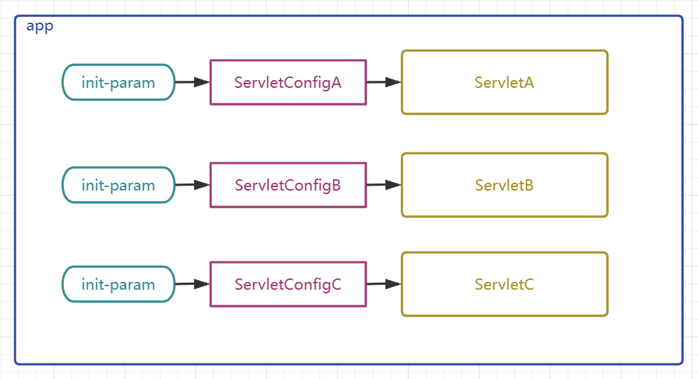
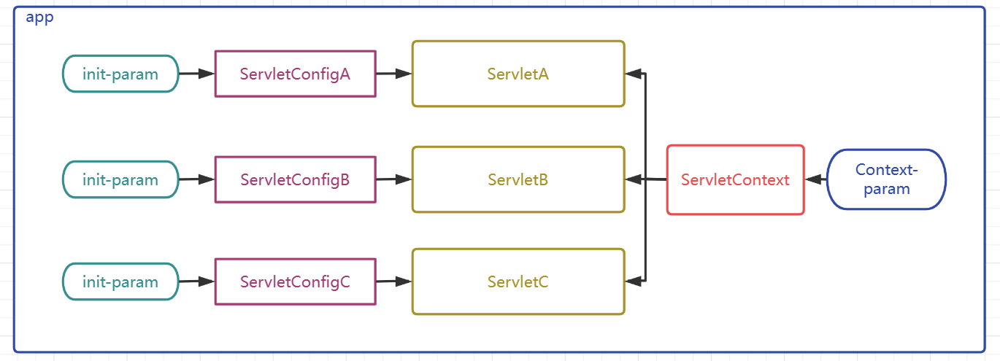
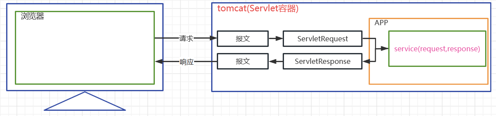
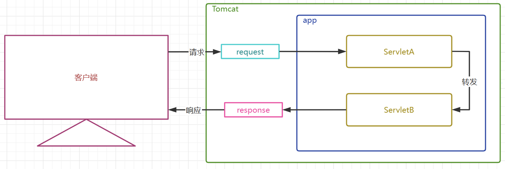
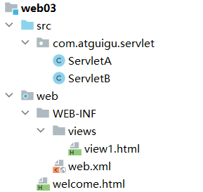
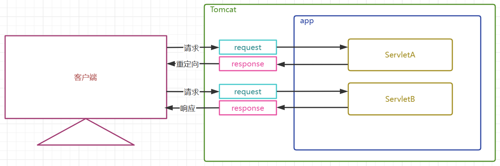
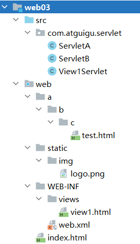
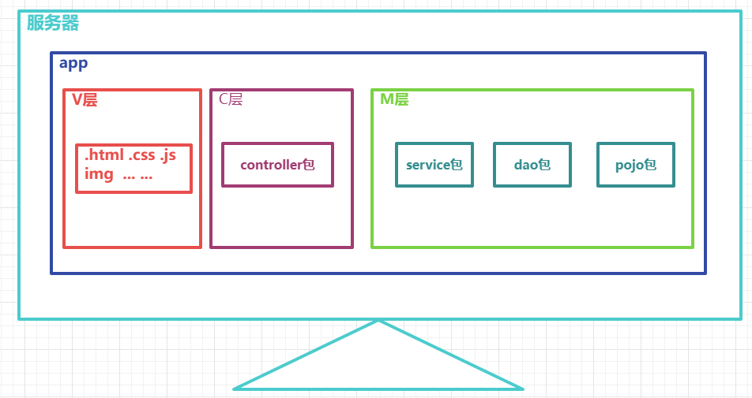
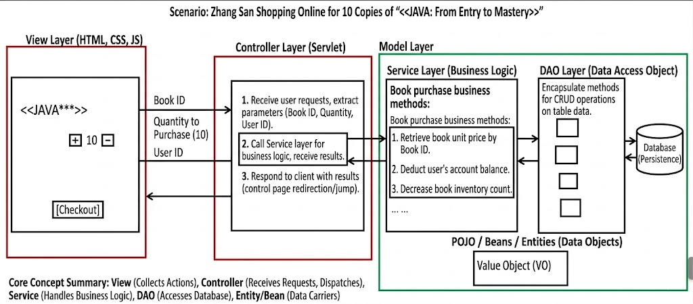
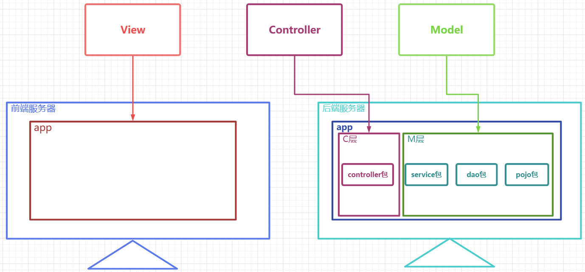

# 6 ServletConfig and ServletContext

## 6.1 Using ServletConfig

> What is ServletConfig

+ ServletConfig is an object that provides initial configuration parameters for a Servlet. Each Servlet has its own unique ServletConfig object.
+ The container instantiates a ServletConfig object for each Servlet and passes it to the Servlet through the `init` method in the Servlet lifecycle.



> ServletConfig is an interface that defines the following APIs

``` java
package jakarta.servlet;
import java.util.Enumeration;
public interface ServletConfig {
    String getServletName();
    ServletContext getServletContext();
    String getInitParameter(String var1);
    Enumeration<String> getInitParameterNames();
}
```

| Method Name             | Description                                                                 |
| ----------------------- | --------------------------------------------------------------------------- |
| getServletName()        | Gets the Servlet name defined in `<servlet-name>HelloServlet</servlet-name>` |
| getServletContext()     | Gets the ServletContext object                                              |
| getInitParameter()      | Gets the initialization parameter configured for the Servlet by name        |
| getInitParameterNames() | Gets an `Enumeration` object containing all initialization parameter names  |

> How to use ServletConfig, as shown in the following test code

+ Define Servlets

``` java
public class ServletA extends HttpServlet {
    @Override
    protected void service(HttpServletRequest req, HttpServletResponse resp) throws ServletException, IOException {
        ServletConfig servletConfig = this.getServletConfig();
        // Get a single parameter by parameter name
        String value = servletConfig.getInitParameter("param1");
        System.out.println("param1:"+value);
        // Get all parameter names
        Enumeration<String> parameterNames = servletConfig.getInitParameterNames();
        // Iterate through all parameter names
        while (parameterNames.hasMoreElements()) {
            String paramaterName = parameterNames.nextElement();
            System.out.println(paramaterName+":"+servletConfig.getInitParameter(paramaterName));
        }
    }
}


public class ServletB extends HttpServlet {
    @Override
    protected void service(HttpServletRequest req, HttpServletResponse resp) throws ServletException, IOException {
        ServletConfig servletConfig = this.getServletConfig();
        // Get a single parameter by parameter name
        String value = servletConfig.getInitParameter("param1");
        System.out.println("param1:"+value);
        // Get all parameter names
        Enumeration<String> parameterNames = servletConfig.getInitParameterNames();
        // Iterate through all parameter names
        while (parameterNames.hasMoreElements()) {
            String paramaterName = parameterNames.nextElement();
            System.out.println(paramaterName+":"+servletConfig.getInitParameter(paramaterName));
        }
    }
}
```

+ Configure Servlets

``` xml
  <servlet>
       <servlet-name>ServletA</servlet-name>
       <servlet-class>com.atguigu.servlet.ServletA</servlet-class>
       <!-- Configure initial parameters for ServletA -->
       <init-param>
           <param-name>param1</param-name>
           <param-value>value1</param-value>
       </init-param>
       <init-param>
           <param-name>param2</param-name>
           <param-value>value2</param-value>
       </init-param>
   </servlet>

    <servlet>
        <servlet-name>ServletB</servlet-name>
        <servlet-class>com.atguigu.servlet.ServletB</servlet-class>
        <!-- Configure initial parameters for ServletB -->
        <init-param>
            <param-name>param3</param-name>
            <param-value>value3</param-value>
        </init-param>
        <init-param>
            <param-name>param4</param-name>
            <param-value>value4</param-value>
        </init-param>
    </servlet>

    <servlet-mapping>
        <servlet-name>ServletA</servlet-name>
        <url-pattern>/servletA</url-pattern>
    </servlet-mapping>

    <servlet-mapping>
        <servlet-name>ServletB</servlet-name>
        <url-pattern>/servletB</url-pattern>
    </servlet-mapping>
```

+ Request the Servlets for testing

Omitted

## 6.2 Using ServletContext

> What is ServletContext

+ The ServletContext object is also called the context object, or the application scope object (scope objects will be explained later in a unified way).
+ The container creates one unique ServletContext object for each app.
+ The ServletContext object is shared by all Servlets.
+ ServletContext can provide initial configuration parameters for all Servlets.



> How to use ServletContext

+ Configure ServletContext parameters

``` xml
<?xml version="1.0" encoding="UTF-8"?>
<web-app xmlns="https://jakarta.ee/xml/ns/jakartaee"
         xmlns:xsi="http://www.w3.org/2001/XMLSchema-instance"
         xsi:schemaLocation="https://jakarta.ee/xml/ns/jakartaee https://jakarta.ee/xml/ns/jakartaee/web-app_5_0.xsd"
         version="5.0">

    <context-param>
        <param-name>paramA</param-name>
        <param-value>valueA</param-value>
    </context-param>
    <context-param>
        <param-name>paramB</param-name>
        <param-value>valueB</param-value>
    </context-param>
</web-app>
```

+ Get ServletContext and its parameters in a Servlet

``` java
package com.atguigu.servlet;

import jakarta.servlet.ServletConfig;
import jakarta.servlet.ServletContext;
import jakarta.servlet.ServletException;
import jakarta.servlet.http.HttpServlet;
import jakarta.servlet.http.HttpServletRequest;
import jakarta.servlet.http.HttpServletResponse;

import java.io.IOException;
import java.util.Enumeration;

public class ServletA extends HttpServlet {
    @Override
    protected void service(HttpServletRequest req, HttpServletResponse resp) throws ServletException, IOException {

        // Get parameters prepared for all Servlets from ServletContext
        ServletContext servletContext = this.getServletContext();
        String valueA = servletContext.getInitParameter("paramA");
        System.out.println("paramA:"+valueA);
        // Get all parameter names
        Enumeration<String> initParameterNames = servletContext.getInitParameterNames();
        // Iterate through all parameter names
        while (initParameterNames.hasMoreElements()) {
            String paramaterName = initParameterNames.nextElement();
            System.out.println(paramaterName+":"+servletContext.getInitParameter(paramaterName));
        }
    }
}
```

## 6.3 Other Important APIs of ServletContext

> Get the real path of a resource

``` java
String realPath = servletContext.getRealPath("the path of the resource inside the web directory");
```

+ For example, suppose we need to get the path of a static resource in the project. What we need is not the path in the source project directory, but the **path in the deployment directory**. If we directly copy the full path from our own computer, that can be problematic, because once the project is deployed to a company server, the path will definitely change. Therefore, we should use code to dynamically get the real path of the resource. As long as we use `servletContext` to dynamically get the real path of a resource, **no matter how the deployment path changes, the actual runtime path of the project will be obtained dynamically**, so path errors caused by hard-coded real paths can be avoided.

> Get the context path of the project

``` java
String contextPath = servletContext.getContextPath();
```

+ The deployment name of the project is also called the context path of the project. It is the path used when the project is deployed into Tomcat, and this path may change. Dynamically obtaining the real context path through this API can **help us solve path problems in some backend page-rendering technologies, request forwarding, and response redirection**.

> APIs related to scope objects

+ Scope objects are objects used to store and transfer data. Different ranges of data sharing are called different scopes, and different scope objects represent different scopes.
+ ServletContext represents the application, so the ServletContext scope is also called the application scope. It is the largest scope in a webapp and can be used to share and transfer data within the application.
+ The three major scope objects in a webapp are application scope, session scope, and request scope.
+ `Later we will explain and demonstrate the three major scope objects in a unified way`. They all have the following APIs:

| API                                         | Description                     |
| ------------------------------------------- | ------------------------------- |
| void setAttribute(String key,Object value); | Store/modify data in the scope  |
| Object getAttribute(String key);            | Get data from the scope         |
| void removeAttribute(String key);           | Remove data from the scope      |

# 7 HttpServletRequest

## 7.1 Introduction to HttpServletRequest

> What is HttpServletRequest

+ HttpServletRequest is an interface, and its parent interface is ServletRequest.
+ HttpServletRequest is the object created by Tomcat by converting and encapsulating the HTTP request message, and it is passed in when Tomcat calls the `service` method.
+ HttpServletRequest represents the request sent by the client, and all information in the request can be obtained through this object.



## 7.2 Common APIs of HttpServletRequest

> How to use HttpServletRequest

+ Get information related to the request line (method, requested URL, protocol, and version)

| API                           | Description                                   |
| ----------------------------- | --------------------------------------------- |
| StringBuffer getRequestURL(); | Get the full URL requested by the client      |
| String getRequestURI();       | Get the specific resource path in the project |
| int getServerPort();          | Get the port used by the client to send the request |
| int getLocalPort();           | Get the port of the container running this application |
| int getRemotePort();          | Get the port of the client program            |
| String getScheme();           | Get the request protocol                      |
| String getProtocol();         | Get the request protocol and version          |
| String getMethod();           | Get the request method                        |

+ Get information related to request headers

| API                                   | Description                             |
| ------------------------------------- | --------------------------------------- |
| String getHeader(String headerName);  | Get a request header by header name     |
| Enumeration<String> getHeaderNames(); | Get all request header names            |
| String getContentType();              | Get the `Content-Type` request header   |

+ Get information related to request parameters

| API                                                     | Description                                      |
| ------------------------------------------------------- | ------------------------------------------------ |
| String getParameter(String parameterName);              | Get a single request parameter value by name     |
| String[] getParameterValues(String parameterName);      | Get multiple request parameter values by name    |
| Enumeration<String> getParameterNames();                | Get all request parameter names                  |
| Map<String, String[]> getParameterMap();                | Get all request parameter key-value pairs        |
| BufferedReader getReader() throws IOException;          | Get a character input stream for reading the request body |
| ServletInputStream getInputStream() throws IOException; | Get a byte input stream for reading the request body      |
| int getContentLength();                                 | Get the length of the request body in bytes      |

+ Other APIs

| API                                          | Description                              |
| -------------------------------------------- | ---------------------------------------- |
| String getServletPath();                     | Get the mapping path of the requested Servlet |
| ServletContext getServletContext();          | Get the ServletContext object            |
| Cookie[] getCookies();                       | Get all cookies in the request           |
| HttpSession getSession();                    | Get the Session object                   |
| void setCharacterEncoding(String encoding) ; | Set the character encoding of the request body |

# 8 HttpServletResponse

## 8.1 Introduction to HttpServletResponse

> What is HttpServletResponse

+ HttpServletResponse is an interface, and its parent interface is ServletResponse.
+ HttpServletResponse is created in advance by Tomcat and passed in when Tomcat calls the `service` method.
+ HttpServletResponse represents the response to the client. This object will be converted into a response message and sent to the client. Through this object, we can set response information.


## 8.2 Common APIs of HttpServletResponse

> How to use HttpServletRequest

+ Set information related to the response line

| API                        | Description                 |
| -------------------------- | --------------------------- |
| void setStatus(int  code); | Set the response status code |

+ Set information related to response headers

| API                                                    | Description                                              |
| ------------------------------------------------------ | -------------------------------------------------------- |
| void setHeader(String headerName, String headerValue); | Set/modify a response header key-value pair              |
| void setContentType(String contentType);               | Set the `Content-Type` response header and response character set (set MIME type) |

+ Set information related to the response body

| API                                                       | Description                                                     |
| --------------------------------------------------------- | --------------------------------------------------------------- |
| PrintWriter getWriter() throws IOException;               | Get a character output stream for writing data to the response body |
| ServletOutputStream getOutputStream() throws IOException; | Get a byte output stream for writing data to the response body |
| void setContentLength(int length);                        | Set the byte length of the response body, which actually means setting the `Content-Length` response header |

+ Other APIs

| API                                                          | Description                                                       |
| ------------------------------------------------------------ | ----------------------------------------------------------------- |
| void sendError(int code, String message) throws IOException; | Send error information to the client, with a status code and message |
| void addCookie(Cookie cookie);                               | Add a cookie to the response body                                 |
| void setCharacterEncoding(String encoding);                  | Set the character encoding of the response body                   |

> MIME types

+ A MIME type can be understood as a document type, used to indicate what kind of document the transmitted data belongs to.
+ The browser can decide how to parse the received response body according to the MIME type.
+ You can understand it this way: during frontend-backend interaction, we tell the other side whether we are sending HTML/CSS/JS/images/audio/video/... ...
+ The mapping between common file extensions and MIME types is configured in `tomcat/conf/web.xml`.
+ Some common MIME types are listed below:

| File Extension              | MIME Type              |
| --------------------------- | ---------------------- |
| .html                       | text/html              |
| .css                        | text/css               |
| .js                         | application/javascript |
| .png /.jpeg/.jpg/... ...    | image/jpeg             |
| .mp3/.mpe/.mpeg/ ... ...    | audio/mpeg             |
| .mp4                        | video/mp4              |
| .m1v/.m1v/.m2v/.mpe/... ... | video/mpeg             |

# 9 Request Forwarding and Response Redirection

## 9.1 Overview

> What are request forwarding and response redirection

+ Request forwarding and response redirection are two ways to indirectly access project resources in web applications, and they are also two ways for Servlets to control page navigation.

+ Request forwarding is implemented through `HttpServletRequest`, while response redirection is implemented through `HttpServletResponse`.

+ Real-life example of request forwarding: Zhang San asks Li Si to borrow money. Li Si does not have it, so Li Si asks Wang Wu to lend money directly to Zhang San.
+ Real-life example of response redirection: Zhang San asks Li Si to borrow money. Li Si does not have it, so Li Si tells Zhang San to go find Wang Wu, and Zhang San then goes to Wang Wu by himself.

## 9.2 Request Forwarding

> Execution logic diagram of request forwarding



> Characteristics of request forwarding (memorize)

+ Request forwarding is implemented by obtaining a `RequestDispatcher` through the `HttpServletRequest` object.
+ Request forwarding is an internal server behavior and is invisible to the client.
+ The client sends only one request, and the address bar in the browser does not change.
+ The server creates only one pair of request and response objects, and this pair continues to be passed to the next resource.
+ Since there is only one `HttpServletRequest` object throughout the process, request parameters can be passed, and data in the request scope can also be passed.
+ Request forwarding can forward to other Servlet dynamic resources, and it can also forward to some static resources to implement page navigation.
+ Request forwarding can forward to protected resources under `WEB-INF`.
+ Request forwarding cannot forward to external resources outside the current project.

> Test code for request forwarding



+ ServletA

``` java
@WebServlet("/servletA")
public class ServletA extends HttpServlet {
    @Override
    protected void service(HttpServletRequest req, HttpServletResponse resp) throws ServletException, IOException {
        //  Get a request dispatcher
        //  Forward to another servlet  OK
        RequestDispatcher  requestDispatcher = req.getRequestDispatcher("servletB");
        //  Forward to a view resource OK
        //RequestDispatcher requestDispatcher = req.getRequestDispatcher("welcome.html");
        //  Forward to a resource under WEB-INF  OK
        //RequestDispatcher requestDispatcher = req.getRequestDispatcher("WEB-INF/views/view1.html");
        //  Forward to an external resource   NO
        //RequestDispatcher requestDispatcher = req.getRequestDispatcher("http://www.atguigu.com");
        //  Get request parameters
        String username = req.getParameter("username");
        System.out.println(username);
        //  Put data into request scope
        req.setAttribute("reqKey","requestMessage");
        //  Perform the forward
        requestDispatcher.forward(req,resp);
    }
}
```

+ ServletB

``` java
@WebServlet("/servletB")
public class ServletB extends HttpServlet {
    @Override
    protected void service(HttpServletRequest req, HttpServletResponse resp) throws ServletException, IOException {
        // Get request parameters
        String username = req.getParameter("username");
        System.out.println(username);
        // Get data in request scope
        String reqMessage = (String)req.getAttribute("reqKey");
        System.out.println(reqMessage);
        // Send response
        resp.getWriter().write("servletB response");        
    }
}
```

+ Open the browser and enter the following URL to test

``` http
http://localhost:8080/web03_war_exploded/servletA?username=atguigu
```

## 9.3 Response Redirection

> Execution logic diagram of response redirection



> Characteristics of response redirection (memorize)

+ Response redirection is implemented by the `sendRedirect` method of the `HttpServletResponse` object.
+ Response redirection means the server returns a 302 status code and a path, telling the client to go find another resource by itself. It is a client-side behavior triggered by the server.
+ The client sends at least two requests, and the address bar in the browser changes.
+ The server creates multiple pairs of request and response objects, and they are not passed to the next resource.
+ Since multiple `HttpServletRequest` objects are created throughout the process, request parameters cannot be passed, and data in the request scope cannot be passed either.
+ Redirection can target other Servlet dynamic resources, and it can also target static resources to implement page navigation.
+ Redirection cannot target protected resources under `WEB-INF`.
+ Redirection can target external resources outside the current project.

> Test code for response redirection


+ ServletA

``` java

@WebServlet("/servletA")
public class ServletA extends HttpServlet {
    @Override
    protected void service(HttpServletRequest req, HttpServletResponse resp) throws ServletException, IOException {
        //  Get request parameters
        String username = req.getParameter("username");
        System.out.println(username);
        //  Put data into request scope
        req.setAttribute("reqKey","requestMessage");
        //  Response redirection
        // Redirect to a servlet dynamic resource OK
        resp.sendRedirect("servletB");
        // Redirect to a static view resource OK
        //resp.sendRedirect("welcome.html");
        // Redirect to a resource under WEB-INF NO
        //resp.sendRedirect("WEB-INF/views/view1");
        // Redirect to an external resource
        //resp.sendRedirect("http://www.atguigu.com");
    }
}
```

+ ServletB

``` java
@WebServlet("/servletB")
public class ServletB extends HttpServlet {
    @Override
    protected void service(HttpServletRequest req, HttpServletResponse resp) throws ServletException, IOException {
        // Get request parameters
        String username = req.getParameter("username");
        System.out.println(username);
        // Get data in request scope
        String reqMessage = (String)req.getAttribute("reqKey");
        System.out.println(reqMessage);
        // Send response
        resp.getWriter().write("servletB response");

    }
}
```

+ Open the browser and enter the following URL to test

``` url
http://localhost:8080/web03_war_exploded/servletA?username=atguigu
```

# 10 Summary of Web Encoding and Path Problems

## 10.2 Path Problems

> Relative paths and absolute paths

+ Relative paths
    + The rule of a relative path is: start from the path of the current resource and then locate the target resource.
    + A relative path does not start with `/`.
    + Under the `file` protocol, it uses a disk path.
    + Under the `http` protocol, it uses a URL path.
    + In a relative path, `./` means the path of the current resource and can be omitted.
    + In a relative path, `../` means the parent directory of the current resource and should be added manually when needed.

+ Absolute paths
    + The rule of an absolute path is: use a fixed path as the starting point to locate the target resource, regardless of the current resource location.
    + An absolute path starts with `/`.
    + In an absolute path, since it does not start from the current resource path, `./` and `../` do not appear.
    + In different projects and under different protocols, the base position of an absolute path may differ, so it must be verified by testing.
    + The advantage of an absolute path is that no matter where the current resource is located, the way to write the target path is always the same.

+ Application scenarios
    1. Attributes such as `href`, `src`, and `action` in frontend code
    2. Paths used in request forwarding and redirection

### 10.2.1 Frontend Path Problems

> Frontend project structure



#### 10.2.1.1 Analysis of relative path cases

> Relative path case 1: referencing `web/static/img/logo.png` in `web/index.html`

+ URL for accessing `index.html`: `http://localhost:8080/web03_war_exploded/index.html`
+ Current resource: `index.html`
+ Current resource location: `http://localhost:8080/web03_war_exploded/`
+ Target resource URL: `http://localhost:8080/web03_war_exploded/static/img/logo.png`
+ The definition in `index.html`: ``
+ The lookup method is to append the `src` value (`static/img/logo.png`) to the current resource location (`http://localhost:8080/web03_war_exploded/`), which gives exactly the correct target resource URL (`http://localhost:8080/web03_war_exploded/static/img/logo.png`)

``` html
<!DOCTYPE html>
<html lang="en">
<head>
    <meta charset="UTF-8">
    <title>Title</title>
</head>
<body>

    
</body>
</html>
```

> Relative path case 2: referencing `web/static/img/logo.png` in `web/a/b/c/test.html`

+ URL for accessing `test.html`: `http://localhost:8080/web03_war_exploded/a/b/c/test.html`
+ Current resource: `test.html`
+ Current resource location: `http://localhost:8080/web03_war_exploded/a/b/c/`
+ Target resource URL: `http://localhost:8080/web03_war_exploded/static/img/logo.png`
+ The definition in `test.html`: ``
+ The lookup method is to append the `src` value (`../../../static/img/logo.png`) to the current resource location (`http://localhost:8080/web03_war_exploded/a/b/c/`). Here, each `../` cancels one directory level, and this gives exactly the correct target resource URL (`http://localhost:8080/web03_war_exploded/static/img/logo.png`)

``` html
<!DOCTYPE html>
<html lang="en">
<head>
    <meta charset="UTF-8">
    <title>Title</title>
</head>
<body>
    <!-- ../ means the parent directory -->
    
</body>
</html>
```

> Relative path case 3: referencing `web/static/img/logo.png` in `web/WEB-INF/views/view1.html`

+ Since `view1.html` is under `WEB-INF`, it must be accessed through Servlet request forwarding

``` java
@WebServlet("/view1Servlet")
public class View1Servlet extends HttpServlet {
    @Override
    protected void service(HttpServletRequest req, HttpServletResponse resp) throws ServletException, IOException {
        RequestDispatcher requestDispatcher = req.getRequestDispatcher("WEB-INF/views/view1.html");
        requestDispatcher.forward(req,resp);
    }
}
```

+ URL for accessing `view1.html`: `http://localhost:8080/web03_war_exploded/view1Servlet`
+ Current resource: `view1Servlet`
+ Current resource location: `http://localhost:8080/web03_war_exploded/`
+ Target resource URL: `http://localhost:8080/web03_war_exploded/static/img/logo.png`
+ The definition in `view1.html`: ``
+ The lookup method is to append the `src` value (`static/img/logo.png`) to the current resource location (`http://localhost:8080/web03_war_exploded/`), which gives exactly the correct target resource URL (`http://localhost:8080/web03_war_exploded/static/img/logo.png`)

``` html
<!DOCTYPE html>
<html lang="en">
<head>
    <meta charset="UTF-8">
    <title>Title</title>
</head>
<body>


</body>
</html>
```

#### 10.2.1.2 Analysis of absolute path cases

> Absolute path case 1: referencing `web/static/img/logo.png` in `web/index.html`

+ URL for accessing `index.html`: `http://localhost:8080/web03_war_exploded/index.html`
+ Base path of the absolute path: `http://localhost:8080`
+ Target resource URL: `http://localhost:8080/web03_war_exploded/static/img/logo.png`
+ The definition in `index.html`: ``
+ The lookup method is to append the `src` value (`/web03_war_exploded/static/img/logo.png`) to the base path (`http://localhost:8080`), and the result is exactly the correct target resource path

``` html
<!DOCTYPE html>
<html lang="en">
<head>
    <meta charset="UTF-8">
    <title>Title</title>
</head>
<body>
    <!-- Absolute path -->
    
</body>
</html>
```

> Absolute path case 2: referencing `web/static/img/logo.png` in `web/a/b/c/test.html`

+ URL for accessing `test.html`: `http://localhost:8080/web03_war_exploded/a/b/c/test.html`
+ Base path of the absolute path: `http://localhost:8080`
+ Target resource URL: `http://localhost:8080/web03_war_exploded/static/img/logo.png`
+ The definition in `test.html`: ``
+ The lookup method is to append the `src` value (`/web03_war_exploded/static/img/logo.png`) to the base path (`http://localhost:8080`), and the result is exactly the correct target resource path

``` html
<!DOCTYPE html>
<html lang="en">
<head>
    <meta charset="UTF-8">
    <title>Title</title>
</head>
<body>
    <!-- Absolute path -->
    
</body>
</html>
```

> Absolute path case 3: referencing `web/static/img/logo.png` in `web/WEB-INF/views/view1.html`

+ Since `view1.html` is under `WEB-INF`, it must be accessed through Servlet request forwarding

``` java
@WebServlet("/view1Servlet")
public class View1Servlet extends HttpServlet {
    @Override
    protected void service(HttpServletRequest req, HttpServletResponse resp) throws ServletException, IOException {
        RequestDispatcher requestDispatcher = req.getRequestDispatcher("WEB-INF/views/view1.html");
        requestDispatcher.forward(req,resp);
    }
}
```

+ URL for accessing `view1.html`: `http://localhost:8080/web03_war_exploded/view1Servlet`
+ Base path of the absolute path: `http://localhost:8080`
+ Target resource URL: `http://localhost:8080/web03_war_exploded/static/img/logo.png`
+ The definition in `view1.html`: ``
+ The lookup method is to append the `src` value (`/static/img/logo.png`) to the base path (`http://localhost:8080`), giving the correct target resource path

``` html
<!DOCTYPE html>
<html lang="en">
<head>
    <meta charset="UTF-8">
    <title>Title</title>
</head>
<body>


</body>
</html>
```

#### 10.2.1.3 Using the `base` tag

> The `base` tag defines a common prefix for relative paths in a page

+ The `base` tag is defined in the `head` tag and is used to define a common prefix for relative paths.
+ The common prefix defined by the `base` tag is only effective for relative paths, not for absolute paths.
+ If a relative path starts with `./` or `../`, the `base` tag is also ineffective for that path.

> Path handling in `index.html`, `a/b/c/test.html`, and `view1Servlet`

```html
<!DOCTYPE html>
<html lang="en">
<head>
    <meta charset="UTF-8">
    <title>Title</title>
    <!-- Define a common prefix for relative paths and convert them into absolute paths -->
    <base href="/web03_war_exploded/">
</head>
<body>
    
</body>
</html>
```

#### 10.2.1.4 Default project context path

> Problem of changing project context paths

+ Although the `base` tag solves the problem of converting relative paths into absolute paths, the `base` tag contains the project context path.
+ The project context path can change freely.
+ Once the project context path changes, all paths in `base` tags need to be modified.

> Solution

+ Set the project context path to `/` by default, so absolute paths no longer need to include the project context path and can simply start with `/`.

### 10.2.2 Path problems in redirection

> Goal: redirect from `/x/y/z/servletA` to `a/b/c/test.html`

``` java
@WebServlet("/x/y/z/servletA")
public class ServletA extends HttpServlet {
    @Override
    protected void service(HttpServletRequest req, HttpServletResponse resp) throws ServletException, IOException {

    }
}
```

#### 10.2.2.1 Relative path form

+ URL for accessing `ServletA`: `http://localhost:8080/web03_war_exploded/x/y/z/servletA`
+ Current resource: `servletA`
+ Current resource location: `http://localhost:8080/web03_war_exploded/x/x/z/`
+ Target resource URL: `http://localhost:8080/web03_war_exploded/a/b/c/test.html`
+ Redirection path in `ServletA`: `../../../a/b/c/test/html`
+ The lookup method is to append `../../../a/b/c/test/html` to the current resource location (`http://localhost:8080/web03_war_exploded/x/y/z/`), forming `http://localhost:8080/web03_war_exploded/x/y/z/../../../a/b/c/test/html`. Each `../` cancels one directory level, so the final URL becomes the correct target resource URL (`http://localhost:8080/web03_war_exploded/a/b/c/test/html`)

``` java
@WebServlet("/x/y/z/servletA")
public class ServletA extends HttpServlet {
    @Override
    protected void service(HttpServletRequest req, HttpServletResponse resp) throws ServletException, IOException {
        // Redirect to test.html using a relative path
        resp.sendRedirect("../../../a/b/c/test.html");
    }
}
```

#### 10.2.2.2 Absolute path form

+ URL for accessing `ServletA`: `http://localhost:8080/web03_war_exploded/x/y/z/servletA`
+ Base path of the absolute path: `http://localhost:8080`
+ Target resource URL: `http://localhost:8080/web03_war_exploded/a/b/c/test.html`
+ Redirection path in `ServletA`: `/web03_war_exploded/a/b/c/test.html`
+ The lookup method is to append `/web03_war_exploded/a/b/c/test.html` to the base path (`http://localhost:8080`), obtaining exactly the correct target resource URL
+ In an absolute path, the project context path must be included, but the context path may change

    + The context path can be obtained dynamically through `ServletContext.getContextPath()`
    + If the project context path is set to the default `/`, the path can simply start with `/`

    ``` java
    // In an absolute path, you need to include the project context path
    //resp.sendRedirect("/web03_war_exploded/a/b/c/test.html");
    // Dynamically get the project context path through ServletContext
    //resp.sendRedirect(getServletContext().getContextPath()+"/a/b/c/test.html");
    // When using the default project context path, just start with /
    resp.sendRedirect("/a/b/c/test.html");
    ```

### 10.2.3 Path problems in request forwarding

> Goal: forward from `x/y/servletB` to `a/b/c/test.html`

``` java
@WebServlet("/x/y/servletB")
public class ServletB extends HttpServlet {
    @Override
    protected void service(HttpServletRequest req, HttpServletResponse resp) throws ServletException, IOException {

    }
}
```

#### 10.2.3.1 Relative path form

+ URL for accessing `ServletB`: `http://localhost:8080/web03_war_exploded/x/y/servletB`
+ Current resource: `servletB`
+ Current resource location: `http://localhost:8080/web03_war_exploded/x/x/`
+ Target resource URL: `http://localhost:8080/web03_war_exploded/a/b/c/test.html`
+ Request forwarding path in `ServletA`: `../../a/b/c/test/html`
+ The lookup method is to append `../../a/b/c/test/html` to the current resource location (`http://localhost:8080/web03_war_exploded/x/y/`), forming `http://localhost:8080/web03_war_exploded/x/y/../../a/b/c/test/html`. Each `../` cancels one directory level, giving the correct target resource URL

``` java
@WebServlet("/x/y/servletB")
public class ServletB extends HttpServlet {
    @Override
    protected void service(HttpServletRequest req, HttpServletResponse resp) throws ServletException, IOException {
        RequestDispatcher requestDispatcher = req.getRequestDispatcher("../../a/b/c/test.html");
        requestDispatcher.forward(req,resp);
    }
}
```

#### 10.2.3.2 Absolute path form

+ Request forwarding can only forward to resources inside the current project, so the absolute path does not need to include the project context path.
+ The base path of an absolute path for request forwarding is equivalent to `http://localhost:8080/web03_war_exploded`
+ Even when the project context path is the default value, this does not change; the path can still start directly with `/`

```java
@WebServlet("/x/y/servletB")
public class ServletB extends HttpServlet {
    @Override
    protected void service(HttpServletRequest req, HttpServletResponse resp) throws ServletException, IOException {
        RequestDispatcher requestDispatcher = req.getRequestDispatcher("/a/b/c/test.html");
        requestDispatcher.forward(req,resp);
    }
}
```

#### 10.2.3.3 Handling relative paths inside the target resource

+ Here you need to note that request forwarding is a server-side behavior, and the browser does not know it. The address bar does not change, so accessing `test.html` is equivalent to visiting `http://localhost:8080/web03_war_exploded/x/y/servletB`
+ Therefore, the current resource path for `test.html` is `http://localhost:8080/web03_war_exploded/x/y/servletB`, and the current resource location is `http://localhost:8080/web03_war_exploded/x/y/`. So any relative path inside `test.html` must be written based on this path. If absolute paths are used, this does not need to be considered.

``` html
<!DOCTYPE html>
<html lang="en">
<head>
    <meta charset="UTF-8">
    <title>Title</title>
</head>
<body>
    <!--
        Current resource path:     http://localhost:8080/web03_war_exploded/x/y/servletB
        Current resource location: http://localhost:8080/web03_war_exploded/x/y/
        Target resource path = current resource location + src attribute value
        http://localhost:8080/web03_war_exploded/x/y/../../static/img/logo.png
        http://localhost:8080/web03_war_exploded/static/img/logo.png
        The resulting target path is exactly the correct access path of the target resource
    -->
    
</body>
</html>
```

# 11 MVC Architectural Pattern

> MVC (Model View Controller) is a **software architecture pattern** in software engineering. It divides a software system into three basic parts: **model**, **view**, and **controller**. It organizes code in a way that separates business logic, data, and interface display. Business logic is concentrated in one component, so the interface and user interaction can be improved or customized without rewriting the business logic.

+ **M**: Model layer, with the following functions
    1. Store entity classes corresponding to database objects, as well as some VO objects not fully corresponding to database tables
    2. Store business-processing code for logical operations on data

+ **V**: View layer, with the following functions
    1. Store code related to view files such as HTML, CSS, and JS
    2. In frontend-backend separated projects, the backend no longer contains view files, and this layer has evolved into an independent frontend project

+ **C**: Controller layer, with the following functions
    1. Receive client requests and obtain request data
    2. Return prepared data to the client

> Common packages in a project under the MVC pattern

+ M:
    1. Entity class package (`pojo` / `entity` / `bean`) specifically used to store entity classes corresponding to database tables and some VO objects
    2. Database access package (`dao` / `mapper`) specifically used to store classes that encapsulate CRUD methods for different database tables
    3. Service package (`service`) specifically used to store classes that perform business logic operations on data

+ C:
    1. Controller package (`controller`)

+ V:
    1. View resources under the `web` directory, such as HTML, CSS, JS, and images
    2. After frontend engineering, these no longer exist in the backend project

Non-frontend-backend-separated MVC





This diagram shows the **MVC idea in a Java Web application**, together with the **three-tier backend structure**.

On the **left side** is the **View layer**.  
This is the part the user can see and interact with, usually built with **HTML, CSS, and JavaScript**.  
In this example, the user is shopping online. They can see a book, change the quantity by clicking **plus** or **minus**, and then click **Checkout**.

When the user performs an action, the request is sent to the **Controller layer** in the middle.  
In Java Web, the controller is usually a **Servlet**.  
The controller mainly does three things:

1. It **receives the user request** and gets the request parameters.  
   For example, it gets the **book ID**, the **quantity**, and the **user ID**.

2. It **calls the Service layer** to process the business logic.

3. It **returns the result to the client**, such as showing a success page, an error page, or jumping to another page.

On the **right side** is the **Model layer**, which is usually divided into several parts.

The first part is the **Service layer**.  
This layer handles the **business logic**.  
For example, in a book purchase scenario, the service may:

* get the book price by book ID,
* reduce the user’s balance,
* reduce the book stock.

So the Service layer focuses on **what the system should do** in business terms.

The second part is the **DAO layer**.  
DAO means **Data Access Object**.  
This layer is responsible for operating on the database.  
It usually contains methods for **CRUD** operations:

* Create
* Read
* Update
* Delete

So the DAO layer focuses on **how to access and modify the data**.

At the bottom, we also have **POJO / beans / entities**.  
These are Java objects used to represent data, such as a **Book**, **User**, or **Order**.  
They help transfer data between different layers.

So the whole flow is:

**View → Controller → Service → DAO → Database**

and then the result goes back:

**Database → DAO → Service → Controller → View**

A simple way to understand it is:

* **View**: what the user sees
* **Controller**: receives requests and dispatches tasks
* **Service**: handles business logic
* **DAO**: talks to the database
* **Entity/Bean**: carries data

You can also give students this short summary:

**The View collects user actions, the Controller receives requests, the Service processes business logic, and the DAO accesses the database.**

Frontend-backend-separated MVC


