# 1. Session

## 1.1 Overview of Session Management

### 1.1.1 Why Session Management Is Needed

> HTTP is a stateless protocol.

- Stateless means that no state is stored. In other words, HTTP itself does not preserve the communication state between a request and a response.
- Simply put: the browser sends a request, and the server receives and responds to it, but the server does not record which browser the request came from, nor does it remember the client's state.

> Example: Zhang San goes to a restaurant and orders several dishes. He likes them, so he comes back the next day and tells the owner, "I'd like the same dishes as last time."

- **Stateless:** The owner did not record whether Zhang San had visited before, nor what he ordered last time, so Zhang San has to order everything again.
- **Stateful:** The owner keeps a record of every customer visit. By checking the previous record, the owner can directly find Zhang San's earlier order.

### 1.1.2 Ways to Implement Session Management

> Cookie and Session work together to solve this problem.

- **Cookie** is a technology for storing a small amount of data on the client side. The server mainly uses response headers to send information that the client should keep.
- **Session** is a technology for storing more data on the server side. It mainly uses the `HttpSession` object to save information related to the client.
- Cookie and Session work together to record request state.

> Example: Zhang San goes to a bank to handle business.

- The first time Zhang San goes to the bank, the bank opens an account for him (**Session**) and gives him a bank card (**Cookie**).
- Every time he comes back later, he brings the bank card (**Cookie**), and the bank uses it to find his previous account (**Session**).

## 1.2 Cookie

### 1.2.1 Overview of Cookie

> A cookie is a client-side session technology. It is created by the server and stored in the browser as a small piece of data. Every time the browser accesses the same server later, it will carry this piece of data back to the server.

- The server creates a cookie and puts it into the response object. The Tomcat container converts it into a `Set-Cookie` response header and sends it to the client.
- After the client receives the cookie header, it will send the cookie back in the next request as a cookie request header.
- A cookie is stored in key-value format. Since Tomcat 8.5, it can store Chinese characters, but this is not recommended.
- Since cookies are stored on the client side and can be easily exposed, they should generally not store sensitive or security-related data.

> Diagram


**“Before we look at the diagram, we need to remember one important idea: HTTP is stateless. This means that each request is independent. The server does not automatically remember who the user is from one request to the next. So if a user opens a website, logs in, and then clicks another page, the server would forget the user unless some mechanism is used to keep track of them. A cookie is one of the main tools used to solve this problem.”**

### **Step 1: The first request**

**“Now, let’s start at the top of the diagram. First, the browser sends a request to the server. This is the user’s first visit, so there is no cookie in the request yet. The server receives the request and processes it. At this point, the server may decide that it wants to remember this user, for example after the user logs in or visits the site for the first time.”**

### **Step 2: The server creates and sends a cookie**

**“Next, the server creates a cookie. This cookie is usually a small piece of data, such as a session ID or user identifier. The server puts this cookie into the response and sends the response back to the browser. So the important point here is: the cookie is created on the server, but it is stored in the browser.”**

### **Step 3: The browser stores the cookie**

**“When the browser receives the response, it reads the cookie information and stores it locally on the client side. This storage is automatic, so the user usually does not need to do anything. At the same time, the browser also displays the page content returned by the server.”**

### **Step 4: The browser sends the cookie back later**

**“Now imagine that the user clicks another link or sends another request to the same website. This time, before sending the request, the browser checks whether it has any cookies for that site. If it does, it automatically attaches the cookie to the new request and sends it back to the server.”**

### **Step 5: The server reads the cookie**

**“When the server receives this new request, it can read the cookie from the request object. By checking the cookie value, the server can recognize the user. For example, it may know that this is the same user who logged in a moment ago, so the server does not need to ask for the login information again.”**

### **Step 6: The server responds with personalized content**

**“Finally, the server processes the request based on that cookie information and sends back a response that is related to this specific user. For example, it may show the user’s name, keep the shopping cart, or remember language preferences.”**

### **Simple conclusion**

**“So, in simple words, a cookie is a small piece of data stored in the browser. It is sent back to the server in later requests, so the server can remember the user and maintain state across multiple requests.”**

> Typical use cases

1. **Remembering the username**

   After a user enters a username in a login page, the browser records it. The next time the user opens the login page, the username can be filled in automatically.

2. **Saving movie playback progress**

   When playing a movie on a webpage, if the user closes the browser in the middle, the next time the same movie is opened, playback can continue from the last position because the progress was saved in a cookie.

### 1.2.2 Using Cookie

> `ServletA` adds cookies to the response

```java
@WebServlet("/servletA")
public class ServletA extends HttpServlet {
    @Override
    protected void service(HttpServletRequest req, HttpServletResponse resp) throws ServletException, IOException {
        // Create cookies
        Cookie cookie1 =new Cookie("c1","c1_message");
        Cookie cookie2 =new Cookie("c2","c2_message");
        // Add cookies to the response object
        resp.addCookie(cookie1);
        resp.addCookie(cookie2);
    }
}
```

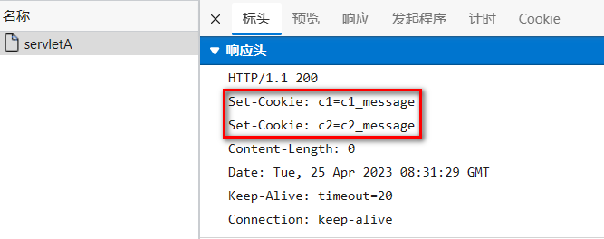

> `ServletB` reads cookies from the request

```java
@WebServlet("/servletB")
public class ServletB extends HttpServlet {
    @Override
    protected void service(HttpServletRequest req, HttpServletResponse resp) throws ServletException, IOException {
        // Get cookies from the request
        Cookie[] cookies = req.getCookies();
        // Iterate through the cookie array
        if (null != cookies && cookies.length!= 0) {
            for (Cookie cookie : cookies) {
                System.out.println(cookie.getName()+":"+cookie.getValue());
            }
        }
    }
}
```

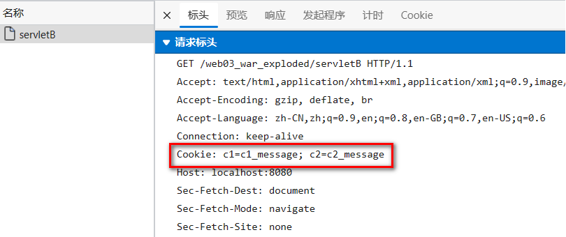

### 1.2.2 Cookie Lifetime

> By default, a cookie is valid only within one session. We can use the `setMaxAge()` method to make it persist in the browser.

- **Session cookie**
  - The server does not explicitly specify how long the cookie should exist.
  - On the browser side, the cookie data is stored in memory.
  - As long as the browser remains open, the cookie is still there.
  - Once the browser is closed, the cookie data in memory is released.
- **Persistent cookie**
  - The server explicitly sets the cookie lifetime.
  - On the browser side, the cookie data is stored on disk.
  - The cookie remains on disk for the time specified by the server, regardless of whether the browser is closed.
  - When the preset time is reached, the cookie is deleted.

> The unit of `cookie.setMaxAge(int expiry)` is seconds. If the value is set to `0`, it means deleting the cookie stored in the browser.

- `ServletA` sets one cookie as a persistent cookie

```java
@WebServlet("/servletA")
public class ServletA extends HttpServlet {
    @Override
    protected void service(HttpServletRequest req, HttpServletResponse resp) throws ServletException, IOException {
        // Create cookies
        Cookie cookie1 =new Cookie("c1","c1_message");
        cookie1.setMaxAge(60);
        Cookie cookie2 =new Cookie("c2","c2_message");
        // Add cookies to the response object
        resp.addCookie(cookie1);
        resp.addCookie(cookie2);
    }
}
```

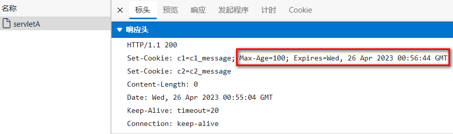

- `ServletB` receives cookies. Restart the browser once and then request `servletB` again to test.

```java
@WebServlet("/servletB")
public class ServletB extends HttpServlet {
    @Override
    protected void service(HttpServletRequest req, HttpServletResponse resp) throws ServletException, IOException {
        // Get cookies from the request
        Cookie[] cookies = req.getCookies();
        // Iterate through the cookie array
        if (null != cookies && cookies.length!= 0) {
            for (Cookie cookie : cookies) {
                System.out.println(cookie.getName()+":"+cookie.getValue());
            }
        }
    }
}
```

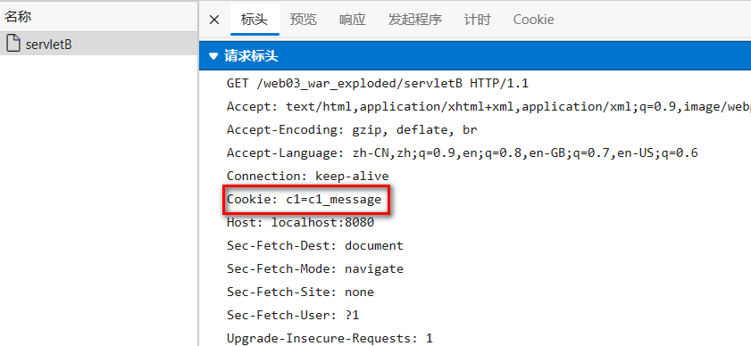

### 1.2.3 Cookie Path

> When accessing online resources, not all cookies need to be sent every time. Different resources can carry different cookies. We can set the cookie path through `cookie.setPath(String path)`.

- Get cookies from `ServletA`

```java
public class ServletA extends HttpServlet {
    @Override
    protected void service(HttpServletRequest req, HttpServletResponse resp) throws ServletException, IOException {
        // Create cookies
        Cookie cookie1 =new Cookie("c1","c1_message");
        // Set the cookie path
        cookie1.setPath("/web03_war_exploded/servletB");
        Cookie cookie2 =new Cookie("c2","c2_message");
        // Add cookies to the response object
        resp.addCookie(cookie1);
        resp.addCookie(cookie2);
    }
}
```

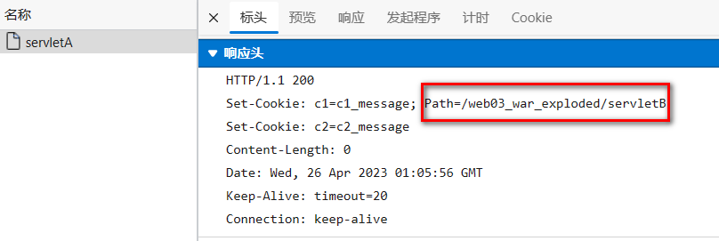

- When requesting `ServletB`, the browser carries `c1`.

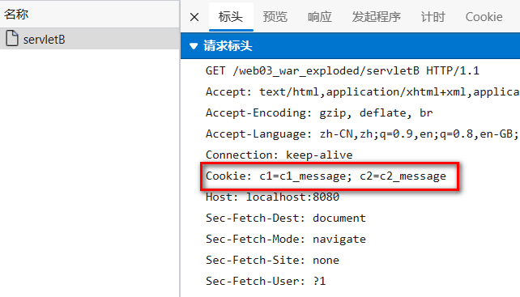

- When requesting other resources, `c1` will not be carried.

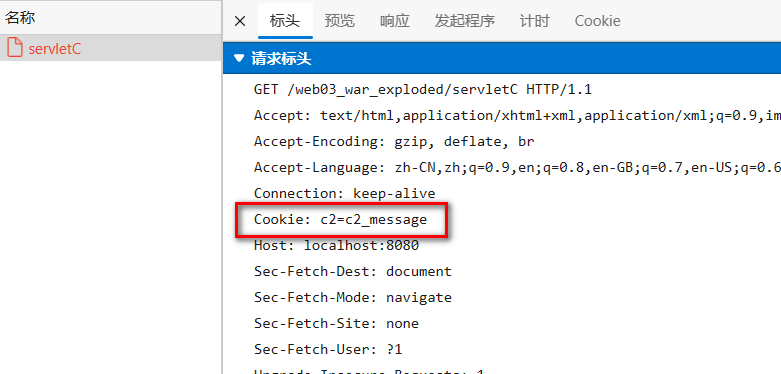

## 1.3 Session

### 1.3.1 Overview of HttpSession

> `HttpSession` is a technology for storing more information on the server side. The server opens a memory space for each client, which is the session object. When sending requests, the client can use its own session. In this way, the server can use the session to record the state of a specific client.

- When the server creates a session for the client, it also places the session ID, namely `JSESSIONID`, into the response object as a cookie.
- After the backend creates the session, the client receives a special cookie called `JSESSIONID`.
- On the next request, the client carries `JSESSIONID`, and the backend uses it to find the corresponding session object.
- Through this mechanism, the server can store client-specific information through the session.
- A session is also a scope object.

> Diagram

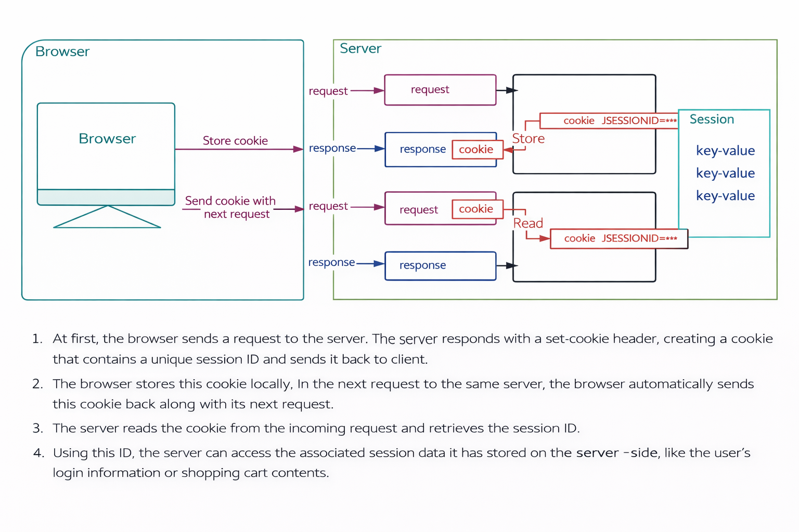
### **Introduction**

* Before we study this picture, we need to remember one important idea: **HTTP is stateless**.
* “Stateless” means the server does **not automatically remember** the client from one request to the next.
* For example, if a user opens a website, logs in, and then clicks another page, the server would forget the user unless we use some mechanism to keep the user’s identity.
* That is why we use **cookies** and **sessions**.
* A **cookie** is stored in the **browser**.
* A **session** is stored on the **server**.
* They usually work together.

---

### **Step 1: The browser sends the first request**

* First, the browser sends a request to the server.
* This is usually the user’s **first visit** or the first action in a new interaction.
* At this moment, the browser may not have any useful cookie yet.
* So the server still does not know who the user is.

You can say to students:

**“At the beginning, the browser sends a request, but the server cannot identify the user yet.”**

---

### **Step 2: The server creates a session**

* After receiving the request, the server decides to create a **session**.
* A session is like a storage area on the server side.
* The server can use this session to keep user-related information.
* This information is usually stored as **key-value pairs**.
* For example:

  * username = Alice
  * role = student
  * cart = 3 items

You can explain it like this:

**“The session is on the server side, and it is used to store the user’s data.”**

---

### **Step 3: The server generates a session ID**

* Now the server has created a session, but it still needs a way to connect this session to the correct browser.
* So the server generates a unique **session ID**.
* In Java web applications, this session ID is often called **JSESSIONID**.
* This ID is very important because it works like a key.
* Later, the server will use this key to find the correct session.

You can tell students:

**“The session ID is like a student ID card number. It helps the server know which session belongs to which user.”**

---

### **Step 4: The server sends the session ID back in a cookie**

* Next, the server sends a response back to the browser.
* In this response, the server puts the **session ID into a cookie**.
* So the cookie does **not usually store all the user data**.
* Instead, it mainly stores the **session ID**.

This is a very important point to emphasize:

* **Cookie:** stored in the browser
* **Session:** stored on the server
* **Cookie usually carries the session ID**

You can say:

**“The real data is in the session on the server. The cookie usually only stores the session ID.”**

---

### **Step 5: The browser stores the cookie**

* After the browser receives the response, it stores the cookie locally.
* This process is usually automatic.
* The user often does not notice it.
* Now the browser has the session ID cookie.

At this stage, you can summarize:

**“Now the browser has a cookie, and that cookie contains the session ID.”**

---

### **Step 6: The browser sends another request**

* Later, the user clicks another link, opens another page, or sends another request.
* Before sending the request, the browser checks its stored cookies.
* If it finds a cookie for this website, it automatically sends the cookie together with the new request.
* This means the browser sends the **JSESSIONID** back to the server.

You can explain:

**“The browser automatically carries the cookie in later requests. The user does not need to send it manually.”**

---

### **Step 7: The server reads the cookie**

* The server receives the new request.
* This time, the request includes the cookie.
* The server reads the cookie value and gets the **session ID**.
* Then it uses this session ID to find the corresponding session on the server side.

This is the key connection:

* browser sends cookie
* cookie contains session ID
* server reads session ID
* server finds session data

You can say:

**“The cookie tells the server which session to use.”**

---

### **Step 8: The server finds the user’s session data**

* Once the server has the correct session ID, it can locate the correct session.
* Then it can read the stored data from that session.
* For example, it can know:

  * who the user is
  * whether the user has logged in
  * what is in the shopping cart
  * what language preference the user chose

So now the server can recognize the user.

You can explain:

**“Because of the session ID, the server can reconnect this request with the user’s previous data.”**

---

### **Step 9: The server sends a personalized response**

* After finding the session data, the server processes the request.
* Then it sends a response back to the browser.
* This response can now be personalized.
* For example:

  * show the user’s name
  * keep the login state
  * display the shopping cart contents

---

## **Key ideas students must remember**

### **1. HTTP is stateless**

* The server does not remember old requests by itself.

### **2. Cookie is stored in the browser**

* The browser keeps the cookie locally.

### **3. Session is stored on the server**

* The real user data is usually stored in the session.

### **4. Cookie and session work together**

* The server creates a session.
* The server sends the session ID in a cookie.
* The browser stores the cookie.
* The browser sends the cookie back later.
* The server reads the session ID and finds the correct session.

---

## **A simple analogy**

If you want students to understand more easily, you can use this analogy:

* The **session** is like a file folder in the school office.
* The **session ID** is like the student number.
* The **cookie** is like a small card that carries the student number.
* The browser keeps this card.
* When the student comes again, they show the card.
* Then the office can quickly find the correct file folder.

---


> Typical use cases

1. **Recording user login status**

   After the user logs in, sensitive information such as the account can be stored in the session.

2. **Recording user operation history**

   For example, browsing history or shopping cart information can be stored as temporary data.

### 1.3.2 Using HttpSession

> The user submits a form to `ServletA` with a username. `ServletA` gets the session and stores the username in it. Then the user requests any other servlet to retrieve the previously stored username.

- Define a form page to submit the username

```html
<form action="servletA" method="post">
        用户名:
        <input type="text" name="username">
        <input type="submit" value="提交">
</form>
```

- Define `ServletA` to store the username in the session

```java
@WebServlet("/servletA")
public class ServletA extends HttpServlet {
    @Override
    protected void service(HttpServletRequest req, HttpServletResponse resp) throws ServletException, IOException {
        // Get the request parameter
        String username = req.getParameter("username");
        // Get the session object
        HttpSession session = req.getSession();
         // Get the session ID
        String jSessionId = session.getId();
        System.out.println(jSessionId);
        // Check whether the session is newly created
        boolean isNew = session.isNew();
        System.out.println(isNew);
        // Store data in the session object
        session.setAttribute("username",username);

    }
}
```

- A `JSESSIONID` cookie is received in the response

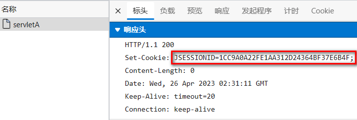

- Define another servlet to read the username from the session

```java
@WebServlet("/servletB")
public class ServletB extends HttpServlet {
    @Override
    protected void service(HttpServletRequest req, HttpServletResponse resp) throws ServletException, IOException {
        // Get the session object
        HttpSession session = req.getSession();
         // Get the session ID
        String jSessionId = session.getId();
        System.out.println(jSessionId);
        // Check whether the session is newly created
        boolean isNew = session.isNew();
        System.out.println(isNew);
        // Read data from the session
        String username = (String)session.getAttribute("username");
        System.out.println(username);
    }
}
```

- The request carries a `JSESSIONID` cookie

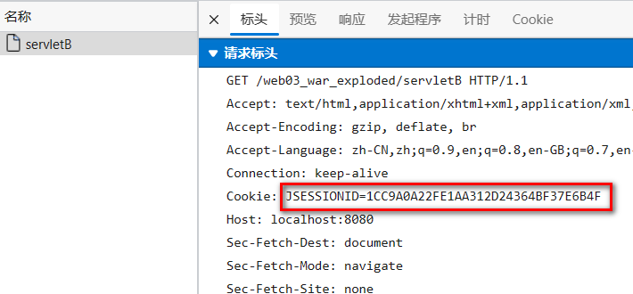

> Processing logic of the `getSession()` method


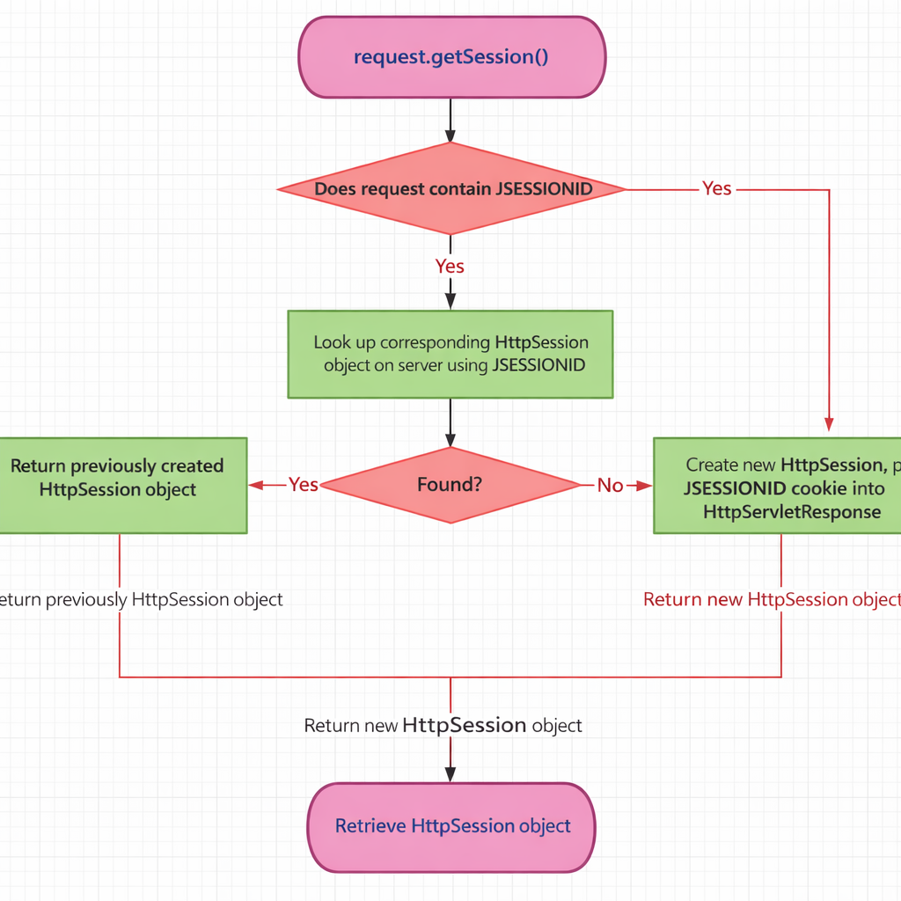

---

**let’s look at this flowchart and understand how `request.getSession()` works in a Java web application.**

First, we need to know what a session is. A session is an object on the server side that stores information about a user. For example, it can store the username, login status, or shopping cart data. When we write `request.getSession()`, we are asking the server to give us the `HttpSession` object for the current user.

Now, let’s follow the diagram step by step.

### **Step 1: The process starts with `request.getSession()`**

At the top of the flowchart, we call `request.getSession()`.
This does not always mean that the server will create a brand-new session immediately.
Instead, the server first checks whether the client already has an existing session.

So the first idea to remember is this: **`request.getSession()` first tries to find an old session before creating a new one.**

### **Step 2: Check whether the request contains `JSESSIONID`**

Next, the server checks the incoming request and asks:
**Does this request contain a `JSESSIONID`?**

`JSESSIONID` is the session ID used in Java web applications.
Usually, it is stored in a cookie in the browser.
When the browser sends another request to the same server, it may include this `JSESSIONID` automatically.

So here the server is really asking:
**Has this browser visited before, and did it send me its session ID?**

### **Step 3: If the request contains `JSESSIONID`**

If the answer is yes, the server uses this `JSESSIONID` to search for the corresponding `HttpSession` object on the server side.

In other words, the server says:
**“The client sent me a session ID. Let me check whether I still have that session in memory.”**

### **Step 4: Check whether the session is found**

After that, the server asks another question:
**Was the session found?**

If the answer is yes, that means the session already exists and is still valid.
In this case, the server returns the previously created `HttpSession` object.

This is the best case for a returning user, because the server can continue using the old session data.
For example, the user may still be logged in, and the shopping cart may still be there.

### **Step 5: If the session is not found**

If the answer is no, that means the server could not find the old session.
Maybe the session expired, maybe it was deleted, or maybe the `JSESSIONID` is no longer valid.

In this situation, the server creates a **new `HttpSession` object**.
Then it generates a new `JSESSIONID` and puts it into the `HttpServletResponse`, usually as a cookie.
The browser will receive this new session ID and store it.

So here the idea is:
**If the old session cannot be found, the server creates a new one.**

### **Step 6: If the request does not contain `JSESSIONID`**

Now let’s go back to the earlier decision.
What if the request does not contain `JSESSIONID` at all?

This usually means the user is visiting for the first time, or the browser does not have the session cookie anymore.

In that case, the server does not even try to find an old session.
It directly creates a new `HttpSession` object.
Then it sends the new `JSESSIONID` back to the browser in the response.

So for a new user, the result is simple:
**No session ID in the request means the server creates a new session.**

### **Step 7: Return the `HttpSession` object**

At the end of the whole process, the server returns an `HttpSession` object.

This object can be:

* the old session, if it was found, or
* a new session, if no valid old session exists.

So the final result is always the same:
**the application gets an `HttpSession` object and can use it to store or read user data.**

---

### **Now let’s summarize the whole process**

When we call `request.getSession()`, the server first checks whether the request contains a `JSESSIONID`.
If it does, the server tries to find the old session using that ID.
If the session is found, the old session is returned.
If it is not found, the server creates a new session and sends a new `JSESSIONID` back to the browser.
If there is no `JSESSIONID` in the request at all, the server also creates a new session directly.

---

### **The key points students should remember are these**

First, **`request.getSession()` does not always create a new session**.
Second, **`JSESSIONID` is the key that connects the browser and the server-side session**.
Third, **the session data is stored on the server, while the browser usually stores only the session ID**.
And finally, **if no valid session exists, the server creates a new one**.

---

### **A simple sentence to end with**

So, in one sentence:
**`request.getSession()` checks for an existing session first, and if it cannot find one, it creates a new session for the user.**

---

If you want, I can also turn this into a shorter 1-minute classroom version or a slower, simpler ESL version.


### 1.3.3 HttpSession Lifetime

> Why should we set a session lifetime?

- As the number of users increases, more session objects are created. If they are never released, the server memory will eventually be exhausted.
- The server cannot directly detect when a client closes the browser, and sometimes the client may remain inactive for a long time. Therefore, session timeout settings are needed.

> The default maximum inactive interval of a session (the interval between two uses of the same session) is 30 minutes in `tomcat/conf/web.xml`.

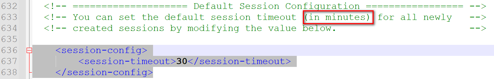

> We can also redefine the maximum inactive interval in the current project's `web.xml`.

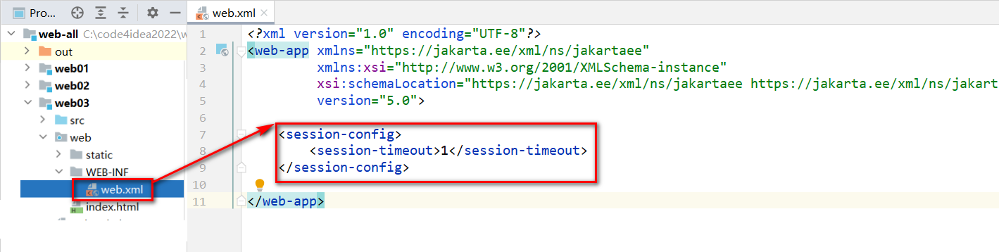

> Or set it directly through the `HttpSession` API

```java
// Set the maximum inactive interval
session.setMaxInactiveInterval(60);
```

> Or invalidate the session directly

```java
// Invalidate the session directly
session.invalidate();
```

## 1.4 The Three Major Scope Objects

### 1.4.1 Overview of Scope Objects

> Scope objects are objects used to store and transfer data. Different transfer ranges are called different scopes. Different scope objects represent different scopes, and the range of shared data is also different.

- In a web project, the three scope objects we must master are: **request scope**, **session scope**, and **application scope**.
- The request scope object is `HttpServletRequest`, and its data transfer range is within one request and request forwarding.
- The session scope object is `HttpSession`, and its data transfer range is within one session and can span multiple requests.
- The application scope object is `ServletContext`, and its data transfer range is within the entire application and can span multiple sessions.

> Daily life analogy: the range of use depends on where a water dispenser is placed.

1. If it is placed under Zhang San's desk, only Zhang San can use it.
2. If it is placed in the shared office area, everyone in the office can use it.
3. If it is placed in the hallway of a floor, everyone on that floor can use it.

> Diagram of the data scope of the three major scope objects

- Request scope

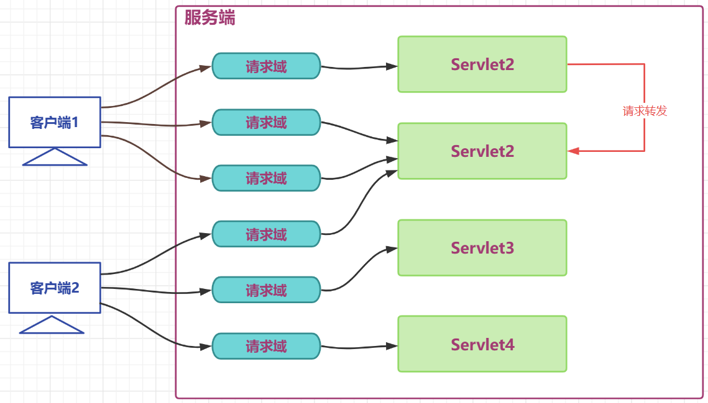

- Session scope

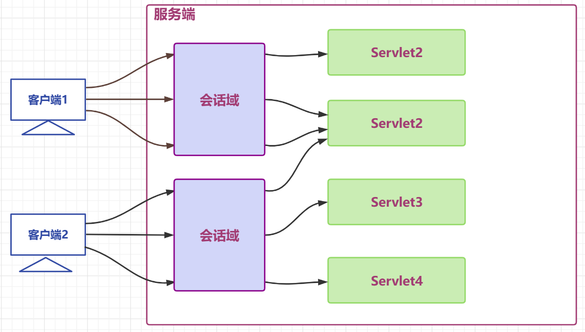

- Application scope

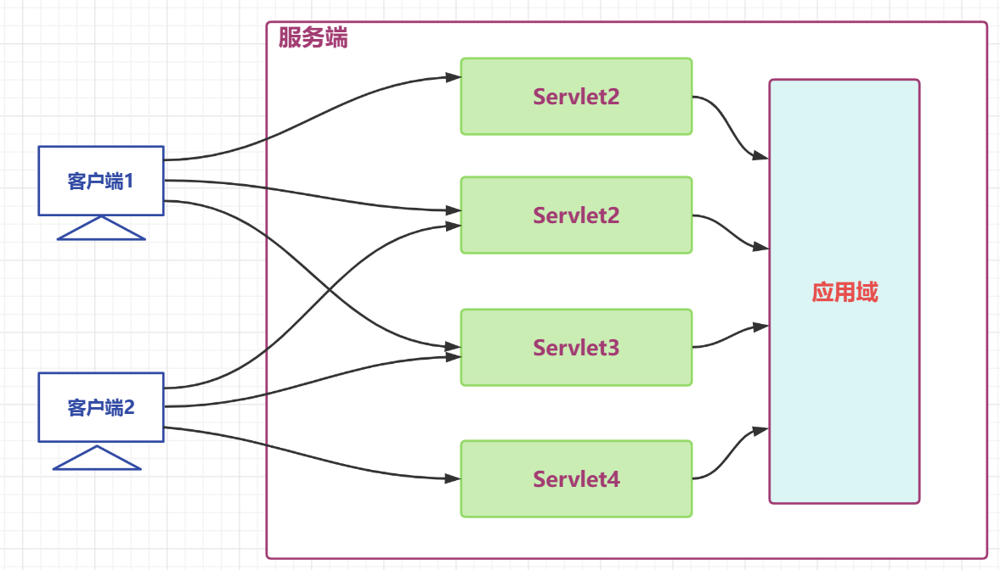

- All scopes together

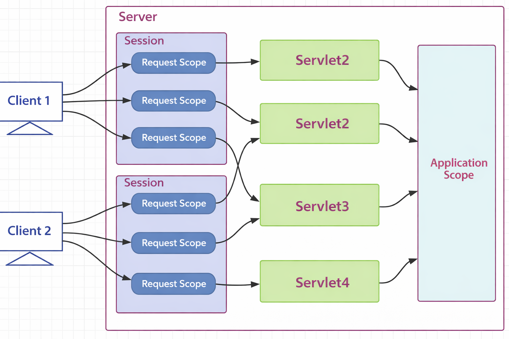
---

## **Classroom Speaking Script: Different Scopes in Java Web**

**Today, let’s use this diagram to understand the different scopes in Java Web.**
In Java Web, a *scope* means the range in which data can be stored and shared.
Different scopes allow data to be used in different places and for different lengths of time.

In this picture, we can see three important scopes:

* **Request Scope**
* **Session Scope**
* **Application Scope**

Now let’s explain them one by one.

---

### **1. Request Scope**

First, look at the small blue boxes labeled **Request Scope**.

A request scope belongs to **one single request**.
This means the data stored in request scope only lives during the current request-response process.

For example, when **Client 1** sends one request to the server, the server creates one request scope for that request.
If the same client sends another request later, that will be a **different request scope**.

So even if the requests come from the same client, their request scopes are still separate.

This is why in the diagram, we can see several request scopes under the same session.
Each request has its own request scope.

You can explain it to students like this:

**“Request scope is short-lived. It is only used for one request. After the request is finished, the data in request scope is usually gone.”**

Typical use of request scope:

* store query results for the current request
* store temporary data used for forwarding
* pass data between servlets or to a JSP page in the same request

So the key idea is:

**Request scope = data for one request only.**

---

### **2. Session Scope**

Next, look at the purple areas labeled **Session**.

A session scope belongs to **one client during one session**.
A session usually starts when the client first connects to the server and gets a session ID, and it continues across multiple requests.

For example, **Client 1** has one session, and inside that session there can be many different requests.
That is why in the diagram, Client 1 has several request scopes inside the same session area.

The same is true for **Client 2**.
Client 2 also has its own session, separate from Client 1.

This means:

* request scope is for one request
* session scope is for many requests from the same client

You can say:

**“Session scope is bigger than request scope. It can keep data across multiple requests from the same user.”**

Typical use of session scope:

* login status
* username
* shopping cart
* user preferences

For example, if a user logs in once, the login information can be stored in the session.
Then when the user opens another page, the server can still know who the user is.

So the key idea is:

**Session scope = data shared across multiple requests of the same client.**

---

### **3. Application Scope**

Now look at the large light-blue box on the right, labeled **Application Scope**.

Application scope is the **largest scope** in this diagram.
It belongs to the whole web application.

This means the data stored in application scope can be shared:

* across different requests
* across different sessions
* across different clients

In the diagram, we can see that different servlets, such as **Servlet2**, **Servlet3**, and **Servlet4**, can all connect to the application scope.

This tells us that application scope is shared by the whole application, not just one user.

You can explain it like this:

**“Application scope is global inside one web application. All users and all servlets in the same application can access it.”**

Typical use of application scope:

* global configuration
* shared counters
* application-wide objects
* framework containers, such as the Spring IoC container

So the key idea is:

**Application scope = data shared by the entire application.**

---

## **4. Comparing the Three Scopes**

Now let’s compare them together.

### **Request Scope**

* smallest scope
* exists for one request only
* cannot normally be shared across different requests

### **Session Scope**

* medium scope
* exists across multiple requests
* shared only within the same client session

### **Application Scope**

* largest scope
* exists for the whole application
* shared by all clients and all servlets

You can summarize to students like this:

**“Request scope is for one request, session scope is for one user across many requests, and application scope is for the whole application.”**

---

## **5. How to Understand the Diagram**

Let’s connect this explanation back to the picture.

* On the left, we have **Client 1** and **Client 2**.
* Each client can send multiple requests.
* Each request creates its own **request scope**.
* Multiple requests from the same client belong to the same **session scope**.
* Different servlets can handle those requests.
* And all servlets can access the shared **application scope**.

So this picture helps us see the hierarchy:

**Request Scope is inside Session Scope, and Application Scope is shared by the whole server application.**

---

## **6. Simple Real-Life Analogy**

Here is an easy way to explain it.

Imagine a school:

* **Request scope** is like a piece of paper used for one class activity. After the class ends, it is no longer used.
* **Session scope** is like one student’s folder. It can keep materials for that student across many classes.
* **Application scope** is like the school notice board. Everyone in the school can see and use it.

This analogy helps students remember the size of each scope.

---

## **7. Final Summary**

So, to conclude:

**This diagram shows the three main scopes in Java Web. Request scope is used for one request only. Session scope is used to share data across multiple requests from the same client. Application scope is used to share data across the entire web application. These different scopes help us decide where to store data depending on how long we want it to live and who should be able to access it.**


### 1.4.2 Using Scope Objects

> APIs of scope objects

| API | Function |
| ------------------------------------------- | ----------------------- |
| void setAttribute(String name,String value) | Add or modify data in the scope object |
| Object getAttribute(String name);           | Get data from the scope object      |
| removeAttribute(String name);               | Remove data from the scope object      |

> API test

- `ServletA` stores data in the three major scopes

```java
@WebServlet("/servletA")
public class ServletA extends HttpServlet {
    @Override
    protected void service(HttpServletRequest req, HttpServletResponse resp) throws ServletException, IOException {
        // Store data in the request scope
        req.setAttribute("request","request-message");
        //req.getRequestDispatcher("servletB").forward(req,resp);
        // Store data in the session scope
        HttpSession session = req.getSession();
        session.setAttribute("session","session-message");
        // Store data in the application scope
        ServletContext application = getServletContext();
        application.setAttribute("application","application-message");

    }
}
```

- `ServletB` retrieves data from the three major scopes

```java
@WebServlet("/servletB")
public class ServletB extends HttpServlet {
    @Override
    protected void service(HttpServletRequest req, HttpServletResponse resp) throws ServletException, IOException {
        // Get data from the request scope
        String reqMessage =(String)req.getAttribute("request");
        System.out.println(reqMessage);

        // Get data from the session scope
        HttpSession session = req.getSession();
        String sessionMessage =(String)session.getAttribute("session");
        System.out.println(sessionMessage);
        // Get data from the application scope
        ServletContext application = getServletContext();
        String applicationMessage =(String)application.getAttribute("application");
        System.out.println(applicationMessage);
    }
}
```

- During **request forwarding**, the request scope can transfer data.  
  `The request scope generally stores data related to the current request business, such as all queried department information.`

- Within the **same session**, even without request forwarding, the session scope can transfer data.  
  `The session scope generally stores data related to the current client in the current session, such as the currently logged-in user.`

- Within the **same application**, and across different clients, the application scope can transfer data.  
  `The application scope generally stores data related to the entire application, such as the IOC container in the Spring framework.`
