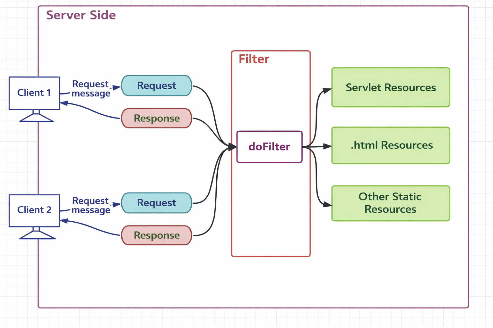
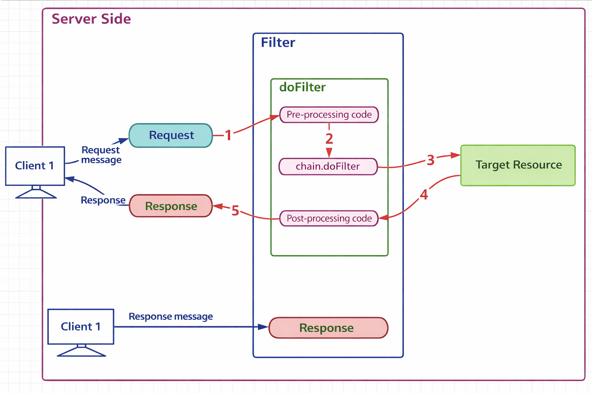
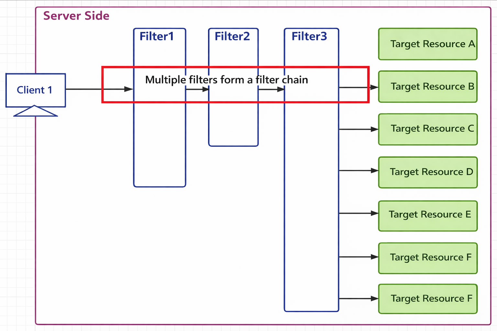
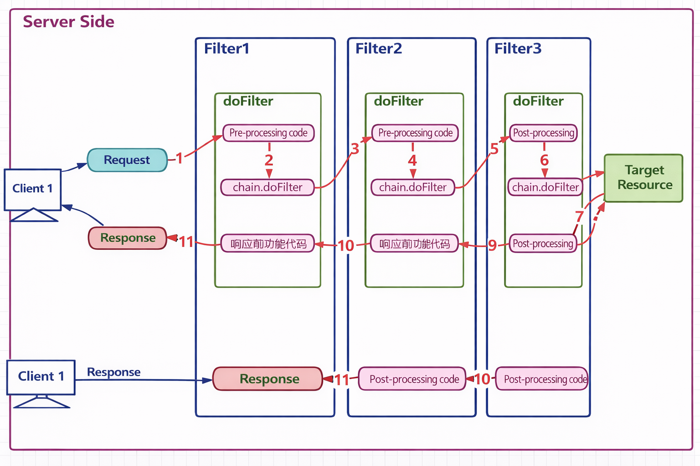

## Chapter 6 Session_Filter_Listener

## 2.1 Overview of Filters

> A Filter is one of the Java EE technical specifications. It is a set of technical rules used to filter requests to target resources, and it is one of the most practical technologies in Java Web projects.

- The `Filter` interface defines the development specification for filters. All filters must implement this interface.
- A filter works before all target resources in the project. After the container creates the `HttpServletRequest` and `HttpServletResponse` objects, it first calls the `doFilter` method of the filter.
- The `doFilter` method can control whether the request should continue. If it allows the request to pass, the request continues. If it rejects the request, the request ends there, and the filter itself generates the response.
- A filter can not only process requests, but can also process the response again before the target resource sends it back.
- A filter is a typical example of the Chain of Responsibility pattern in GOF.
- Common applications of filters include, but are not limited to: login permission checking, solving encoding problems, filtering sensitive characters, logging, and performance analysis.

> Real-life examples: company reception desk, parking lot security, subway ticket gate

- The company reception desk checks visitors. If a person is only a visitor, entry is denied. If the person is a client, entry is allowed. When the client leaves, the receptionist reminds the client not to forget personal belongings.
- The parking lot security guard controls incoming vehicles. If there is no parking space, entry is denied. If there is space, a parking card is issued and the vehicle is allowed in. When the vehicle leaves, the parking fee is collected.
- The subway ticket gate checks tickets before people enter. Without a ticket, entry is denied. With a valid ticket, the person is allowed in. When leaving, the ticket is also checked.

> Typical scenarios where filters are used

- Logging
- Performance analysis
- Character encoding handling
- Transaction control
- Login control
- Cross-origin handling
- ...

> Diagram of where a filter works



### Introduction

Please look at this diagram carefully. It shows how client requests travel through the server, how the filter works in the middle, and how the request is finally sent to different types of resources, such as **Servlet resources**, **HTML resources**, or **other static resources**.

A filter is an important part of Java Web development because it can **intercept**, **check**, and **process** requests before they reach the target resource. It can also process the response before it is sent back to the client.

---

## Part 1: What does this diagram show?

This diagram describes the general workflow of a web request on the **server side**.

On the left, we have **Client 1** and **Client 2**.
These clients may be browsers, mobile applications, or any other program that sends HTTP requests.

Each client sends a **request message** to the server.
The server receives that request and creates two important objects:

* a **Request** object, which contains the data sent by the client
* a **Response** object, which is used to send data back to the client

After that, the request does not always go directly to the target resource.
Instead, it may first pass through a **Filter**.

In the center of the diagram, we see the **Filter** and its core method: **doFilter**.

After the filter processes the request, the request may continue to:

* **Servlet Resources**
* **.html Resources**
* **Other Static Resources**

Finally, the result is returned through the **Response** object to the client.

---

## Part 2: What is a Filter?

A **Filter** is a server-side component in Java Web.

Its main purpose is to stand between the client and the target resource.

In simple words, we can say:

> A Filter is like a checkpoint, a guard, or a preprocessing station.

Before the request reaches the final destination, the filter can:

* inspect the request
* modify the request
* block the request
* allow the request to continue
* process the response before it goes back

So, a filter is not the final business logic itself.
Instead, it is a **common processing layer** placed before or after the real resource.

---

## Part 3: Meaning of each component in the figure

### 1. Client 1 / Client 2

These represent users or user programs.

For example, one client may request a login page, and another client may request a servlet for form submission.

The important point is that **many different clients** can send requests to the same server.

---

### 2. Request message

A request message is the data sent from the client to the server.

It may include:

* the URL
* the HTTP method, such as GET or POST
* form parameters
* headers
* cookies
* session information

For example, when a student submits a diary form, the form data is carried in the request.

---

### 3. Request object

On the server side, the request message is represented as a **Request object**.

In Java Web, this is usually `HttpServletRequest`.

This object allows the server program to read information such as:

* parameter values
* request path
* client IP
* request method

For example:

* `request.getParameter("title")`
* `request.getParameter("content")`

These methods are often used in Servlet programs, which is also part of your experiment requirements.

---

### 4. Response object

The response object is used by the server to send the result back to the client.

In Java Web, this is usually `HttpServletResponse`.

The response may contain:

* HTML page content
* text
* JSON data
* redirect information
* error messages

For example, after a form is submitted, the servlet may generate a result page and write it into the response.

---

### 5. Filter

The filter is the key topic here.

It sits between the client request and the target resource.

Its job is to perform **shared processing**.

This means that instead of writing the same checking code again and again in every servlet, we can place common logic inside a filter.

Typical uses of filters include:

* character encoding processing
* login checking
* permission checking
* request logging
* sensitive word filtering
* compression
* response modification

So filters improve both **code reuse** and **project structure**.

---

### 6. doFilter method

The **doFilter** method is the core method of a filter.

Whenever a matched request passes through the filter, this method is executed.

Inside `doFilter`, the filter can do three things:

1. process the request before it goes forward
2. decide whether the request should continue
3. process the response after the target resource finishes

This is why filters are often described as having a **before-and-after** effect.

You can think of it like this:

* before: check or prepare
* middle: let the request continue
* after: clean up or add extra processing

Usually, the filter lets the request continue by calling the filter chain.

If it does not call the chain, the request may be blocked.

---

## Part 4: Why can the filter connect to different resources?

On the right side of the figure, the filter can forward requests to different resource types:

* **Servlet Resources**
* **.html Resources**
* **Other Static Resources**

This tells us an important idea:

> A filter is not limited to only Servlets.

A filter can be configured to intercept different URL patterns, such as:

* only servlet requests
* only HTML pages
* all requests
* requests under a certain folder

For example:

* `/login`
* `/diary/*`
* `/*`

This makes filters very flexible.

---

## Part 5: Typical execution process

Now let us describe the whole process step by step.

### Step 1

A client sends an HTTP request to the server.

### Step 2

The server receives the request and creates the Request and Response objects.

### Step 3

The request matches the filter rule, so it enters the filter first.

### Step 4

The `doFilter` method runs.

At this moment, the filter may:

* check encoding
* verify login status
* print logs
* inspect parameters

### Step 5

If everything is fine, the filter allows the request to continue to the target resource.

This resource may be:

* a servlet
* an HTML page
* a static file

### Step 6

The target resource generates the result.

### Step 7

The response comes back through the filter again.

At this time, the filter may also process the response.

### Step 8

The server sends the final response back to the client.

---

## Part 6: A simple real-life analogy

To make this easier to understand, we can compare a filter to a **security checkpoint at an airport**.

* The **client** is the passenger.
* The **request** is the passenger’s travel action.
* The **filter** is the security checkpoint.
* The **target resource** is the boarding gate or the airplane.

Before the passenger reaches the gate, security checks happen first.

If everything is correct, the passenger can continue.

If something is wrong, the passenger is stopped.

This is very similar to a login filter in a web application.

If the user is not logged in, the filter may stop the request and send the user to a login page.

---

## Part 7: Common examples in Java Web projects

Here are some common examples of filters in real projects.

### 1. Encoding filter

Used to solve character encoding problems.

For example, it may set the request and response encoding to UTF-8.

This is especially important when processing form data, and your experiment document also emphasizes proper encoding settings.

### 2. Login filter

Used to check whether the user has logged in.

If not, the request is redirected to the login page.

### 3. Permission filter

Used to check whether the user has permission to access a resource.

For example, only an admin can open the management page.

### 4. Log filter

Used to record information such as:

* access time
* IP address
* requested URL
* execution result

### 5. Sensitive content filter

Used to replace or block improper words in input data.

---

## Part 8: Relationship between Filter and Servlet

Students often confuse filters and servlets, so this difference is very important.

A **Servlet** is used to handle the main business logic.

For example, a servlet may:

* receive form data
* validate input
* calculate results
* generate a response page

A **Filter** does not replace the servlet.

Instead, a filter provides **common preprocessing or postprocessing** around the servlet.

So their roles are different:

* **Servlet** = handles the core task
* **Filter** = provides shared interception and control

---

## Part 9: Why is Filter useful?

A filter is useful because it helps us write cleaner and more maintainable code.

Without a filter, every servlet may need to repeat the same code for:

* encoding settings
* login checks
* logging
* permission checking

That creates duplication.

With a filter, we write that common logic once and apply it to many requests.

So the advantages of filters are:

* better code reuse
* easier maintenance
* clearer structure
* centralized control

---

## Part 10: Conclusion

To conclude, this diagram shows the basic role of a filter in Java Web:

* Clients send requests to the server.
* The server creates Request and Response objects.
* The request passes through the Filter.
* The `doFilter` method performs interception and processing.
* The request then reaches the target resource.
* The final result is returned to the client.

So, the key idea is:

> A Filter is a reusable interception mechanism on the server side that processes requests and responses before or after they reach the target resource.

This makes Java Web applications more organized, secure, and easier to maintain.

---

> Filter interface API

- Source code

```java
package jakarta.servlet;
import java.io.IOException;

public interface Filter {
    default public void init(FilterConfig filterConfig) throws ServletException {
    }
    public void doFilter(ServletRequest request, ServletResponse response, FilterChain chain)
            throws IOException, ServletException;
    default public void destroy() {
    }
}
```

- API purposes

| API | Purpose |
| --- | --- |
| default public void init(FilterConfig filterConfig) | Initialization method. It is called by the container and receives the initial configuration information through the `FilterConfig` object. |
| public void doFilter(ServletRequest request, ServletResponse response, FilterChain chain) | Filtering method. This is the core method. It filters requests, decides whether to allow them to continue, and performs other processing before the response is sent. |
| default public void destroy() | Destruction method. It is called by the container before the filter object is recycled. |

## 2.2 Using Filters

> Goal: develop a logging filter

- Before the user's request reaches the target resource, record the request path.
- Before the response is returned, record the execution time of the target resource for this request.
- The log could be written into a file, but for easy testing, it is printed directly to the console here.

> Define a filter class and write the functional code

```java
package com.atguigu.filters;

import jakarta.servlet.*;
import jakarta.servlet.annotation.WebFilter;
import jakarta.servlet.http.HttpServletRequest;
import jakarta.servlet.http.HttpServletResponse;

import java.io.IOException;
import java.text.SimpleDateFormat;
import java.util.Date;
public class LoggingFilter implements Filter {

    private SimpleDateFormat dateFormat = new SimpleDateFormat("yyyy-MM-dd HH:mm:ss");

    @Override
    public void doFilter(ServletRequest servletRequest, ServletResponse servletResponse, FilterChain filterChain) throws IOException, ServletException {
        // Downcast the parent-type parameters to HTTP-specific child types
        HttpServletRequest request = (HttpServletRequest) servletRequest;
        HttpServletResponse response = (HttpServletResponse) servletResponse;

        // Build the log text
        String requestURI = request.getRequestURI();
        String time = dateFormat.format(new Date());
        String beforeLogging = requestURI + " was requested at " + time;

        // Print the log
        System.out.println(beforeLogging);

        // Get the system time
        long t1 = System.currentTimeMillis();

        // Let the request continue
        filterChain.doFilter(request, response);

        // Get the system time
        long t2 = System.currentTimeMillis();

        // Build the log text
        String afterLogging = requestURI + " requested at " + time + " took: " + (t2 - t1) + " milliseconds";

        // Print the log
        System.out.println(afterLogging);
    }
}
```

- Notes
  - The request and response objects in the `doFilter` method are declared as parent interfaces, but the actual arguments passed in are `HttpServletRequest` and `HttpServletResponse`, so they can be safely downcast.
  - The function of `filterChain.doFilter(request,response);` is to allow the request to continue. Without this line, the request stops there.
  - `filterChain.doFilter(request,response);` needs the request and response objects to continue passing them to the following resources, which means no new request or response objects are created here.

> Define two Servlets as target resources

- ServletA

```java
@WebServlet(urlPatterns = "/servletA", name = "servletAName")
public class ServletA extends HttpServlet {
    @Override
    protected void service(HttpServletRequest req, HttpServletResponse resp) throws ServletException, IOException {
        // Process the request
        System.out.println("ServletA request processing method, takes 10 milliseconds");

        // Simulate processing time
        try {
            Thread.sleep(10);
        } catch (InterruptedException e) {
            throw new RuntimeException(e);
        }
    }
}
```

- ServletB

```java
@WebServlet(urlPatterns = "/servletB", name = "servletBName")
public class ServletB extends HttpServlet {
    @Override
    protected void service(HttpServletRequest req, HttpServletResponse resp) throws ServletException, IOException {
        // Process the request
        System.out.println("ServletB request processing method, takes 15 milliseconds");

        // Simulate processing time
        try {
            Thread.sleep(15);
        } catch (InterruptedException e) {
            throw new RuntimeException(e);
        }
    }
}
```

> Configure the filter and the filtering scope

- `web.xml`

```xml
<?xml version="1.0" encoding="UTF-8"?>
<web-app xmlns="https://jakarta.ee/xml/ns/jakartaee"
         xmlns:xsi="http://www.w3.org/2001/XMLSchema-instance"
         xsi:schemaLocation="https://jakarta.ee/xml/ns/jakartaee https://jakarta.ee/xml/ns/jakartaee/web-app_5_0.xsd"
         version="5.0">

    <!-- Configure the filter and assign an alias -->
    <filter>
        <filter-name>loggingFilter</filter-name>
        <filter-class>com.atguigu.filters.LoggingFilter</filter-class>
    </filter>

    <!-- Configure the target resources to be filtered for the filter alias -->
    <filter-mapping>
        <filter-name>loggingFilter</filter-name>

        <!-- Determine filtered resources by mapped path -->
        <url-pattern>/servletA</url-pattern>

        <!-- Determine filtered resources by suffix -->
        <url-pattern>*.html</url-pattern>

        <!-- Determine filtered resources by servlet alias -->
        <servlet-name>servletBName</servlet-name>
    </filter-mapping>
</web-app>
```

- Notes
  - The `filter-mapping` tag defines which resources the filter will filter.
  - The child tag `url-pattern` determines the filtering scope by mapped path.
    - `/servletA` means exact matching and filters requests to the `servletA` resource.
    - `*.html` means filtering paths ending with `.html`.
    - `/*` means filtering all resources.
    - Multiple `url-pattern` tags can be configured under one `filter-mapping`.
  - The child tag `servlet-name` determines which servlets are filtered based on servlet aliases.
    - To use this tag, the servlet must already have an alias.
    - Multiple `servlet-name` tags can be defined under one `filter-mapping`.
    - Under one `filter-mapping`, `servlet-name` and `url-pattern` can exist at the same time.

> Diagram of the filtering process



---

## Explanation of the Diagram: How a Filter Works in Java Web

This diagram shows the **working process of a Filter** on the **server side** in a Java Web application.

On the left, we can see the **client**.
The client sends a **request message** to the server, and later receives a **response message** from the server.

In the middle, we have the **Filter**, and inside the filter there is the most important method: **doFilter**.

On the right, we have the **target resource**.
This target resource may be a Servlet, a JSP page, an HTML page, or another web resource.

The main purpose of this diagram is to show that a Filter works like an **interceptor**.
It stands between the client and the target resource, and it can process the request **before** the request reaches the target resource, and it can also process the response **before** the response is sent back to the client.

---

## Step-by-step explanation of the numbered flow

### Step 1: The request enters the Filter

First, the client sends a request to the server.

This request does not go directly to the target resource.
Instead, it first enters the **Filter**.

That is why arrow **1** points from the **Request** object to the filter area.

At this stage, the filter gets a chance to examine the request.
For example, it can check:

* whether the user has logged in
* whether the request encoding is correct
* whether the request contains illegal data
* whether access permission is allowed

So at this point, the filter performs the **pre-processing** work.

---

### Step 2: Execute pre-processing code, then call `chain.doFilter()`

Inside the `doFilter` method, the first part is the **pre-processing code**.

This is the code executed **before** the target resource runs.

After that, the filter calls:

```java
chain.doFilter(request, response);
```

This line is extremely important.

It means:

> “The filter has finished its preliminary work, and now the request can continue to the next resource.”

If this line is **not called**, the request will stop inside the filter and will **not** reach the target resource.

So `chain.doFilter()` is the key step that allows the request to move forward.

---

### Step 3: The request reaches the target resource

After `chain.doFilter()` is called, the request continues to the **target resource**.

This is shown by arrow **3**.

The target resource may be:

* a Servlet
* a JSP page
* an HTML file
* another protected resource

This target resource performs the main business logic.

For example, in a diary application, the servlet may:

* receive the title, author, and content
* validate the form data
* generate an HTML result page

This matches the kind of request-processing-response workflow required in your experiment.

---

### Step 4: Control returns from the target resource to the Filter

After the target resource finishes processing, control comes back to the filter again.

This is shown by arrow **4**.

Now the code **after** `chain.doFilter()` begins to run.

This part is called the **post-processing code**.

So the filter is special because it can work in two stages:

* before the target resource
* after the target resource

That is why a filter is often described as surrounding the target resource.

---

### Step 5: The response leaves the Filter and returns to the client

Finally, after the post-processing code is completed, the response is sent back to the client.

This is shown by arrow **5**.

At this point, the client receives the final response message.

So the full path is:

* client sends request
* filter intercepts request
* target resource processes request
* filter processes response
* client receives response

---

## Core idea of this diagram

The most important idea shown here is:

> A Filter can process both the incoming request and the outgoing response.

This means the filter is not only a “gate” before the resource, but also a “checkpoint” after the resource.

Because of this feature, filters are very useful for tasks that should be applied to many resources in a unified way.

---

## What can the pre-processing code do?

The **pre-processing code** can be used for many common tasks, such as:

* setting character encoding
* checking login status
* checking user permissions
* recording access logs
* filtering illegal parameters
* timing the request

For example, if a user is not logged in, the filter can stop the request and redirect the user to the login page.

---

## What can the post-processing code do?

The **post-processing code** runs after the target resource has finished.

It can be used for tasks such as:

* adding response headers
* logging the processing result
* measuring execution time
* modifying the response content
* releasing resources

So the filter can control not only what goes in, but also what comes out.

---

## Why is `doFilter()` important?

The `doFilter()` method is the core of the whole filter mechanism.

It usually has three important parts:

1. code before `chain.doFilter()`
2. the call to `chain.doFilter()`
3. code after `chain.doFilter()`

Its structure is often understood like this:

```java
public void doFilter(ServletRequest request, ServletResponse response, FilterChain chain) {
    // pre-processing code

    chain.doFilter(request, response);

    // post-processing code
}
```

So this diagram is a visual explanation of this exact structure.

---

## A simple analogy

You can explain this to students with a very simple analogy:

A filter is like a **security checkpoint** at the entrance of a building.

* The **client** is the visitor.
* The **request** is the visitor’s attempt to enter.
* The **filter** is the security check.
* The **target resource** is the office inside the building.
* The **response** is the result that comes back to the visitor.

Before entering, the visitor is checked.
After leaving, there may also be another check or record.

This is exactly how a filter works.

---

## 2.3 Filter Lifecycle

> A filter is one of the components in a web project. Its lifecycle is similar to that of a Servlet, but slightly different. There is no `load-on-startup` configuration for filters. By default, they are constructed immediately when the system starts.

| Stage | Corresponding Method | Execution Time | Number of Executions |
| --- | --- | --- | --- |
| Object creation | Constructor | When the web application starts | 1 |
| Initialization method | void init(FilterConfig filterConfig) | After construction | 1 |
| Filtering requests | void doFilter(ServletRequest servletRequest, ServletResponse servletResponse, FilterChain filterChain) | Every request | Multiple times |
| Destruction | default void destroy() | When the web application closes | 1 |

> Test code

```java
package com.atguigu.filters;

import jakarta.servlet.*;
import jakarta.servlet.annotation.WebServlet;

import java.io.IOException;

@WebServlet("/*")
public class LifeCycleFilter implements Filter {
    public LifeCycleFilter() {
        System.out.println("LifeCycleFilter constructor method invoked");
    }

    @Override
    public void init(FilterConfig filterConfig) throws ServletException {
        System.out.println("LifeCycleFilter init method invoked");
    }

    @Override
    public void doFilter(ServletRequest servletRequest, ServletResponse servletResponse, FilterChain filterChain) throws IOException, ServletException {
        System.out.println("LifeCycleFilter doFilter method invoked");
        filterChain.doFilter(servletRequest, servletResponse);
    }

    @Override
    public void destroy() {
        System.out.println("LifeCycleFilter destory method invoked");
    }
}
```

## 2.4 Using the Filter Chain

> In one web project, multiple filters can be defined at the same time. When multiple filters filter the same resource, they have an execution order and together form a working chain called the filter chain.

- The order of filters in the filter chain is determined by the order of `filter-mapping`.
- Different filters may have different filtering scopes, so for the same resource, the number of filters in the chain may be different.
- If a filter uses `ServletName` as its matching rule, then its execution priority is lower.

> Diagram of the filter chain



---

## Explanation of the Diagram: Filter Chain in Java Web

This diagram shows how **multiple filters** work together in a Java Web application.

On the left side, we have **Client 1**.
The client sends a request to the server.

Inside the server, the request does not go directly to the target resource.
Instead, it passes through several filters: **Filter1**, **Filter2**, and **Filter3**.

These filters are connected one after another, so together they form a **filter chain**.

After the request passes through the filter chain, it reaches the final **target resource**, such as Target Resource A, B, C, D, E, or F.

So, the main idea of this diagram is:

> Multiple filters can be arranged in order, and together they form a filter chain that processes the request before it reaches the target resource.

---

## What is a filter chain?

A **filter chain** means that more than one filter is applied to the same request.

Instead of using only one filter, the server can configure several filters, and each filter performs one part of the work.

For example:

* one filter handles encoding
* one filter checks login status
* one filter records logs
* one filter checks permissions

In this way, each filter has its own responsibility, and all of them work together in sequence.

This makes the program cleaner and easier to maintain.

---

## Explanation of each part in the diagram

### 1. Client 1

This is the user or the browser.

The client sends an HTTP request to the server, for example:

* opening a page
* submitting a form
* accessing a servlet
* requesting a protected resource

---

### 2. Filter1, Filter2, Filter3

These are three different filters.

They are placed one after another in front of the target resource.

This means the request must pass through:

* Filter1 first
* then Filter2
* then Filter3

Only after that can it reach the target resource.

Each filter can do a different job.

For example:

* **Filter1** may set character encoding
* **Filter2** may check whether the user is logged in
* **Filter3** may record access logs

So each filter focuses on one task, and together they provide complete request processing.

---

### 3. “Multiple filters form a filter chain”

The red box in the middle highlights the most important message in this diagram:

> Multiple filters form a filter chain.

This means the filters do not work independently.
They work as a connected sequence.

When one filter finishes its work, it passes the request to the next filter.

This continues until the request reaches the target resource.

---

### 4. Target Resource A to F

On the right side, we see several target resources.

These represent the final destinations of the request.

A target resource may be:

* a Servlet
* a JSP page
* an HTML page
* another web component

The diagram shows that the filter chain can stand in front of many different resources.

This means one filter chain can protect or process multiple resources, depending on the URL mapping.

---

## How does the request move through the filter chain?

The request processing flow can be described step by step like this:

### Step 1

The client sends a request to the server.

### Step 2

The request first enters **Filter1**.

### Step 3

After Filter1 finishes its work, it passes the request to **Filter2**.

### Step 4

After Filter2 finishes, it passes the request to **Filter3**.

### Step 5

After Filter3 finishes, the request reaches the **target resource**.

### Step 6

The target resource processes the request and generates a response.

### Step 7

The response can then return back through the filters in reverse order.

Finally, the response is sent back to the client.

So the filters work like a processing pipeline.

---

## Why do we use multiple filters instead of one big filter?

This is an important question.

We use multiple filters because it is better to separate different tasks.

If one filter does everything, the code becomes too long and difficult to manage.

But if we divide the work into several filters, then:

* each filter has one clear responsibility
* the code is easier to understand
* the code is easier to reuse
* the system is easier to maintain

This design follows a very important programming idea:

> One component should do one main job.

---

## A simple real-life analogy

You can explain this with an everyday example.

A filter chain is like passing through several checkpoints in an airport.

For example:

* the first checkpoint checks your ticket
* the second checkpoint checks your passport
* the third checkpoint checks your luggage

Only after passing all checkpoints can you enter the boarding gate.

This is very similar to a request passing through Filter1, Filter2, and Filter3 before reaching the target resource.

---

## Common examples of filters in a filter chain

In real Java Web projects, a filter chain may include filters like these:

### Encoding Filter

Used to set request and response encoding, such as UTF-8.

### Login Filter

Used to check whether the user has logged in.

### Permission Filter

Used to check whether the user has the right to access a certain page.

### Log Filter

Used to record who accessed which resource and when.

### Security Filter

Used to detect illegal requests or unsafe input.

Each filter handles one concern, and together they form a complete control mechanism.

---

## Relationship with Servlet processing

This diagram is closely related to Servlet-based web development.

In your experiment, students need to:

* receive request parameters
* process submitted data
* generate a response page

These are usually done by a **Servlet**.

But before the request reaches the Servlet, it may first pass through a filter chain.

So the relationship is:

* **Filters** handle common pre-processing and control
* **Servlets** handle the main business logic

This division makes the web application more organized.

---

> Functional test of the filter chain

- Define three filters to filter requests to the target Servlet resource.

- Target Servlet resource code

```java
package com.atguigu.servlet;

import jakarta.servlet.ServletException;
import jakarta.servlet.annotation.WebServlet;
import jakarta.servlet.http.HttpServlet;
import jakarta.servlet.http.HttpServletRequest;
import jakarta.servlet.http.HttpServletResponse;

import java.io.IOException;

@WebServlet("/servletC")
public class ServletC extends HttpServlet {
    @Override
    protected void service(HttpServletRequest req, HttpServletResponse resp) throws ServletException, IOException {
        System.out.println("servletC service method invoked");
    }
}
```

- Three filter classes

```java
public class Filter1 implements Filter {
    @Override
    public void doFilter(ServletRequest servletRequest, ServletResponse servletResponse, FilterChain filterChain) throws IOException, ServletException {
        System.out.println("filter1 before chain.doFilter code invoked");

        filterChain.doFilter(servletRequest, servletResponse);

        System.out.println("filter1 after chain.doFilter code invoked");
    }
}

public class Filter2 implements Filter {
    @Override
    public void doFilter(ServletRequest servletRequest, ServletResponse servletResponse, FilterChain filterChain) throws IOException, ServletException {
        System.out.println("filter2 before chain.doFilter code invoked");

        filterChain.doFilter(servletRequest, servletResponse);

        System.out.println("filter2 after chain.doFilter code invoked");
    }
}

public class Filter3 implements Filter {
    @Override
    public void doFilter(ServletRequest servletRequest, ServletResponse servletResponse, FilterChain filterChain) throws IOException, ServletException {
        System.out.println("filter3 before chain.doFilter code invoked");

        filterChain.doFilter(servletRequest, servletResponse);

        System.out.println("filter3 after chain.doFilter code invoked");
    }
}
```

- Filter configuration code

```xml
<?xml version="1.0" encoding="UTF-8"?>
<web-app xmlns="https://jakarta.ee/xml/ns/jakartaee"
         xmlns:xsi="http://www.w3.org/2001/XMLSchema-instance"
         xsi:schemaLocation="https://jakarta.ee/xml/ns/jakartaee https://jakarta.ee/xml/ns/jakartaee/web-app_5_0.xsd"
         version="5.0">
    <filter>
        <filter-name>filter1</filter-name>
        <filter-class>com.atguigu.filters.Filter1</filter-class>
    </filter>

    <filter>
        <filter-name>filter2</filter-name>
        <filter-class>com.atguigu.filters.Filter2</filter-class>
    </filter>

    <filter>
        <filter-name>filter3</filter-name>
        <filter-class>com.atguigu.filters.Filter3</filter-class>
    </filter>

    <!-- The order of filter-mapping determines the working order of filters -->
    <filter-mapping>
        <filter-name>filter1</filter-name>
        <url-pattern>/servletC</url-pattern>
    </filter-mapping>

    <filter-mapping>
        <filter-name>filter2</filter-name>
        <url-pattern>/servletC</url-pattern>
    </filter-mapping>

    <filter-mapping>
        <filter-name>filter3</filter-name>
        <url-pattern>/servletC</url-pattern>
    </filter-mapping>
</web-app>
```

> Workflow diagram



## Explanation of the Diagram: Full Execution Process of a Filter Chain

This diagram shows the **complete execution process of a filter chain** in a Java Web application.

On the left side, we have **Client 1**.
The client sends a **request** to the server.

Inside the server, the request passes through **Filter1**, **Filter2**, and **Filter3** one by one.
Each filter has its own `doFilter()` method.

Inside each `doFilter()` method, there are usually three parts:

* **pre-processing code**
* `chain.doFilter()`
* **post-processing code**

After the request passes through all the filters, it reaches the **target resource**.

Then, after the target resource finishes its work, the response does not go directly back to the client.
Instead, it returns through the filters in the **reverse order**.

Finally, the response is sent back to the client.

So this diagram explains not only the **forward path of the request**, but also the **return path of the response**.

---

## Main idea of this diagram

The key point is this:

> In a filter chain, the request moves forward through the filters in order, while the response returns backward through the filters in reverse order.

This is why filters can do work both:

* **before** the target resource runs
* **after** the target resource finishes

That is the most important concept shown in this figure.

---

## Step-by-step explanation of the numbered process

### Step 1

The client sends a **request** to the server.

The request first enters **Filter1**.

---

### Step 2

Inside **Filter1**, the server executes the **pre-processing code**.

This may include:

* setting encoding
* checking login
* printing logs
* validating some request information

After that, `chain.doFilter()` is called, so the request continues to the next filter.

---

### Step 3

The request moves from **Filter1** to **Filter2**.

---

### Step 4

Inside **Filter2**, the **pre-processing code** runs first.

Then `chain.doFilter()` is called again, allowing the request to continue.

---

### Step 5

The request moves from **Filter2** to **Filter3**.

---

### Step 6

Inside **Filter3**, the **pre-processing code** is executed.

Then `chain.doFilter()` is called once more.

---

### Step 7

After passing through all three filters, the request finally reaches the **target resource**.

This target resource may be:

* a Servlet
* a JSP page
* an HTML page
* another web component

In a Java Web project, this resource usually performs the main business logic, such as receiving parameters, processing form data, and generating the response page. That matches the request-processing-response workflow emphasized in your experiment.

---

### Step 8

After the target resource finishes processing, control returns from the target resource back to **Filter3**.

Now the code **after** `chain.doFilter()` in Filter3 starts to run.

This is the **post-processing code**.

So Filter3 now handles the outgoing response.

---

### Step 9

After Filter3 finishes its post-processing work, the response moves back to **Filter2**.

Now Filter2 executes its **post-processing code**.

---

### Step 10

Then the response moves back to **Filter1**.

Now Filter1 executes its **post-processing code**.

---

### Step 11

Finally, after all filters have completed their post-processing work, the **response** is sent back to the client.

So the entire process is complete.

---

## Why does the response return in reverse order?

This is a very important point for students.

The request enters the filters in this order:

* Filter1
* Filter2
* Filter3
* Target Resource

But the response returns in the opposite order:

* Target Resource
* Filter3
* Filter2
* Filter1
* Client

This happens because each filter surrounds the next step in the chain.

It is similar to nested layers.

So each filter performs:

* pre-processing before passing the request forward
* post-processing after the next component finishes

That is why filters behave like layers around the target resource.

---

## Simple example to help students understand

You can explain it like this:

Imagine three security checkpoints before entering a special room.

* At the first checkpoint, your ID is checked.
* At the second checkpoint, your bag is checked.
* At the third checkpoint, your ticket is checked.

After that, you enter the room.

When you leave the room, you pass back through the checkpoints in the opposite order.

This is exactly how the filter chain works.

The request goes in step by step, and the response comes back step by step in reverse order.

---

## What can each filter do?

Each filter may have a different responsibility.

For example:

### Filter1

May handle **encoding settings**

### Filter2

May handle **login verification**

### Filter3

May handle **access logging**

This design is useful because each filter focuses on one task only.

That makes the code:

* easier to understand
* easier to reuse
* easier to maintain

---

## Why is `chain.doFilter()` so important?

`chain.doFilter()` is the key instruction that passes control to the next filter or to the target resource.

If a filter does **not** call `chain.doFilter()`, then the request stops there.

That means:

* the next filter will not run
* the target resource will not be reached
* the response may be blocked or replaced

So `chain.doFilter()` is what allows the chain to continue.

---

## The structure of each filter

Each filter usually follows this logic:

```java id="26q7f4"
public void doFilter(ServletRequest request, ServletResponse response, FilterChain chain) {
    // pre-processing code

    chain.doFilter(request, response);

    // post-processing code
}
```

This diagram is basically a visual expansion of that structure across three filters.

---

## 2.5 Configuring Filters with Annotations

> Using the `@WebFilter` annotation

- Source code

```java
package jakarta.servlet.annotation;

import jakarta.servlet.DispatcherType;
import java.lang.annotation.Documented;
import java.lang.annotation.ElementType;
import java.lang.annotation.Retention;
import java.lang.annotation.RetentionPolicy;
import java.lang.annotation.Target;

@Target({ElementType.TYPE})
@Retention(RetentionPolicy.RUNTIME)
@Documented
public @interface WebFilter {
    String description() default "";

    String displayName() default "";

    WebInitParam[] initParams() default {};

    String filterName() default "";

    String smallIcon() default "";

    String largeIcon() default "";

    String[] servletNames() default {};

    String[] value() default {};

    String[] urlPatterns() default {};

    DispatcherType[] dispatcherTypes() default {DispatcherType.REQUEST};

    boolean asyncSupported() default false;
}
```

- A relatively complete XML configuration of a Filter

```xml
<!-- Configure the filter and assign an alias -->
<filter>
    <filter-name>loggingFilter</filter-name>
    <filter-class>com.atguigu.filters.LoggingFilter</filter-class>

    <!-- Configure the initial parameters of the filter -->
    <init-param>
        <param-name>dateTimePattern</param-name>
        <param-value>yyyy-MM-dd HH:mm:ss</param-value>
    </init-param>
</filter>

<!-- Configure the target resources to be filtered for the filter alias -->
<filter-mapping>
    <filter-name>loggingFilter</filter-name>

    <!-- Determine filtered resources by mapped path -->
    <url-pattern>/servletA</url-pattern>

    <!-- Determine filtered resources by suffix -->
    <url-pattern>*.html</url-pattern>

    <!-- Determine filtered resources by servlet alias -->
    <servlet-name>servletBName</servlet-name>
</filter-mapping>
```

- Convert the XML configuration into annotation-based implementation

```java
package com.atguigu.filters;

import jakarta.servlet.*;
import jakarta.servlet.annotation.WebFilter;
import jakarta.servlet.annotation.WebInitParam;
import jakarta.servlet.http.HttpServletRequest;
import jakarta.servlet.http.HttpServletResponse;

import java.io.IOException;
import java.text.SimpleDateFormat;
import java.util.Date;

@WebFilter(
        filterName = "loggingFilter",
        initParams = {@WebInitParam(name="dateTimePattern", value="yyyy-MM-dd HH:mm:ss")},
        urlPatterns = {"/servletA", "*.html"},
        servletNames = {"servletBName"}
)
public class LoggingFilter implements Filter {
    private SimpleDateFormat dateFormat;

    /* init initialization method, uses filterConfig to get the initialization parameters
     * The init method can also be used to define other initialization code
     */
    @Override
    public void init(FilterConfig filterConfig) throws ServletException {
        // Get the initialization parameter
        String dateTimePattern = filterConfig.getInitParameter("dateTimePattern");

        // Initialize the member variable
        dateFormat = new SimpleDateFormat(dateTimePattern);
    }

    @Override
    public void doFilter(ServletRequest servletRequest, ServletResponse servletResponse, FilterChain filterChain) throws IOException, ServletException {
        // Downcast the parent-type parameters to HTTP-specific child types
        HttpServletRequest request = (HttpServletRequest) servletRequest;
        HttpServletResponse response = (HttpServletResponse) servletResponse;

        // Build the log text
        String requestURI = request.getRequestURI();
        String time = dateFormat.format(new Date());
        String beforeLogging = requestURI + " was requested at " + time;

        // Print the log
        System.out.println(beforeLogging);

        // Get the system time
        long t1 = System.currentTimeMillis();

        // Let the request continue
        filterChain.doFilter(request, response);

        // Get the system time
        long t2 = System.currentTimeMillis();

        String afterLogging = requestURI + " requested at " + time + " took: " + (t2 - t1) + " milliseconds";

        // Print the log
        System.out.println(afterLogging);
    }
}
```

# 3 Listeners

## 3.1 Overview of Listeners

> A listener is an object specially used to listen to events or state changes that happen on scope objects and perform corresponding processing.

- A listener is a typical example of the Observer pattern in GOF.
- Observer pattern: when the observed object changes in some way, the observer automatically takes corresponding action.

- The experience of using listeners is similar to events in JavaScript. When something happens to the observed object, the code is automatically triggered.
- Listeners do not monitor all components in a web project. They only monitor events related to the three scope objects.

> Classification of listeners

- Eight listener interfaces are defined in web applications as the listener specification. These eight interfaces can be classified in different ways according to different standards.

- Classified by monitored object
  - application scope listeners: `ServletContextListener`, `ServletContextAttributeListener`
  - session scope listeners: `HttpSessionListener`, `HttpSessionAttributeListener`, `HttpSessionBindingListener`, `HttpSessionActivationListener`
  - request scope listeners: `ServletRequestListener`, `ServletRequestAttributeListener`

- Classified by monitored event
  - creation and destruction listeners of scope objects: `ServletContextListener`, `HttpSessionListener`, `ServletRequestListener`
  - add/remove/replace attribute listeners of scope objects: `ServletContextAttributeListener`, `HttpSessionAttributeListener`, `ServletRequestAttributeListener`
  - other listeners: `HttpSessionBindingListener`, `HttpSessionActivationListener`

## 3.2 Six Main Listener Interfaces

### 3.2.1 application scope listeners

> `ServletContextListener` listens to the creation and destruction of the `ServletContext` object.

| Method Name | Function |
| --- | --- |
| contextInitialized(ServletContextEvent sce) | Called when `ServletContext` is created |
| contextDestroyed(ServletContextEvent sce) | Called when `ServletContext` is destroyed |

- The `ServletContextEvent` object represents an event captured from the `ServletContext` object. Through this event object, we can obtain the `ServletContext` object.

> `ServletContextAttributeListener` listens to the addition, removal, and modification of attributes in `ServletContext`.

| Method Name | Function |
| --- | --- |
| attributeAdded(ServletContextAttributeEvent scab) | Called when an attribute is added to `ServletContext` |
| attributeRemoved(ServletContextAttributeEvent scab) | Called when an attribute is removed from `ServletContext` |
| attributeReplaced(ServletContextAttributeEvent scab) | Called when an attribute in `ServletContext` is modified |

- The `ServletContextAttributeEvent` object represents an attribute change event. It contains the following methods:

| Method Name | Function |
| --- | --- |
| getName() | Get the name of the modified or added attribute |
| getValue() | Get the value of the modified or added attribute |
| getServletContext() | Get the `ServletContext` object |

> Test code

- Define the listener

```java
package com.atguigu.listeners;

import jakarta.servlet.*;
import jakarta.servlet.annotation.WebListener;

@WebListener
public class ApplicationListener implements ServletContextListener, ServletContextAttributeListener {
    // Listen for initialization
    @Override
    public void contextInitialized(ServletContextEvent sce) {
        ServletContext application = sce.getServletContext();
        System.out.println("application" + application.hashCode() + " initialized");
    }

    // Listen for destruction
    @Override
    public void contextDestroyed(ServletContextEvent sce) {
        ServletContext application = sce.getServletContext();
        System.out.println("application" + application.hashCode() + " destroyed");
    }

    // Listen for attribute addition
    @Override
    public void attributeAdded(ServletContextAttributeEvent scae) {
        String name = scae.getName();
        Object value = scae.getValue();
        ServletContext application = scae.getServletContext();
        System.out.println("application" + application.hashCode() + " add:" + name + "=" + value);
    }

    // Listen for attribute removal
    @Override
    public void attributeRemoved(ServletContextAttributeEvent scae) {
        String name = scae.getName();
        Object value = scae.getValue();
        ServletContext application = scae.getServletContext();
        System.out.println("application" + application.hashCode() + " remove:" + name + "=" + value);
    }

    // Listen for attribute modification
    @Override
    public void attributeReplaced(ServletContextAttributeEvent scae) {
        String name = scae.getName();
        Object value = scae.getValue();
        ServletContext application = scae.getServletContext();
        Object newValue = application.getAttribute(name);
        System.out.println("application" + application.hashCode() + " change:" + name + "=" + value + " to " + newValue);
    }
}
```

- Define the code that triggers the listener

```java
// ServletA is used to put data into the application scope
@WebServlet(urlPatterns = "/servletA", name = "servletAName")
public class ServletA extends HttpServlet {
    @Override
    protected void service(HttpServletRequest req, HttpServletResponse resp) throws ServletException, IOException {
        // Put data into the application scope
        ServletContext application = this.getServletContext();
        application.setAttribute("k1", "v1");
        application.setAttribute("k2", "v2");
    }
}

// ServletB is used to modify and remove data from the application scope
@WebServlet(urlPatterns = "/servletB", name = "servletBName")
public class ServletB extends HttpServlet {
    @Override
    protected void service(HttpServletRequest req, HttpServletResponse resp) throws ServletException, IOException {
        ServletContext appliation = getServletContext();

        // Modify data in the application scope
        appliation.setAttribute("k1", "value1");

        // Remove data from the application scope
        appliation.removeAttribute("k2");
    }
}
```

### 3.2.2 session scope listeners

> `HttpSessionListener` listens to the creation and destruction of `HttpSession` objects.

| Method Name | Function |
| --- | --- |
| sessionCreated(HttpSessionEvent hse) | Called when an `HttpSession` object is created |
| sessionDestroyed(HttpSessionEvent hse) | Called when an `HttpSession` object is destroyed |

- The `HttpSessionEvent` object represents an event captured from the `HttpSession` object. Through this event object, we can obtain the `HttpSession` object that triggered the event.

> `HttpSessionAttributeListener` listens to the addition, removal, and modification of attributes in `HttpSession`.

| Method Name | Function |
| --- | --- |
| attributeAdded(HttpSessionBindingEvent se) | Called when an attribute is added to `HttpSession` |
| attributeRemoved(HttpSessionBindingEvent se) | Called when an attribute is removed from `HttpSession` |
| attributeReplaced(HttpSessionBindingEvent se) | Called when an attribute in `HttpSession` is modified |

- The `HttpSessionBindingEvent` object represents an attribute change event. It contains the following methods:

| Method Name | Function |
| --- | --- |
| getName() | Get the name of the modified or added attribute |
| getValue() | Get the value of the modified or added attribute |
| getSession() | Get the `HttpSession` object that triggered the event |

> Test code

- Define the listener

```java
package com.atguigu.listeners;

import jakarta.servlet.*;
import jakarta.servlet.annotation.WebListener;
import jakarta.servlet.http.*;

@WebListener
public class SessionListener implements HttpSessionListener, HttpSessionAttributeListener {
    // Listen for session creation
    @Override
    public void sessionCreated(HttpSessionEvent se) {
        HttpSession session = se.getSession();
        System.out.println("session" + session.hashCode() + " created");
    }

    // Listen for session destruction
    @Override
    public void sessionDestroyed(HttpSessionEvent se) {
        HttpSession session = se.getSession();
        System.out.println("session" + session.hashCode() + " destroyed");
    }

    // Listen for attribute addition
    @Override
    public void attributeAdded(HttpSessionBindingEvent se) {
        String name = se.getName();
        Object value = se.getValue();
        HttpSession session = se.getSession();
        System.out.println("session" + session.hashCode() + " add:" + name + "=" + value);
    }

    // Listen for attribute removal
    @Override
    public void attributeRemoved(HttpSessionBindingEvent se) {
        String name = se.getName();
        Object value = se.getValue();
        HttpSession session = se.getSession();
        System.out.println("session" + session.hashCode() + " remove:" + name + "=" + value);
    }

    // Listen for attribute modification
    @Override
    public void attributeReplaced(HttpSessionBindingEvent se) {
        String name = se.getName();
        Object value = se.getValue();
        HttpSession session = se.getSession();
        Object newValue = session.getAttribute(name);
        System.out.println("session" + session.hashCode() + " change:" + name + "=" + value + " to " + newValue);
    }
}
```

- Define the code that triggers the listener

```java
// servletA is used to create a session and put data into it
@WebServlet(urlPatterns = "/servletA", name = "servletAName")
public class ServletA extends HttpServlet {
    @Override
    protected void service(HttpServletRequest req, HttpServletResponse resp) throws ServletException, IOException {
        // Create a session and put data into it
        HttpSession session = req.getSession();

        session.setAttribute("k1", "v1");
        session.setAttribute("k2", "v2");
    }
}

// servletB is used to modify and remove data in the session, and manually invalidate the session
@WebServlet(urlPatterns = "/servletB", name = "servletBName")
public class ServletB extends HttpServlet {
    @Override
    protected void service(HttpServletRequest req, HttpServletResponse resp) throws ServletException, IOException {
        HttpSession session = req.getSession();

        // Modify data in the session scope
        session.setAttribute("k1", "value1");

        // Remove data from the session scope
        session.removeAttribute("k2");

        // Manually invalidate the session
        session.invalidate();
    }
}
```

### 3.2.3 request scope listeners

> `ServletRequestListener` listens to the creation and destruction of `ServletRequest` objects.

| Method Name | Function |
| --- | --- |
| requestInitialized(ServletRequestEvent sre) | Called when a `ServletRequest` object is created |
| requestDestroyed(ServletRequestEvent sre) | Called when a `ServletRequest` object is destroyed |

- The `ServletRequestEvent` object represents an event captured from the `HttpServletRequest` object. Through this event object, we can obtain the `HttpServletRequest` object that triggered the event. Another method can be used to obtain the `ServletContext` object of the current web application.

> `ServletRequestAttributeListener` listens to the addition, removal, and modification of attributes in `ServletRequest`.

| Method Name | Function |
| --- | --- |
| attributeAdded(ServletRequestAttributeEvent srae) | Called when an attribute is added to `ServletRequest` |
| attributeRemoved(ServletRequestAttributeEvent srae) | Called when an attribute is removed from `ServletRequest` |
| attributeReplaced(ServletRequestAttributeEvent srae) | Called when an attribute in `ServletRequest` is modified |

- The `ServletRequestAttributeEvent` object represents an attribute change event. It contains the following methods:

| Method Name | Function |
| --- | --- |
| getName() | Get the name of the modified or added attribute |
| getValue() | Get the value of the modified or added attribute |
| getServletRequest () | Get the `ServletRequest` object that triggered the event |

- Define the listener

```java
package com.atguigu.listeners;

import jakarta.servlet.*;
import jakarta.servlet.annotation.WebListener;

@WebListener
public class RequestListener implements ServletRequestListener, ServletRequestAttributeListener {
    // Listen for initialization
    @Override
    public void requestInitialized(ServletRequestEvent sre) {
        ServletRequest request = sre.getServletRequest();
        System.out.println("request" + request.hashCode() + " initialized");
    }

    // Listen for destruction
    @Override
    public void requestDestroyed(ServletRequestEvent sre) {
        ServletRequest request = sre.getServletRequest();
        System.out.println("request" + request.hashCode() + " destoryed");
    }

    // Listen for attribute addition
    @Override
    public void attributeAdded(ServletRequestAttributeEvent srae) {
        String name = srae.getName();
        Object value = srae.getValue();
        ServletRequest request = srae.getServletRequest();
        System.out.println("request" + request.hashCode() + " add:" + name + "=" + value);
    }

    // Listen for attribute removal
    @Override
    public void attributeRemoved(ServletRequestAttributeEvent srae) {
        String name = srae.getName();
        Object value = srae.getValue();
        ServletRequest request = srae.getServletRequest();
        System.out.println("request" + request.hashCode() + " remove:" + name + "=" + value);
    }

    // Listen for attribute modification
    @Override
    public void attributeReplaced(ServletRequestAttributeEvent srae) {
        String name = srae.getName();
        Object value = srae.getValue();
        ServletRequest request = srae.getServletRequest();
        Object newValue = request.getAttribute(name);
        System.out.println("request" + request.hashCode() + " change:" + name + "=" + value + " to " + newValue);
    }
}
```

- Define the code that triggers the listener

```java
// servletA puts data into the request scope
@WebServlet(urlPatterns = "/servletA", name = "servletAName")
public class ServletA extends HttpServlet {
    @Override
    protected void service(HttpServletRequest req, HttpServletResponse resp) throws ServletException, IOException {
        // Add data to the request scope
        req.setAttribute("k1", "v1");
        req.setAttribute("k2", "v2");

        // Request forwarding
        req.getRequestDispatcher("servletB").forward(req, resp);
    }
}

// servletB modifies and removes data in the scope
@WebServlet(urlPatterns = "/servletB", name = "servletBName")
public class ServletB extends HttpServlet {
    @Override
    protected void service(HttpServletRequest req, HttpServletResponse resp) throws ServletException, IOException {
        // Modify data in the request scope
        req.setAttribute("k1", "value1");

        // Remove data from the request scope
        req.removeAttribute("k2");
    }
}
```

## 3.3 Two Special Listeners in the Session Scope

### 3.3.3 session binding listener

> `HttpSessionBindingListener` listens to the addition and removal of the current listener object in the Session scope.

| Method Name | Function |
| --- | --- |
| valueBound(HttpSessionBindingEvent event) | Called when an instance of this class is placed into the Session scope |
| valueUnbound(HttpSessionBindingEvent event) | Called when an instance of this class is removed from the Session scope |

- The `HttpSessionBindingEvent` object represents an attribute change event. It contains the following methods:

| Method Name | Function |
| --- | --- |
| getName() | Get the name of the attribute involved in the current event |
| getValue() | Get the value of the attribute involved in the current event |
| getSession() | Get the `HttpSession` object that triggered the event |

> Test code

- Define the listener

```java
package com.atguigu.listeners;

import jakarta.servlet.http.HttpSession;
import jakarta.servlet.http.HttpSessionBindingEvent;
import jakarta.servlet.http.HttpSessionBindingListener;

public class MySessionBindingListener implements HttpSessionBindingListener {
    // Listen for binding
    @Override
    public void valueBound(HttpSessionBindingEvent event) {
        HttpSession session = event.getSession();
        String name = event.getName();
        System.out.println("MySessionBindingListener" + this.hashCode() + " binding into session" + session.hashCode() + " with name " + name);
    }

    // Listen for unbinding
    @Override
    public void valueUnbound(HttpSessionBindingEvent event) {
        HttpSession session = event.getSession();
        String name = event.getName();
        System.out.println("MySessionBindingListener" + this.hashCode() + " unbond outof session" + session.hashCode() + " with name " + name);
    }
}
```

- Define the code that triggers the listener

```java
@WebServlet(urlPatterns = "/servletA", name = "servletAName")
public class ServletA extends HttpServlet {
    @Override
    protected void service(HttpServletRequest req, HttpServletResponse resp) throws ServletException, IOException {
        HttpSession session = req.getSession();

        // Bind the listener object
        session.setAttribute("bindingListener", new MySessionBindingListener());

        // Unbind the listener object
        session.removeAttribute("bindingListener");
    }
}
```

### 3.3.4 passivation and activation listener

> `HttpSessionActivationListener` listens to the serialization and deserialization of an object in the Session.

| Method Name | Function |
| --- | --- |
| sessionWillPassivate(HttpSessionEvent se) | Called when the instance of this class is passivated to disk together with the Session |
| sessionDidActivate(HttpSessionEvent se) | Called when the instance of this class is activated back into memory together with the Session |

- The `HttpSessionEvent` object represents the event object. Through the `getSession()` method, we can get the `HttpSession` involved in the event.

> What are passivation and activation?

- Session objects are stored in memory on the server side in object form. If there are too many sessions, the server memory will be under pressure.
- Also, if the server restarts, all session objects will be cleared, which means the login states stored for different clients will be lost.
- To reduce memory pressure and to avoid losing sessions after a restart, we can configure session passivation.
- Before the server is shut down or when a configured time is reached, the session can be serialized to disk. This is called session passivation.
- After the server starts again or when a certain session is accessed again, the session on disk is deserialized back into memory. This is called session activation.

> How to configure passivation and activation

- Under the `web` directory, add `META-INF` and create `Context.xml`


- Configure passivation in the file

```xml
<?xml version="1.0" encoding="UTF-8"?>
<Context>
    <Manager className="org.apache.catalina.session.PersistentManager" maxIdleSwap="1">
        <Store className="org.apache.catalina.session.FileStore" directory="d:\mysession"></Store>
    </Manager>
</Context>
```

- Request `servletA`, get the session, store data, and then restart the server

```java
@WebServlet(urlPatterns = "/servletA", name = "servletAName")
public class ServletA extends HttpServlet {
    @Override
    protected void service(HttpServletRequest req, HttpServletResponse resp) throws ServletException, IOException {
        HttpSession session = req.getSession();

        // Add data
        session.setAttribute("k1", "v1");
    }
}
```

- Request `servletB` to get the session and retrieve the data stored before the restart

```java
@WebServlet(urlPatterns = "/servletB", name = "servletBName")
public class ServletB extends HttpServlet {
    @Override
    protected void service(HttpServletRequest req, HttpServletResponse resp) throws ServletException, IOException {
        HttpSession session = req.getSession();
        Object v1 = session.getAttribute("k1");
        System.out.println(v1);
    }
}
```

> How to listen for passivation and activation

- Define the listener

```java
package com.atguigu.listeners;

import jakarta.servlet.http.HttpSession;
import jakarta.servlet.http.HttpSessionActivationListener;
import jakarta.servlet.http.HttpSessionEvent;

import java.io.Serializable;

public class ActivationListener implements HttpSessionActivationListener, Serializable {
    // Listen for passivation
    @Override
    public void sessionWillPassivate(HttpSessionEvent se) {
        HttpSession session = se.getSession();
        System.out.println("session with JSESSIONID " + session.getId() + " will passivate");
    }

    // Listen for activation
    @Override
    public void sessionDidActivate(HttpSessionEvent se) {
        HttpSession session = se.getSession();
        System.out.println("session with JSESSIONID " + session.getId() + " did activate");
    }
}
```

- Define the code that triggers the listener

```java
@WebServlet(urlPatterns = "/servletA", name = "servletAName")
public class ServletA extends HttpServlet {
    @Override
    protected void service(HttpServletRequest req, HttpServletResponse resp) throws ServletException, IOException {
        HttpSession session = req.getSession();

        // Add data
        session.setAttribute("k1", "v1");

        // Add the passivation/activation listener
        session.setAttribute("activationListener", new ActivationListener());
    }
}
```
