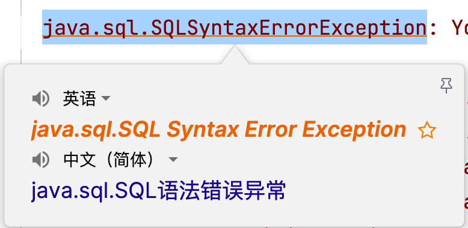
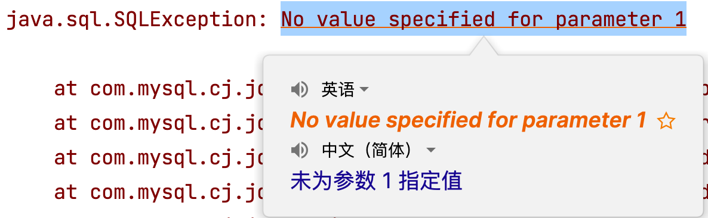
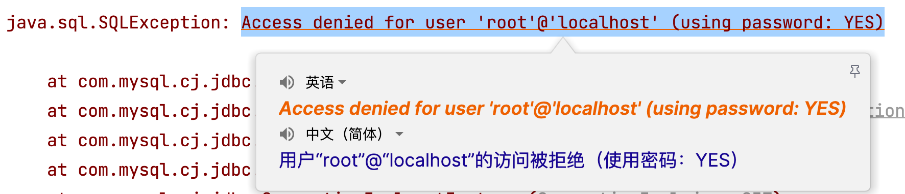
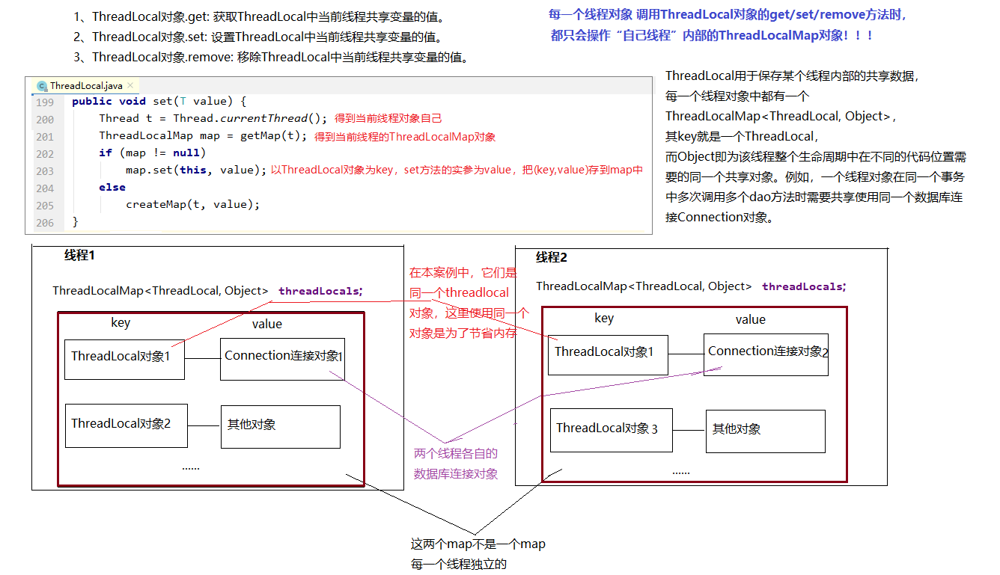

# Shang Silicon Valley Java Technology 8.x Database + JDK21 Edition JDBC Database Connection Technology

## Fundamentals

### 1. Introduction

#### 1.1 Data Storage

> When we develop Java programs, data is usually stored in memory, which is only temporary storage. Once the program stops or restarts, the data in memory is lost. To solve the problem of long-term data storage, we have the following solutions:
>
> 1. Data can be stored on the local disk through I/O stream technology, which solves the persistence problem, but it has no clear structure or logic and is inconvenient to manage and maintain.
> 2. Through a relational database, data is maintained by the database management system in a specific format. Relational databases separate different data by databases and tables. Data in a table is stored in rows and columns, which helps distinguish data with the same format but different values.

|                     Data Stored in a Database                     |
| :--------------------------------------------------------------: |
|  |


#### 1.2 Data Operations

> Storing data in a database only solves the problem of data storage. When our program runs, we still need to read data and perform operations such as insert, delete, and update. So how can a Java program perform CRUD operations on a database?

|                   Java Program Reading the Database                   |
| :------------------------------------------------------------------: |
|  |


### 2. JDBC

#### 2.1 Concept of JDBC

> - JDBC: Java Database Connectivity.
> - JDBC is a set of APIs provided by Java that are independent of any specific database management system.
> - Java provides the interface specifications, while database vendors provide the implementations of those interfaces. The implementation classes are packaged into jar files, commonly known as database driver jars.
> - Learning JDBC fully demonstrates the benefits of interface-oriented programming. Programmers only need to care about the standards and specifications, without paying attention to the implementation details.

|                    Simple JDBC Execution Process                    |
| :----------------------------------------------------------------: |
|  |


#### 2.2 Core Components of JDBC

- Interface specification:
  - To improve project portability and maintainability, SUN defined a unified set of interface specifications from the beginning for Java programs to connect to different databases. In this way, regardless of which DBMS software is used, the Java code can remain consistent.
  - The interfaces are stored in the `java.sql` and `javax.sql` packages.
- Implementation specification:
  - Since different database vendors have different DBMS software, only the vendor itself truly understands how its own database internally implements SQL operations such as insert, delete, update, and query. Therefore, the implementation of the interfaces is left to each database vendor.
  - Vendors package the implementation details into jar files. Programmers only need to import the jar files into the project to use them for database operations.


### 3. JDBC Quick Start

#### 3.1 JDBC Setup Steps

1. Prepare the database.
2. Download the database driver jar from the official website. [https://downloads.mysql.com/archives/c-j/]()
3. Create a Java project, then create a `lib` folder under the project, and copy the downloaded driver jar into this folder.
4. Right-click the `lib` folder and select **Add as Library** to integrate it into the project.
5. Write the code.


#### 3.2 Code Implementation

##### 3.2.1 Database

```sql
CREATE DATABASE atguigu;

use atguigu;

create table t_emp
(
    emp_id     int auto_increment comment 'Employee ID' primary key,
    emp_name   varchar(100)  not null comment 'Employee Name',
    emp_salary double(10, 5) not null comment 'Employee Salary',
    emp_age    int           not null comment 'Employee Age'
);

insert into t_emp (emp_name,emp_salary,emp_age)
values  ('andy', 777.77, 32),
        ('大风哥', 666.66, 41),
        ('康师傅',111, 23),
        ('Gavin',123, 26),
        ('小鱼儿', 123, 28);
```


##### 3.2.2 Java Code

```java
package com.atguigu;

import java.sql.*;

public class JdbcQuick {
    public static void main(String[] args) throws ClassNotFoundException, SQLException {
        // 1. Register the driver
        Class.forName("com.mysql.cj.jdbc.Driver");

        // 2. Get the database connection
        Connection connection = DriverManager.getConnection("jdbc:mysql://localhost:3306/atguigu", "root", "atguigu");

        // 3. Create a Statement object
        PreparedStatement preparedStatement = connection.prepareStatement("select emp_id,emp_name,emp_salary,emp_age from t_emp");

        // 4. Write and execute the SQL statement, then get the result
        ResultSet resultSet = preparedStatement.executeQuery();


        // 5. Process the result
        while (resultSet.next()) {
            int empId = resultSet.getInt("emp_id");
            String empName = resultSet.getString("emp_name");
            String empSalary = resultSet.getString("emp_salary");
            int empAge = resultSet.getInt("emp_age");
            System.out.println(empId + "\t" + empName + "\t" + empSalary + "\t" + empAge);
        }

        // 6. Release resources (last opened, first closed)
        resultSet.close();
        preparedStatement.close();
        connection.close();

    }
}
```


#### 3.3 Summary of the Steps

1. Register the driver [load the dependent driver class]
2. Get the connection [use `Connection` to establish a connection]
3. Create an object to send SQL statements [use `Connection` to create a `Statement`]
4. Send SQL statements and get the returned result [`Statement` sends SQL to the database and gets the result]
5. Parse the result set [extract the query results]
6. Close resources [release `ResultSet`, `Statement`, and `Connection`]


### 4. Understanding the Core APIs

#### 4.1 Registering the Driver

- ```java
  Class.forName("com.mysql.cj.jdbc.Driver");
  ```

- In Java, when using JDBC (Java Database Connectivity) to connect to a database, the database-specific driver program must be loaded so that the program can communicate with the database. The purpose of loading the driver is to register it, allowing the JDBC API to recognize and interact with the specific database.

- Since JDK 6, it is no longer necessary to explicitly call `Class.forName()` to load the JDBC driver. As long as the corresponding jar file is included in the classpath, the driver will be automatically registered during initialization.


#### 4.2 Connection

- The `Connection` interface is an important interface in JDBC API and is used to establish a communication channel with the database. In other words, if a `Connection` object is not null, it represents an active database connection.
- When establishing a connection, the database URL, username, and password must be specified.
  - URL: `jdbc:mysql://localhost:3306/atguigu`
    - `jdbc:mysql://IP address:port/database name?parameter1=value1&parameter2=value2`
- The `Connection` interface is also responsible for transaction management. It provides the `commit` and `rollback` methods for committing and rolling back transactions.
- It can create `Statement` objects for executing SQL statements and interacting with the database.
- When using JDBC, you must first obtain a `Connection` object and release it after use to avoid resource waste and leaks.


#### 4.3 Statement

- The `Statement` interface is used to execute SQL statements and interact with the database. It is an important interface in JDBC API. Through a `Statement` object, you can send SQL statements to the database and obtain execution results.
- The result may be one or more outcomes.
  - Insert, delete, and update: a single result representing the number of affected rows.
  - Query: results such as one row one column, multiple rows multiple columns, or one row multiple columns.
- However, when executing SQL statements, the `Statement` interface may cause **SQL injection attacks**:
  - When a dynamically constructed SQL query is executed using `Statement`, query conditions often have to be concatenated into the SQL string directly. This may allow malicious input to manipulate the SQL condition so that it always evaluates to true.


#### 4.4 PreparedStatement

- `PreparedStatement` is a subinterface of `Statement`, used to execute **precompiled** SQL queries. Its main functions are as follows:
  - Precompile SQL statements: when creating a `PreparedStatement`, the SQL statement is precompiled, meaning the SQL structure is fixed.
  - Prevent SQL injection: `PreparedStatement` supports parameterized queries. Data is passed as parameters into the SQL statement using `?` placeholders, and the input is treated as a value. This effectively prevents SQL injection caused by keywords or malicious input.
  - Better performance: because `PreparedStatement` uses precompiled SQL, the same SQL statement can be reused multiple times without repeated compilation and parsing.
- In the following sections, all implementations are based on `PreparedStatement` because it is safer and more efficient.


#### 4.5 ResultSet

- `ResultSet` is an interface in JDBC API used to represent the result set returned by executing a query statement on the database.
- Traversing results: `ResultSet` can use the `next()` method to move the cursor to the next row and iterate through the query results row by row. The return value is of type `boolean`: `true` means there is a next row, and `false` means there is no more data.
- Getting a single-column value: data can be retrieved through `getXxx()` methods. These are overloaded methods and support access by column index or column name.

## SQL Injection Problem and the Introduction of PreparedStatement

This code may look fine at first glance: the program asks the user to enter an employee name, then concatenates the input into an SQL statement and queries the database.

The key line is:

```java
String sql = "SELECT emp_id, emp_name, emp_salary, emp_age FROM t_emp WHERE emp_name = '" + name + "'";
```

The problem lies exactly here: **the user input is directly concatenated into the SQL statement**.

That means the program assumes the user's input is always just a normal employee name.
However, in reality, the user may enter malicious content that contains SQL syntax.

------

### Normal Input Case

For example, if the user enters:

```text
andy
```

Then the final SQL becomes:

```sql
SELECT emp_id, emp_name, emp_salary, emp_age FROM t_emp WHERE emp_name = 'andy'
```

This is correct and will only return the employee whose name is `andy`.

------

### Malicious Input Case

But if someone enters:

```text
abc' or '1'='1
```

Then the final SQL becomes:

```sql
SELECT emp_id, emp_name, emp_salary, emp_age FROM t_emp WHERE emp_name = 'abc' or '1'='1'
```

Here, the condition `'1'='1'` is always true, so the `WHERE` clause is bypassed.

Originally, the query was supposed to search for one specific employee.
But now it may return **all records in the table**.

------

### What Is SQL Injection?

This is called **SQL Injection**.

The user input was supposed to be treated only as **data**,
but because of direct string concatenation, it is treated as part of the **SQL command** and executed by the database.

You can explain it like this in class:

> SQL injection happens when user input is directly concatenated into an SQL statement.
> In this case, the input is no longer treated as pure data.
> Instead, it may change the meaning of the original SQL command.

------

### Risks of SQL Injection

SQL injection can cause serious security problems, such as:

- Bypassing login validation
- Reading data that should not be accessible
- Modifying or deleting data in the database
- Causing severe database security issues

For example, when students later write a login function, they may write code like this:

```java
String sql = "select * from user where username='" + username + "' and password='" + password + "'";
```

This looks normal, but it is dangerous.
An attacker may construct special input and log in successfully without knowing the real password.

------

### Why This Code Is Unsafe

So this code is actually a very typical **bad example** in JDBC learning:

- It can run correctly
- But it is **not secure**

This naturally leads to the question:

> So how can we solve this problem?

------

## Introducing PreparedStatement

The key idea is:

- Do **not** let user input become part of the SQL syntax
- Separate the **SQL structure** from the **parameter values**

That is exactly why we use `PreparedStatement`.

Instead of directly concatenating strings, we first write the SQL template:

```java
String sql = "SELECT emp_id, emp_name, emp_salary, emp_age FROM t_emp WHERE emp_name = ?";
PreparedStatement ps = connection.prepareStatement(sql);
ps.setString(1, name);
ResultSet rs = ps.executeQuery();
```

------

### How PreparedStatement Works

Here, the `?` is a **placeholder**, which means a parameter value will be filled in later.

Then we use:

```java
ps.setString(1, name);
```

to pass the user input into the SQL statement.

The important point is:

> No matter what the user enters, it will only be treated as a normal data value, not as part of the SQL syntax.

Even if the user enters:

```text
abc' or '1'='1
```

the database will still treat it as a complete string value,
rather than interpreting it as SQL logic.

So `PreparedStatement` can effectively prevent SQL injection.

------

## Summary

In this example, the program uses `Statement` and directly concatenates user input into the SQL string. This is dangerous because the input may contain malicious SQL fragments. For example, if the user enters `abc' or '1'='1`, the final SQL condition becomes always true, and the database may return all rows. This is called SQL injection.

The root cause is that the program mixes **SQL code** and **user data** together.

To solve this problem, we should use `PreparedStatement`. With `PreparedStatement`, the SQL structure is written first, and user input is passed in as parameters. This means the input is treated only as data, not as part of the SQL command. Therefore, `PreparedStatement` is safer, more standard, and strongly recommended in real database development.


## @Test Annotation and Why We Use a Test Class

Before introducing CRUD operations with `PreparedStatement`, it is important to understand how we test our database code.

### What is `@Test`?

`@Test` is an annotation provided by JUnit (a Java testing framework).  
It is used to mark a method as a **test method**.

For example:

```java
@Test
public void testSelect() {
    // test code here
}
```

When running the test class, JUnit will automatically execute all methods annotated with `@Test`.

------

### Why Do We Use a Test Class?

In real development, we usually do not test database code inside the `main` method.
Instead, we use a **separate test class**.

There are several reasons:

#### 1. Easier Testing

- No need to repeatedly run the whole application
- Each method can be tested independently

#### 2. Better Code Organization

- Business logic and test code are separated
- Makes the project more clear and maintainable

#### 3. Faster Debugging

- We can test only one function at a time (e.g., query, insert)
- Easier to locate errors

#### 4. Standard Development Practice

- In real projects, testing frameworks like JUnit are widely used
- Helps ensure code correctness and stability

------

### Example: Using @Test for Database Query


------

### Summary

- `@Test` is used to mark test methods
- It allows us to run code without a `main` method
- Test classes make development more efficient, clear, and professional

------

Now, based on this testing approach, we can move on to CRUD operations using `PreparedStatement`.


### 5. CRUD with PreparedStatement

#### 5.1 Query One Row and One Column

```java
    @Test
    public void querySingleRowAndColumn() throws SQLException {
        // 1. Register the driver
//        Class.forName("com.mysql.cj.jdbc.Driver");

        // 2. Get the database connection
        Connection connection = DriverManager.getConnection("jdbc:mysql://localhost:3306/atguigu", "root","atguigu");

        // 3. Create a PreparedStatement object and precompile the SQL
        PreparedStatement preparedStatement = connection.prepareStatement("select count(*) as count from t_emp");

        // 4. Execute the SQL statement and get the result
        ResultSet resultSet = preparedStatement.executeQuery();

        // 5. Process the result
        while (resultSet.next()){
            int count = resultSet.getInt("count");
            System.out.println("count = " + count);
        }

        // 6. Release resources (last opened, first closed)
        resultSet.close();
        preparedStatement.close();
        connection.close();

    }
```


#### 5.2 Query One Row and Multiple Columns

```java
    @Test
    public void querySingleRow() throws SQLException {
        // 1. Register the driver
//        Class.forName("com.mysql.cj.jdbc.Driver");

        // 2. Get the database connection
        Connection connection = DriverManager.getConnection("jdbc:mysql://localhost:3306/atguigu","root","atguigu");

        // 3. Create a PreparedStatement object, precompile the SQL, and use ? placeholders
        PreparedStatement preparedStatement = connection.prepareStatement("select emp_id,emp_name,emp_salary,emp_age from t_emp where emp_id = ?");

        // 4. Set the placeholder value (index starts from 1), execute the SQL, and get the result
        preparedStatement.setInt(1,1);
        ResultSet resultSet = preparedStatement.executeQuery();

        // 5. Process the result
        while (resultSet.next()){
            int empId = resultSet.getInt("emp_id");
            String empName = resultSet.getString("emp_name");
            String empSalary = resultSet.getString("emp_salary");
            int empAge = resultSet.getInt("emp_age");
            System.out.println(empId+"\t"+empName+"\t"+empSalary+"\t"+empAge);
        }

        // 6. Release resources (last opened, first closed)
        resultSet.close();
        preparedStatement.close();
        connection.close();

    }
```


#### 5.3 Query Multiple Rows and Multiple Columns

```java
    @Test
    public void queryMoreRow() throws SQLException {
        // 1. Register the driver
//        Class.forName("com.mysql.cj.jdbc.Driver");

        // 2. Get the database connection
        Connection connection = DriverManager.getConnection("jdbc:mysql://localhost:3306/atguigu","root","atguigu");

        // 3. Create a Statement object
        PreparedStatement preparedStatement = connection.prepareStatement("select emp_id,emp_name,emp_salary,emp_age from t_emp");

        // 4. Write and execute the SQL statement, then get the result
        ResultSet resultSet = preparedStatement.executeQuery();


        // 5. Process the result
        while (resultSet.next()){
            int empId = resultSet.getInt("emp_id");
            String empName = resultSet.getString("emp_name");
            String empSalary = resultSet.getString("emp_salary");
            int empAge = resultSet.getInt("emp_age");
            System.out.println(empId+"\t"+empName+"\t"+empSalary+"\t"+empAge);
        }

        // 6. Release resources (last opened, first closed)
        resultSet.close();
        preparedStatement.close();
        connection.close();

    }
```


#### 5.4 Insert

```java
    @Test
    public void insert() throws SQLException {
        // 1. Register the driver
//        Class.forName("com.mysql.cj.jdbc.Driver");

        // 2. Get the database connection
        Connection connection = DriverManager.getConnection("jdbc:mysql://localhost:3306/atguigu","root", "atguigu");

        // 3. Create a Statement object
        PreparedStatement preparedStatement = connection.prepareStatement("insert into t_emp (emp_name,emp_salary,emp_age)values  (?, ?,?)");

        // 4. Set placeholder values (index starts from 1), execute the SQL statement, and get the result
        preparedStatement.setString(1,"rose");
        preparedStatement.setDouble(2,666.66);
        preparedStatement.setDouble(3,28);
        int result = preparedStatement.executeUpdate();

        // 5. Process the result
        if(result>0){
            System.out.println("Insert successful");
        }else{
            System.out.println("Insert failed");
        }

        // 6. Release resources (last opened, first closed)
        preparedStatement.close();
        connection.close();

    }
```


#### 5.5 Update

```java
    @Test
    public void update() throws SQLException {
        // 1. Register the driver
//        Class.forName("com.mysql.cj.jdbc.Driver");

        // 2. Get the database connection
        Connection connection = DriverManager.getConnection("jdbc:mysql://localhost:3306/atguigu", "root", "atguigu");

        // 3. Create a Statement object
        PreparedStatement preparedStatement = connection.prepareStatement("update t_emp set emp_salary = ? where emp_id = ?");

        // 4. Set placeholder values (index starts from 1), execute the SQL statement, and get the result
        preparedStatement.setDouble(1,888.88);
        preparedStatement.setDouble(2,8);
        int result = preparedStatement.executeUpdate();

        // 5. Process the result
        if(result>0){
            System.out.println("Update successful");
        }else{
            System.out.println("Update failed");
        }

        // 6. Release resources (last opened, first closed)
        preparedStatement.close();
        connection.close();

    }
```


#### 5.6 Delete

```java
    @Test
    public void delete() throws SQLException {
        // 1. Register the driver
//        Class.forName("com.mysql.cj.jdbc.Driver");

        // 2. Get the database connection
        Connection connection = DriverManager.getConnection("jdbc:mysql://localhost:3306/atguigu", "root", "atguigu");

        // 3. Create a Statement object
        PreparedStatement preparedStatement = connection.prepareStatement("delete from t_emp where emp_id = ?");

        // 4. Set the placeholder value (index starts from 1), execute the SQL statement, and get the result
        preparedStatement.setInt(1,8);
        int result = preparedStatement.executeUpdate();

        // 5. Process the result
        if(result>0){
            System.out.println("Delete successful");
        }else{
            System.out.println("Delete failed");
        }

        // 6. Release resources (last opened, first closed)
        preparedStatement.close();
        connection.close();

    }
```


### 6. Common Issues

#### 6.1 Resource Management

> When using JDBC resources such as `Connection`, `PreparedStatement`, and `ResultSet`, it is very important to close them in time after use in order to release database server resources and avoid memory leaks.


#### 6.2 SQL Statement Issues

> `java.sql.SQLSyntaxErrorException`: SQL syntax error exception. Generally, there are several possible causes:
>
> 1. There is an error in the SQL statement. Check the SQL carefully. It is recommended to test the SQL in an SQL tool first and then copy it into the Java program.
> 2. If the database name in the connection URL is written incorrectly, this exception may also occur.
>
> 


#### 6.3 Missing SQL Parameter Issue

> `java.sql.SQLException: No value specified for parameter 1`
>
> When using precompiled SQL statements, if there are `?` placeholders, every placeholder must be assigned a value. Otherwise, this error will occur.
>
> 


#### 6.4 Username or Password Error

> When connecting to the database, if the username or password is incorrect, an `SQLException` will also occur, which can be confusing. Therefore, make sure to read the detailed cause in the exception message carefully.
>
> 


#### 6.5 Communication Exception

> If the IP address or port number in the database connection URL is incorrect, the following exception may occur:
>
> `com.mysql.cj.jdbc.exceptions.CommunicationsException: Communications link failure`
>
> 


## Advanced Part

### 7. JDBC Extensions

#### 7.1 Entity Classes and ORM

> - When using JDBC to operate on a database, we often find that the data is scattered. A complete row of data in the database becomes several separate variables in Java, which is inconvenient to maintain and manage. Since Java is object-oriented, one table corresponds to one class, one row of data corresponds to one object, and one column corresponds to one field. Therefore, we need a carrier to hold the data, and that carrier is the entity class.
> - ORM (Object Relational Mapping) refers to the mapping between objects and relational databases. It allows us to operate on database data from an object-oriented perspective: one table corresponds to one class, one row corresponds to one object, and one column corresponds to one field.
> - In JDBC, this process is called manual ORM. Later, we will also learn ORM frameworks such as MyBatis and JPA.

```java
package com.atguigu.pojo;
// The class name corresponds to the business meaning of the database table.
// Table names are often abbreviated, but class names should usually be fully written.
public class Employee {
    private Integer empId; // emp_id = empId: database columns use underscores, Java fields use camelCase
    private String empName; // emp_name = empName
    private Double empSalary; // emp_salary = empSalary
    private Integer empAge; // emp_age = empAge

    // Getter, setter, no-arg constructor, all-arg constructor, and toString methods are omitted.
}
```

Encapsulation example:

```java
    @Test
    public void querySingleRow() throws SQLException {
        // 1. Register the driver
//        Class.forName("com.mysql.cj.jdbc.Driver");

        // 2. Get the database connection
        Connection connection = DriverManager.getConnection("jdbc:mysql://localhost:3306/atguigu", "root","atguigu");

        // 3. Create a PreparedStatement object, precompile the SQL, and use ? placeholders
        PreparedStatement preparedStatement = connection.prepareStatement("select emp_id,emp_name,emp_salary,emp_age from t_emp where emp_id = ?");

        // 4. Set the placeholder value (index starts from 1), execute the SQL statement, and get the result
        preparedStatement.setInt(1, 1);
        ResultSet resultSet = preparedStatement.executeQuery();
        // Create an entity reference in advance
        Employee employee = null;
        // 5. Process the result
        while (resultSet.next()) {
            int empId = resultSet.getInt("emp_id");
            String empName = resultSet.getString("emp_name");
            Double empSalary = Double.valueOf(resultSet.getString("emp_salary"));
            int empAge = resultSet.getInt("emp_age");
            // Create the object only when there is data in the result set
            employee = new Employee(empId,empName,empSalary,empAge);
        }

        System.out.println("employee = " + employee);

        // 6. Release resources (last opened, first closed)
        resultSet.close();
        preparedStatement.close();
        connection.close();

    }
```


#### 7.2 Returning the Auto-Generated Primary Key

- In the database, when performing an insert operation, the primary key column may be auto-incremented. We can see it directly in the table, but in a Java program, after insertion we usually only get the number of affected rows and cannot directly know the generated primary key value. Retrieving the primary key value of the newly inserted row from the database and assigning it to the Java object is called **primary key backfill** or **generated key retrieval**.

- Code example:

  - ```java
            @Test
        public void testReturnPK() throws SQLException {
            // 1. Register the driver
    //        Class.forName("com.mysql.cj.jdbc.Driver");

            // 2. Get the database connection
            Connection connection = DriverManager.getConnection("jdbc:mysql://localhost:3306/atguigu", "root", "atguigu");

            // 3. Create the PreparedStatement object and pass Statement.RETURN_GENERATED_KEYS
            PreparedStatement preparedStatement = connection.prepareStatement("insert into t_emp (emp_name, emp_salary, emp_age)values  (?, ?,?)",Statement.RETURN_GENERATED_KEYS);

            // 4. Write and execute the SQL statement, then get the result
            Employee employee = new Employee(null,"rose",666.66,28);
            preparedStatement.setString(1,employee.getEmpName());
            preparedStatement.setDouble(2,employee.getEmpSalary());
            preparedStatement.setDouble(3,employee.getEmpAge());
            int result = preparedStatement.executeUpdate();

            // 5. Process the result
            if(result>0){
                System.out.println("Insert successful");
            }else{
                System.out.println("Insert failed");
            }

            // 6. Get the generated primary key value.
            // The returned value is a ResultSet, and the key can be read from it.
            ResultSet resultSet = preparedStatement.getGeneratedKeys();
            if (resultSet.next()){
                int empId = resultSet.getInt(1);
                employee.setEmpId(empId);
            }

            System.out.println(employee.toString());

            // 7. Release resources (last opened, first closed)
            resultSet.close();
            preparedStatement.close();
            connection.close();

        }
    ```


#### 7.3 Batch Operations

- If multiple rows are inserted one by one, the efficiency is low.

- Batch operations can improve efficiency for repeated database actions.

- Code example:

  - ```java
            @Test
         public void testBatch() throws Exception {
             // 1. Register the driver
    //        Class.forName("com.mysql.cj.jdbc.Driver");

            // 2. Get the connection
            Connection connection = DriverManager.getConnection("jdbc:mysql:///atguigu?rewriteBatchedStatements=true", "root", "atguigu");

            // 3. Write the SQL statement
            /*
                Notes:
                1. You must append ?rewriteBatchedStatements=true to the JDBC URL to enable batch operations.
                2. The insert SQL must use values, and there should be no semicolon at the end.
                3. Call addBatch() to add the SQL operations to the batch.
                4. Call executeBatch() once to execute them all.
             */
            String sql = "insert into t_emp (emp_name,emp_salary,emp_age) values (?,?,?)";

            // 4. Create a precompiled PreparedStatement with the SQL
            PreparedStatement preparedStatement = connection.prepareStatement(sql);

            // Record the current time in milliseconds
            long start = System.currentTimeMillis();
            for(int i = 0;i<10000;i++){
                // 5. Set the placeholder values
                preparedStatement.setString(1, "marry"+i);
                preparedStatement.setDouble(2, 100.0+i);
                preparedStatement.setInt(3, 20+i);

                preparedStatement.addBatch();
            }

            // Execute the batch
            preparedStatement.executeBatch();

            long end = System.currentTimeMillis();

            System.out.println("Time consumed: "+(end - start));

            preparedStatement.close();
            connection.close();
        }
    ```


### 8. Connection Pool

#### 8.1 Existing Problems

> - Every database operation requires creating a new connection and closing it afterward. Frequent creation and destruction wastes resources.
> - The number of connections is difficult to control, which puts huge pressure on the server.


#### 8.2 Connection Pool

> A connection pool is a buffer for database connection objects. Through configuration, the pool is responsible for creating, managing, and releasing connections.
>
> Database connections are created in advance and stored in the pool. When a user makes a request, the connection is obtained directly from the pool. After use, the connection is returned to the pool for reuse, which avoids frequent creation and destruction and improves efficiency.
>
> If there is no available connection in the pool and the maximum limit has not been reached, the pool will create a new connection.
>
> If the maximum number of connections has been reached, user requests will wait, and a timeout can be configured.


#### 8.3 Common Connection Pools

JDBC connection pools use the `javax.sql.DataSource` interface as the standard. All third-party connection pools implement this interface. That means the way to obtain and recycle connections is basically the same, while performance and extended features differ.

- DBCP is a connection pool provided by Apache. It is relatively faster than C3P0, but it has some bugs.
- C3P0 is an open-source connection pool. It is relatively slower, but its stability is acceptable.
- Proxool is an open-source project under SourceForge. It can monitor connection pool status, but its stability is slightly worse than C3P0.
- **Druid is a connection pool provided by Alibaba. It combines the advantages of DBCP, C3P0, and Proxool, and offers better performance, extensibility, and usability, with rich features.**
- **Hikari (ひかり, meaning "light" in Japanese) is the built-in connection pool after Spring Boot 2.x. It is based on BoneCP (which is no longer maintained) and has many improvements and optimizations. Its slogan is fast, simple, and reliable.**

|                    Feature Comparison of Mainstream Connection Pools                    |
| :-------------------------------------------------------------------------------------: |
|  |

|                         Mock Performance Data (unit: ms)                         |
| :------------------------------------------------------------------------------: |
|  |

|                         MySQL Performance Data (unit: ms)                         |
| :-------------------------------------------------------------------------------: |
|  |


#### 8.4 Using Druid Connection Pool

- Steps:
  - Import the jar package.
  - Write the code.

- Code implementation:

  - Hard-coded method (for understanding):

    - ```java
      @Test
          public void testHardCodeDruid() throws SQLException {
              /*
                  Hard coding means coupling the connection pool configuration directly with Java code.
                  1. Create a DruidDataSource object.
                  2. Set the configuration parameters [required | optional].
                  3. Get a connection object from the pool.
                  4. Recycle the connection [not truly release it, but return it to the pool for reuse].
               */

              // 1. Create the DruidDataSource object
              DruidDataSource druidDataSource = new DruidDataSource();

              // 2. Set the connection pool configuration [required | optional]
              // 2.1 Required configuration
              druidDataSource.setDriverClassName("com.mysql.cj.jdbc.Driver");
              druidDataSource.setUrl("jdbc:mysql:///atguigu");
              druidDataSource.setUsername("root");
              druidDataSource.setPassword("atguigu");

              // 2.2 Optional configuration
              druidDataSource.setInitialSize(10);
              druidDataSource.setMaxActive(20);

              // 3. Get a connection object from the pool
              Connection connection = druidDataSource.getConnection();
              System.out.println(connection);

              // Perform CRUD based on connection

              // 4. Recycle the connection
              connection.close();
          }
      ```

  - Soft-coded method (recommended):

    - Create a `resources` folder in the project directory, mark it as a resource directory, and create a `db.properties` file to define the connection information.

      - ```properties
        # Configuration parameters required by the Druid connection pool. The key names are fixed.
        driverClassName=com.mysql.cj.jdbc.Driver
        url=jdbc:mysql:///atguigu
        username=root
        password=atguigu
        initialSize=10
        maxActive=20
        ```

    - Java code:

      - ```java
        @Test
            public void testResourcesDruid() throws Exception {
                // 1. Create a Properties object to store key-value pairs from the external configuration file
                Properties properties = new Properties();

                // 2. Read the external configuration file as an input stream and load it into Properties
                InputStream inputStream = DruidTest.class.getClassLoader().getResourceAsStream("db.properties");
                properties.load(inputStream);

                // 3. Build a DruidDataSource connection pool based on Properties
                DataSource dataSource = DruidDataSourceFactory.createDataSource(properties);

                // 4. Get a connection object from the pool
                Connection connection = dataSource.getConnection();
                System.out.println(connection);

                // 5. Perform CRUD

                // 6. Recycle the connection
                connection.close();
            }
        ```


#### 8.5 Other Druid Configurations [For Reference]

| Configuration                   | **Default** | **Description** |
| ------------------------------ | ----------- | --------------- |
| name                           |             | The meaning of this property is that if there are multiple data sources, they can be distinguished by name during monitoring. If not configured, a name will be generated in the format `"DataSource-" + System.identityHashCode(this)` |
| jdbcUrl                        |             | The URL used to connect to the database. It differs by database type. For example: MySQL: `jdbc:mysql://10.20.153.104:3306/druid2` Oracle: `jdbc:oracle:thin:@10.20.149.85:1521:ocnauto` |
| username                       |             | Username for connecting to the database |
| password                       |             | Password for connecting to the database. If you do not want to write the password directly in the config file, you can use `ConfigFilter`. |
| driverClassName                |             | Automatically recognized based on the URL. This item is optional, but it is recommended to configure it explicitly. |
| initialSize                    | 0           | Number of physical connections created during initialization |
| maxActive                      | 8           | Maximum number of active connections in the pool |
| maxIdle                        | 8           | No longer used; setting it has no effect |
| minIdle                        |             | Minimum number of idle connections in the pool |
| maxWait                        |             | Maximum waiting time in milliseconds when getting a connection |
| poolPreparedStatements         | false       | Whether to cache prepared statements (PSCache). Greatly improves performance for databases that support cursors, such as Oracle. It is recommended to disable this for MySQL. |
| maxOpenPreparedStatements      | -1          | To enable PSCache, this value must be greater than 0. |
| validationQuery                |             | SQL used to validate whether a connection is valid |
| testOnBorrow                   | true        | Whether to validate the connection when borrowing it from the pool |
| testOnReturn                   | false       | Whether to validate the connection when returning it to the pool |
| testWhileIdle                  | false       | Recommended to set to true. It ensures safety without significantly affecting performance. |
| timeBetweenEvictionRunsMillis  |             | Interval for checking idle connections |
| numTestsPerEvictionRun         |             | No longer used |
| minEvictableIdleTimeMillis     |             | Minimum time a connection may stay idle before being evicted |
| connectionInitSqls             |             | SQL statements executed when a physical connection is initialized |
| exceptionSorter                |             | Automatically recognized according to `dbType`; used to discard connections when unrecoverable exceptions occur |
| filters                        |             | String type. Used to configure extension plugins, such as monitoring, logging, and SQL injection defense |
| proxyFilters                   |             | List type. If both `filters` and `proxyFilters` are configured, they are combined rather than replacing one another |


#### 8.6 Using HikariCP Connection Pool

- Steps:

  - Import the jar package

  - Hard-coded method:

    - ```java
      @Test
      public void testHardCodeHikari() throws SQLException {
          /*
           Hard coding means coupling the connection pool configuration directly with Java code.
           1. Create a HikariDataSource object
           2. Set the configuration [required | optional]
           3. Get a connection from the pool
           4. Recycle the connection
           */
          // 1. Create a HikariDataSource object
          HikariDataSource hikariDataSource = new HikariDataSource();

          // 2. Set the configuration [required | optional]
          // 2.1 Required configuration
          hikariDataSource.setDriverClassName("com.mysql.cj.jdbc.Driver");
          hikariDataSource.setJdbcUrl("jdbc:mysql:///atguigu");
          hikariDataSource.setUsername("root");
          hikariDataSource.setPassword("atguigu");

          // 2.2 Optional configuration
          hikariDataSource.setMinimumIdle(10);
          hikariDataSource.setMaximumPoolSize(20);

          // 3. Get a connection object from the pool
          Connection connection = hikariDataSource.getConnection();

          System.out.println(connection);

          // Recycle the connection
          connection.close();
      }
      ```

  - Soft-coded method:

    - Create `resources/hikari.properties` in the project

      - ```properties
        driverClassName=com.mysql.cj.jdbc.Driver
        jdbcUrl=jdbc:mysql:///atguigu
        username=root
        password=atguigu
        minimumIdle=10
        maximumPoolSize=20
        ```

    - Write the code:

      - ```java
            @Test
            public void testResourcesHikari()throws Exception{
                 // 1. Create a Properties object to store key-value pairs from the external configuration file
                Properties properties = new Properties();

                // 2. Read the external configuration file as an input stream and load it into Properties
                InputStream inputStream = HikariTest.class.getClassLoader().getResourceAsStream("db.properties");
                properties.load(inputStream);

                // 3. Create a HikariConfig object from Properties
                HikariConfig hikariConfig = new HikariConfig(properties);

                // 4. Build the Hikari connection pool based on the configuration object
                HikariDataSource hikariDataSource = new HikariDataSource(hikariConfig);

                // 5. Get a connection
                Connection connection = hikariDataSource.getConnection();
                System.out.println("connection = " + connection);

                // 6. Recycle the connection
                connection.close();
            }
        ```
#### 8.7 Other HikariCP Configurations [For Reference]

| Property            | Default      | Description |
| ------------------- | ------------ | ----------- |
| isAutoCommit        | true         | Automatically commit connections returned from the pool |
| connectionTimeout   | 30000        | Maximum number of milliseconds to wait for a connection from the pool |
| maxLifetime         | 1800000      | Maximum lifetime of a connection in the pool |
| minimumIdle         | 10           | Minimum number of idle connections maintained in the pool |
| maximumPoolSize     | 10           | Maximum number of connections in the pool, including idle and in-use connections |
| metricRegistry      | null         | User-defined name of the connection pool, mainly used in logs and JMX management |
| healthCheckRegistry | null         | Reports current health information |
| poolName            | HikariPool-1 | User-defined name of the connection pool |
| idleTimeout         |              | Maximum time a connection is allowed to stay idle in the pool |


## Expert Part

### 9. JDBC Optimization and Utility Class Encapsulation

#### 9.1 Existing Problems

> During the use of JDBC, we find that some code is repetitive, such as:
>
> - Creating the connection pool
> - Getting a connection
> - Releasing a connection

A utility class is used to place common and reusable code in one central location.  
In JDBC, operations such as creating the connection pool, getting a connection, and releasing a connection are used repeatedly.  
So we put them into a utility class to avoid duplicated code and make the program easier to maintain.

#### 9.2 JDBC Utility Class Encapsulation V1.0

- `resources/db.properties` configuration file:

  - ```properties
    # Configuration parameters required by the Druid connection pool. Key names are fixed.
    driverClassName=com.mysql.cj.jdbc.Driver
    username=root
    password=atguigu
    url=jdbc:mysql:///atguigu
    ```

- Utility class code:

  - ```java
    import com.alibaba.druid.pool.DruidDataSourceFactory;

    import javax.sql.DataSource;
    import java.sql.Connection;
    import java.sql.SQLException;
    import java.util.Properties;
    /**
    *   JDBC Utility Class (V1.0):
    *       1. Maintain a connection pool object.
    *       2. Provide a method to obtain a connection from the pool.
    *       3. Provide a method to release a connection.
    *   Note: A utility class only provides shared common functions, so its methods are all static.
    */
    public class JDBCTools {
        // Create a reference to the connection pool.
        // Since it will be used globally in the project, it is declared as static.
        private static DataSource dataSource;
        // Create the connection pool object when the project starts
        static{
            try {
                Properties properties = new Properties();
                InputStream inputStream =  JDBCTools.getClass().getClassLoader().getSystemResourceAsStream("db.properties");
                properties.load(inputStream);
                dataSource = DruidDataSourceFactory.createDataSource(properties);
            } catch (Exception e) {
                e.printStackTrace();
            }
        }
        // Provide a static method to obtain a connection
        public static Connection getConnection() throws SQLException {
            return ds.getConnection();
        }
        // Provide a static method to release the connection
        public static void release(Connection conn) throws SQLException {
            conn.close();// Return it to the connection pool
        }
    }
    ```

- Note: With this encapsulation method, if a single request performs multiple database operations in the same thread, it cannot guarantee that the same connection object is used throughout the process. Therefore, transactions cannot be guaranteed.


#### 9.3 ThreadLocal

> Since JDK 1.2, `java.lang.ThreadLocal` has been provided as a clean way to solve concurrent issues in multithreaded programs. It is commonly used to manage shared database connections, sessions, and other thread-bound resources.
>
> `ThreadLocal` is used to store variables that are shared within the same thread. The reason is that in Java, each thread object contains a `ThreadLocalMap<ThreadLocal, Object>`. The key is a `ThreadLocal` object, and the value is the variable shared by that thread.
>
> This map is operated through the `set()` and `get()` methods of `ThreadLocal`. For the same static `ThreadLocal`, different threads can only `get`, `set`, and `remove` their own variables without affecting other threads.
>
> - During cross-layer object passing, `ThreadLocal` can reduce the need for repeatedly passing objects and break layer constraints.
> - It provides data isolation between threads.
> - It can be used in transaction operations to store thread transaction information.
> - It is also commonly used for database connection and session management.
>
> 1. `ThreadLocal.get()`: get the value of the current thread's shared variable
> 2. `ThreadLocal.set()`: set the value of the current thread's shared variable
> 3. `ThreadLocal.remove()`: remove the value of the current thread's shared variable




#### 9.4 JDBC Utility Class Encapsulation V2.0

> Based on V1.0, we store the connection object in a `ThreadLocal` variable for each thread, ensuring that the current thread uses the same connection object throughout the whole process.

Code implementation:

```java
package com.atguigu.senior.util;

import com.alibaba.druid.pool.DruidDataSourceFactory;

import javax.sql.DataSource;
import java.io.InputStream;
import java.sql.Connection;
import java.sql.SQLException;
import java.util.Properties;
/**
 *  JDBC Utility Class (V2.0):
 *      1. Maintain a connection pool object and a ThreadLocal object bound to each thread
 *      2. Provide a method to obtain the connection stored in ThreadLocal
 *      3. Provide a method to release the connection, and remove it from ThreadLocal during release
 *  Note: A utility class only provides shared common functions, so its methods are all static.
 *  Note: The purpose of using ThreadLocal is to ensure that one thread uses the same connection across multiple database operations.
 */
public class JDBCUtilV2 {
    // Reference to the connection pool. Since it will be used globally, declare it as static.
    private static DataSource dataSource;
    private static ThreadLocal<Connection> threadLocal = new ThreadLocal<>();

    // Create the connection pool object when the project starts
    static {
        try {
            Properties properties = new Properties();
            InputStream inputStream = JDBCUtil.class.getClassLoader().getResourceAsStream("db.properties");
            properties.load(inputStream);

            dataSource = DruidDataSourceFactory.createDataSource(properties);
        } catch (Exception e) {
            throw new RuntimeException(e);
        }
    }
    // Provide a method to obtain a connection
    public static Connection getConnection(){
        try {
            // Get the Connection from ThreadLocal
            Connection connection = threadLocal.get();
            // If no Connection is stored in ThreadLocal, it means this is the first time
            if (connection == null) {
                // Get a connection from the pool and store it in ThreadLocal
                connection = dataSource.getConnection();
                threadLocal.set(connection);
            }
            return connection;

        } catch (SQLException e) {
            throw new RuntimeException(e);
        }
    }
    // Provide a method to release the connection
    public static void release(){
        try {
            Connection connection = threadLocal.get();
            if(connection!=null){
                // Remove the Connection stored in ThreadLocal
                threadLocal.remove();
                // If auto-commit was turned off for transactions, restore it before returning to the pool
                connection.setAutoCommit(true);
                // Return the Connection to the pool
                connection.close();
            }
        } catch (SQLException e) {
            throw new RuntimeException(e);
        }
    }

}
```


## Transition: From JDBC Basics to DAO Encapsulation

Before introducing the concept of DAO, let’s briefly summarize what we have done with JDBC so far.

Up to this point, we have already completed the basic setup of JDBC operations, including:

- Registering the JDBC driver
- Establishing database connections
- Managing connections using a connection pool (e.g., Druid)
- Encapsulating connection acquisition and release (e.g., `JDBCUtilV2`)

This means that the **infrastructure part of database operations has already been encapsulated**.

However, there is still an important problem:

> The actual database operations (such as CRUD: Create, Read, Update, Delete) are still written directly in the code.

For example, SQL statements are still scattered in different classes and methods.  
This leads to several issues:

- Code duplication
- Poor readability
- Difficult maintenance
- Tight coupling between business logic and database operations

---

### What Should We Do Next?

To solve these problems, we need a better way to organize database operations.

That is why we introduce the **DAO (Data Access Object) pattern**.

The idea is:

- Encapsulate all database CRUD operations into separate DAO classes
- Separate **business logic** from **data access logic**
- Make the code more modular, reusable, and easier to maintain

---

In the following section, we will learn how to use DAO to encapsulate database operations step by step.

### 10. DAO Encapsulation and BaseDAO Utility Class

#### 10.1 Concept of DAO

> DAO: Data Access Object.
>
> Java is an object-oriented language, and data in Java usually exists in the form of objects. One table corresponds to one entity class, and operations on one table correspond to one DAO object.
>
> When operating on a database in Java, we usually maintain all CRUD operations for the same table in one place. This class is called the DAO layer.
>
> The DAO layer focuses only on database operations and is called by the Service layer, making the division of responsibilities clear.


#### 10.1 Concept of BaseDAO

> Basically, every data table should have a corresponding DAO interface and implementation class. Since CRUD operations for all tables have a high degree of code repetition, we can extract the common code into a shared parent class for all DAO implementations. This shared parent class is called `BaseDAO`.


#### 10.2 Building BaseDAO

```java
public abstract class BaseDAO {
    /*
    Generic insert, delete, and update method
    String sql: SQL statement
    Object... args: values for the ? placeholders in SQL, can be 0~n
     */
    protected int update(String sql,Object... args) throws SQLException {
//        Create the PreparedStatement object and precompile the SQL
        Connection connection = JDBCTools.getConnection();
        PreparedStatement ps = connection.prepareStatement(sql);
        // Set the values of the ? placeholders
        if(args != null && args.length>0){
            for(int i=0; i<args.length; i++) {
                ps.setObject(i+1,args[i]);// Placeholder index starts from 1, array index starts from 0
            }
        }

        // Execute the SQL
        int len = ps.executeUpdate();
        ps.close();
        // Check whether a transaction has been started
        // If autoCommit is false, do not release the connection here; the business method should close it
        // If autoCommit is true, release the connection normally
        if (connection.getAutoCommit()) {
            // Release
            JDBCTools.release();
        }
        return len;
    }

    /*
    Generic method for querying multiple JavaBean objects, such as multiple employee objects, department objects, etc.
    clazz is the Class object of type T.
    If querying employees, clazz is Employee.class.
    If querying departments, clazz is Department.class.
    Returns List<T> list
     */
    protected <T> ArrayList<T> query(Class<T> clazz,String sql,Object... args) throws Exception {
        // Create the PreparedStatement object and precompile the SQL
        Connection connection = JDBCTools.getConnection();
        PreparedStatement ps = connection.prepareStatement(sql);
        // Set the values of ?
        if(args != null && args.length>0){
            for(int i=0; i<args.length; i++) {
                ps.setObject(i+1, args[i]);// Placeholder index starts from 1
            }
        }

        ArrayList<T> list = new ArrayList<>();
        ResultSet res = ps.executeQuery();

        /*
        Get the metadata object of the result set.
        It contains information such as the number of columns and column names.
         */
        ResultSetMetaData metaData = res.getMetaData();
        int columnCount = metaData.getColumnCount();// Get the number of columns

        // Traverse the ResultSet and convert each row into a T object, then add it to list
        while(res.next()){
            // Each iteration means one row, which corresponds to one T object
            T t = clazz.newInstance();// This type must have a public no-arg constructor

            // Extract each cell value of the current row and set it into the corresponding field of t
            for(int i=1; i<=columnCount; i++){
                // One loop means reading one column value in the current row
                Object value = res.getObject(i);

                // This value should be assigned to a field of object t
                // Get the corresponding Field object
                // String columnName = metaData.getColumnName(i);// actual column name
                // Using alias may be more convenient
                String columnName = metaData.getColumnLabel(i);// column name or alias
                Field field = clazz.getDeclaredField(columnName);
                field.setAccessible(true);// Allow access to private fields

                field.set(t,value);
            }

            list.add(t);
        }

        res.close();
        ps.close();
        // Check whether a transaction has been started
        // If no transaction is started, release the connection directly
        if (connection.getAutoCommit()) {
            // Release
            JDBCTools.release();
        }
        return list;
    }

    protected <T> T queryBean(Class<T> clazz,String sql, Object... args) throws Exception {
        ArrayList<T> list = query(clazz, sql,args);
        if(list == null || list.size() == 0){
            return null;
        }
        return list.get(0);
    }
}
```


#### 10.3 Application of BaseDAO

##### 10.3.1 Create the Employee DAO Interface

```java
package com.atguigu.senior.dao;

import com.atguigu.senior.pojo.Employee;

import java.util.List;

/**
 * EmployeeDao corresponds to CRUD operations for the table t_emp
 */
public interface EmployeeDao {
    /**
     * Query all data in the table
     * @return all rows in the table
     */
    List<Employee> selectAll();

    /**
     * Query one employee by empId
     * @param empId primary key
     * @return an employee object (one row of data)
     */
    Employee selectByEmpId(Integer empId);

    /**
     * Insert one employee record
     * @param employee an employee object in ORM style
     * @return number of affected rows
     */
    int insert(Employee employee);

    /**
     * Update one employee record
     * @param employee an employee object in ORM style
     * @return number of affected rows
     */
    int update(Employee employee);

    /**
     * Delete one employee by empId
     * @param empId primary key
     * @return number of affected rows
     */
    int delete(Integer empId);
}
```


##### 10.3.2 Create the Employee DAO Implementation Class

```java
package com.atguigu.senior.dao.impl;

import com.atguigu.senior.dao.BaseDAO;
import com.atguigu.senior.dao.EmployeeDao;
import com.atguigu.senior.pojo.Employee;

import java.util.List;

public class EmployeeDaoImpl extends BaseDAO implements EmployeeDao {
    @Override
    public List<Employee> selectAll() {
        try {
            String sql = "SELECT emp_id empId,emp_name empName,emp_salary empSalary,emp_age empAge FROM t_emp";
            return executeQuery(Employee.class,sql,null);
        } catch (Exception e) {
            throw new RuntimeException(e);
        }
    }

    @Override
    public Employee selectByEmpId(Integer empId) {
        try {
            String sql = "SELECT emp_id empId,emp_name empName,emp_salary empSalary,emp_age empAge FROM t_emp where emp_id = ?";
            return executeQueryBean(Employee.class,sql,empId);
        } catch (Exception e) {
            throw new RuntimeException(e);
        }
    }

    @Override
    public int insert(Employee employee) {
        try {
            String sql = "INSERT INTO t_emp(emp_name,emp_salary,emp_age) VALUES (?,?,?)";
            return executeUpdate(sql,employee.getEmpName(),employee.getEmpSalary(),employee.getEmpAge());
        } catch (Exception e) {
            throw new RuntimeException(e);
        }
    }

    @Override
    public int update(Employee employee) {
        try {
            String sql = "UPDATE t_emp SET emp_salary = ? WHERE emp_id = ?";
            return executeUpdate(sql,employee.getEmpSalary(),employee.getEmpId());
        } catch (Exception e) {
            throw new RuntimeException(e);
        }
    }

    @Override
    public int delete(Integer empId) {
        try {
            String sql = "delete from t_emp where emp_id = ?";
            return executeUpdate(sql,empId);
        } catch (Exception e) {
            throw new RuntimeException(e);
        }
    }
}
```


### 11. Transactions

#### 11.1 Transaction Review

- A database transaction is a caching mechanism for a group of SQL statements. Statements are not necessarily committed one by one immediately. At the end, the system decides the final result based on the execution results of all statements in the transaction. If all statements in one transaction succeed, the transaction succeeds, and we can call `commit()` to save the changes. If any statement fails, the transaction fails, and we can call `rollback()` to revert to the previous state.
- A business process often involves multiple database modification statements. For example:
  - The classic transfer case (money is deducted from account A and added to account B, and both must succeed together)
  - Batch delete
  - Batch insert
- Characteristics of transactions:
  1. Atomicity: a transaction is an indivisible unit of work. Either all operations happen, or none happen.
  2. Consistency: a transaction must bring the database from one consistent state to another consistent state.
  3. Isolation: the execution of one transaction should not be interfered with by other transactions.
  4. Durability: once a transaction is committed, its effect on the database is permanent.
- Ways to commit transactions:
  - Auto commit: each statement is treated as a separate transaction and committed automatically if successful.
  - Manual commit: manually start a transaction, execute multiple statements, and then commit or roll back manually.


#### 11.2 Implementing Transactions in JDBC

- Key code:

  - ```java
    try{
        connection.setAutoCommit(false); // turn off auto-commit
        // connection.setAutoCommit(false) is similar to SET autocommit = off

        // As long as this connection object is used for database operations,
        // the transaction will not be committed automatically
        // Database operations!
        // PreparedStatement - a single database action: CRUD
        // Connection - transaction control

        // If all operations are successful, commit the transaction
        connection.commit();
      }catch(Exception e){
        // If an exception occurs, roll back the transaction
        connection.rollback();
      }
    ```


#### 11.3 JDBC Transaction Code Example

- Prepare the database table:

  - ```sql
    -- Continue using the atguigu database and create a bank table
    CREATE TABLE t_bank(
       id INT PRIMARY KEY AUTO_INCREMENT COMMENT 'Account primary key',
       account VARCHAR(20) NOT NULL UNIQUE COMMENT 'Account',
       money  INT UNSIGNED COMMENT 'Balance, cannot be negative') ;

    INSERT INTO t_bank(account,money) VALUES
      ('zhangsan',1000),('lisi',1000);

    ```

- DAO interface code:

  - ```java
    public interface BankDao{
        int addMoney(Integer id,Integer money);

        int subMoney(Integer id,Integer money);
    }
    ```

- DAO implementation class code:

  - ```java
    public class BankDaoImpl  extends BaseDao implements BankDao{
        public int addMoney(Integer id,Integer money){
            try {
                String sql = "update t_bank set money = money + ? where id = ? ";
                return executeUpdate(sql,money,id);
            } catch (SQLException e) {
                throw new RuntimeException(e);
            }
        }

       public int subMoney(Integer id,Integer money){
            try {
                String sql = "update t_bank set money = money - ? where id = ? ";
                return executeUpdate(sql,money,id);
            } catch (SQLException e) {
                throw new RuntimeException(e);
            }
        }
    }
    ```

- Test code:

  - ```java
     @Test
        public void testTransaction(){
            BankDao bankDao = new BankDaoImpl();
            Connection connection=null;
            try {
                // 1. Get the connection and switch to manual transaction commit
                connection = JDBCUtilV2.getConnection();
                connection.setAutoCommit(false);// Start the transaction by turning off auto-commit

                // 2. Deduct money
                bankDao.subMoney(1,100);

                int i = 10 / 0;

                // 3. Add money
                bankDao.addMoney(2,100);

                // 4. If all previous DAO operations succeed, commit the transaction
                connection.commit();
            } catch (Exception e) {
                try {
                    connection.rollback();
                } catch (Exception ex) {
                    throw new RuntimeException(ex);
                }
            }finally {
                JDBCUtilV2.release();
            }
        }
    ```


**Note:**

> After starting a transaction, make sure to commit or roll back according to the execution result. Otherwise, the database will not show the final operation result.
