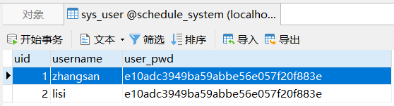
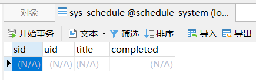
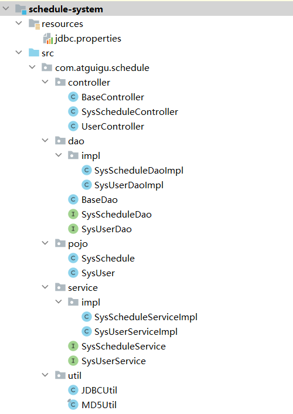
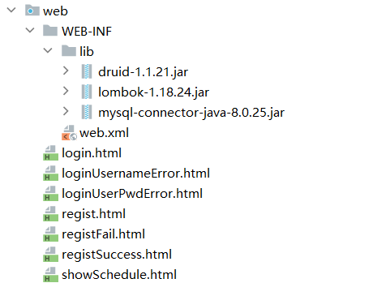
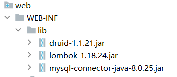
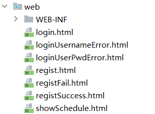

# Prerequisite Knowledge Before MVC

Before learning the MVC architecture pattern, students should already have some basic knowledge of Java Web development. MVC is not a new programming language or a specific technology. Instead, it is a way to organize the code structure of a Web application more clearly.

To better understand this part, students should be familiar with the following basic technologies:

1. **HTML**

   HTML is used to build the basic structure of Web pages, such as forms, input boxes, buttons, and tables.

2. **CSS**

   CSS is used to control the appearance of Web pages, such as layout, colors, fonts, spacing, and overall visual style.

3. **JavaScript**

   JavaScript can be used to add simple interaction on the client side, such as form checking and button events.

4. **Servlet**

   Servlet is a core technology in Java Web development. It is used to receive requests from the browser, process request data, and return responses to the client.

5. **Tomcat**

   Tomcat is a Web server and Servlet container. Our Java Web project must be deployed and run on Tomcat so that the browser can access it.

6. **JDBC**

   JDBC is used to connect Java programs with the database. Through JDBC, we can perform basic database operations such as insert, delete, update, and query.

7. **MySQL**

   MySQL is used to store application data, such as user information and schedule information in this project.

8. **Basic Java Syntax and Object-Oriented Programming**

   Students should understand classes, objects, methods, interfaces, inheritance, and encapsulation. These concepts are necessary for understanding POJO, DAO, Service, and Controller classes.

After learning these technologies separately, we need a better way to organize them in a real project. If all code is written directly inside one Servlet, the project will become difficult to read, modify, and maintain. Therefore, we introduce the MVC architecture pattern to separate page display, business logic, and request control.

In the following section, we will learn how to use MVC to organize a Java Web project.


# 11. MVC Architecture Pattern

> MVC (Model-View-Controller) is a common **software architecture pattern** in Java Web development. It divides a Web application into three main parts: **Model**, **View**, and **Controller**.  
>
> The main purpose of MVC is to separate page display, request control, business logic, and data access. In this way, different types of code are placed in different packages or directories, making the project clearer, easier to maintain, and easier to extend.

Before using MVC, we may put all the code inside one Servlet. For example, one Servlet may receive form data, check the username and password, connect to the database, execute SQL statements, and return the response page. This approach can work in a small demo, but when the project becomes larger, the code will become messy.

Therefore, in this project, we use the MVC idea to organize the schedule management system.

## 11.1 Model

The **Model** layer is responsible for data and business logic. In our project, the Model layer mainly includes the following packages:

+ `pojo`
+ `dao`
+ `service`

### 1. `pojo` package

The `pojo` package is used to store entity classes.

For example:

```java
com.atguigu.schedule.pojo.SysUser
com.atguigu.schedule.pojo.SysSchedule
~~~

`SysUser` is used to describe user information, such as:

​```java
private Integer uid;
private String username;
private String userPwd;
```

`SysSchedule` is used to describe schedule information, such as:

```java
private Integer sid;
private Integer uid;
private String title;
private Integer completed;
```

These classes correspond to the database tables `sys_user` and `sys_schedule`.

### 2. `dao` package

The `dao` package is responsible for database access.

For example:

```java
com.atguigu.schedule.dao.SysUserDao
com.atguigu.schedule.dao.impl.SysUserDaoImpl
com.atguigu.schedule.dao.SysScheduleDao
com.atguigu.schedule.dao.impl.SysScheduleDaoImpl
```

The DAO layer directly communicates with the database. It mainly contains SQL operations such as insert, delete, update, and query.

For example, in the user registration function, the DAO layer is responsible for inserting user data into the `sys_user` table:

```java
int addSysUser(SysUser sysUser);
```

In the login function, the DAO layer is responsible for querying user information by username:

```java
SysUser findByUsername(String username);
```

### 3. `service` package

The `service` package is responsible for business logic.

For example:

```java
com.atguigu.schedule.service.SysUserService
com.atguigu.schedule.service.impl.SysUserServiceImpl
com.atguigu.schedule.service.SysScheduleService
com.atguigu.schedule.service.impl.SysScheduleServiceImpl
```

The Service layer does not directly receive browser requests, and it does not directly display pages. Its job is to process business logic.

For example, during user registration, the Service layer first encrypts the password and then calls the DAO layer to save the user:

```java
sysUser.setUserPwd(MD5Util.encrypt(sysUser.getUserPwd()));
return userDao.addSysUser(sysUser);
```

So the Model layer in this project can be understood as:

```text
Model
 ├── pojo      entity classes
 ├── dao       database access
 └── service   business logic
```

## 11.2 View

The **View** layer is responsible for displaying pages to the user.

In this project, the View layer mainly refers to the static resources under the `web` directory, such as:

```text
login.html
regist.html
showSchedule.html
registSuccess.html
registFail.html
loginUsernameError.html
loginUserPwdError.html
```

The View layer usually contains:

- HTML
- CSS
- JavaScript
- images

For example, the login page allows the user to enter a username and password. The registration page allows the user to create a new account. The error pages are used to show login or registration failure messages.

In a traditional Java Web project, these pages are placed inside the back-end project.

However, in front-end/back-end separated projects, the View layer usually becomes an independent front-end project, such as a Vue or React project. In that case, the back-end mainly provides data interfaces instead of HTML pages.

## 11.3 Controller

The **Controller** layer is responsible for receiving client requests and controlling the request flow.

In this project, Servlet plays the role of Controller.

For example:

```java
com.atguigu.schedule.controller.BaseController
com.atguigu.schedule.controller.SysUserController
com.atguigu.schedule.controller.SysScheduleController
```

The Controller layer receives requests from the browser, obtains request parameters, calls the Service layer, and finally redirects or forwards the user to the correct page.

For example, in the registration function:

```java
protected void regist(HttpServletRequest req, HttpServletResponse resp)
```

The Controller does the following things:

1. Receives the username and password from the request.
2. Creates a `SysUser` object.
3. Calls the Service layer to complete registration.
4. Redirects the user to the success or failure page.

The workflow is:

```text
Browser
   ↓
SysUserController
   ↓
SysUserService
   ↓
SysUserDao
   ↓
Database
```

For the login function, the workflow is similar:

```text
Browser submits username and password
   ↓
SysUserController receives the request
   ↓
SysUserService processes login logic
   ↓
SysUserDao queries the database
   ↓
Controller redirects to the correct page
```

## 11.4 MVC Structure in This Project

In this schedule management project, the MVC structure can be summarized as follows:

```text
com.atguigu.schedule
 ├── controller
 │   ├── BaseController
 │   ├── SysUserController
 │   └── SysScheduleController
 │
 ├── service
 │   ├── SysUserService
 │   ├── SysScheduleService
 │   └── impl
 │       ├── SysUserServiceImpl
 │       └── SysScheduleServiceImpl
 │
 ├── dao
 │   ├── BaseDao
 │   ├── SysUserDao
 │   ├── SysScheduleDao
 │   └── impl
 │       ├── SysUserDaoImpl
 │       └── SysScheduleDaoImpl
 │
 ├── pojo
 │   ├── SysUser
 │   └── SysSchedule
 │
 └── util
     ├── JDBCUtil
     └── MD5Util
```

The `web` directory stores the View resources:

```text
web
 ├── login.html
 ├── regist.html
 ├── showSchedule.html
 ├── registSuccess.html
 ├── registFail.html
 ├── loginUsernameError.html
 └── loginUserPwdError.html
```

## 11.5 Request Processing Flow

Taking user registration as an example, the complete MVC processing flow is:

```text
1. The user fills in the registration form on regist.html.

2. The browser sends the request to:
   /user/regist

3. SysUserController receives the request.

4. SysUserController gets request parameters:
   username
   userPwd

5. SysUserController creates a SysUser object.

6. SysUserController calls SysUserService.

7. SysUserService encrypts the password and calls SysUserDao.

8. SysUserDao executes SQL and inserts the user into the database.

9. SysUserController redirects the user to:
   registSuccess.html
   or
   registFail.html
```

Taking user login as an example, the complete MVC processing flow is:

```text
1. The user fills in the login form on login.html.

2. The browser sends the request to:
   /user/login

3. SysUserController receives the request.

4. SysUserController gets the username and password.

5. SysUserController calls SysUserService to query user information.

6. SysUserService calls SysUserDao.

7. SysUserDao queries the sys_user table according to username.

8. The Controller checks whether the user exists and whether the password is correct.

9. The Controller redirects the user to:
   showSchedule.html
   or
   loginUsernameError.html
   or
   loginUserPwdError.html
```

## 11.6 Summary

In this project, MVC helps us organize the code clearly:

- **View**: HTML pages under the `web` directory. They are responsible for page display.
- **Controller**: Servlet classes under the `controller` package. They are responsible for receiving requests and controlling the request flow.
- **Service**: Classes under the `service` package. They are responsible for business logic.
- **DAO**: Classes under the `dao` package. They are responsible for database operations.
- **POJO**: Entity classes under the `pojo` package. They are responsible for storing data.

The most important idea of MVC is:

> Do not put all code into one Servlet.
> Put different responsibilities into different layers.

This makes the Java Web project easier to read, easier to debug, and closer to real enterprise development.

```

```

# 12. Case Development: Schedule Management, Phase II

## 12.1 Project Setup

### 12.1.1 Database Preparation

+ Create the `schedule_system` database and execute the following statements.

```sql
SET NAMES utf8mb4;
SET FOREIGN_KEY_CHECKS = 0;


-- ----------------------------
-- Create schedule table
-- ----------------------------
CREATE DATABASE IF NOT EXISTS experiments;
DROP TABLE IF EXISTS `sys_schedule`;
CREATE TABLE `sys_schedule`  (
  `sid` int NOT NULL AUTO_INCREMENT,
  `uid` int NULL DEFAULT NULL,
  `title` varchar(20) CHARACTER SET utf8mb4 COLLATE utf8mb4_0900_ai_ci NULL DEFAULT NULL,
  `completed` int(1) NULL DEFAULT NULL,
  PRIMARY KEY (`sid`) USING BTREE
) ENGINE = InnoDB AUTO_INCREMENT = 1 CHARACTER SET = utf8mb4 COLLATE = utf8mb4_0900_ai_ci ROW_FORMAT = Dynamic;

-- ----------------------------
-- Insert schedule data
-- ----------------------------

-- ----------------------------
-- Create user table
-- ----------------------------
DROP TABLE IF EXISTS `sys_user`;
CREATE TABLE `sys_user`  (
  `uid` int NOT NULL AUTO_INCREMENT,
  `username` varchar(10) CHARACTER SET utf8mb4 COLLATE utf8mb4_0900_ai_ci NULL DEFAULT NULL,
  `user_pwd` varchar(100) CHARACTER SET utf8mb4 COLLATE utf8mb4_0900_ai_ci NULL DEFAULT NULL,
  PRIMARY KEY (`uid`) USING BTREE,
  UNIQUE INDEX `username`(`username`) USING BTREE
) ENGINE = InnoDB CHARACTER SET = utf8mb4 COLLATE = utf8mb4_0900_ai_ci ROW_FORMAT = Dynamic;

-- ----------------------------
-- Insert user data
-- ----------------------------
INSERT INTO `sys_user` VALUES (1, 'zhangsan', 'e10adc3949ba59abbe56e057f20f883e');
INSERT INTO `sys_user` VALUES (2, 'lisi', 'e10adc3949ba59abbe56e057f20f883e');

SET FOREIGN_KEY_CHECKS = 1;
```

+ The following tables will be obtained.





### 12.1.2 Project Structure





### 12.1.3 Import Dependencies



### 12.1.4 Processing the `pojo` Package

The `pojo` package is used to store entity classes. An entity class is usually a Java class that corresponds to a table or an object in the system. For example, in this project, `SysUser` represents user information, and `SysSchedule` represents schedule information.

A standard entity class usually contains the following parts:

1. **Private member variables**

These variables are used to store object data. Usually, each variable corresponds to one field in the database table.

```java
private Integer uid;
private String username;
private String userPwd;
```

2. **No-argument constructor**

The no-argument constructor is required in many Java frameworks and tools. It allows an object to be created without passing initial values.

```java
public SysUser() {
}
```

3. **All-argument constructor**

The all-argument constructor is used to create an object and initialize all fields at the same time.

```java
public SysUser(Integer uid, String username, String userPwd) {
    this.uid = uid;
    this.username = username;
    this.userPwd = userPwd;
}
```

4. **Getter and Setter methods**

Getter methods are used to read private fields, and setter methods are used to modify private fields. Since the member variables are private, other classes need to access them through these methods.

```java
public String getUsername() {
    return username;
}

public void setUsername(String username) {
    this.username = username;
}
```

5. **`toString()` method**

The `toString()` method is usually used to print object information conveniently during testing and debugging.

```java
@Override
public String toString() {
    return "SysUser{" +
            "uid=" + uid +
            ", username='" + username + '\'' +
            ", userPwd='" + userPwd + '\'' +
            '}';
}
```

In short, the `pojo` package mainly defines the data structure of the project. These entity classes do not usually contain complex business logic. Their main purpose is to store and transfer data between different layers, such as the Servlet layer, Service layer, and DAO layer.

```java
package com.atguigu.schedule.pojo;

import java.io.Serializable;

public class SysUser implements Serializable {
private Integer uid;
private String username;
private String userPwd;

// No-argument constructor
public SysUser() {
}

// All-argument constructor
public SysUser(Integer uid, String username, String userPwd) {
    this.uid = uid;
    this.username = username;
    this.userPwd = userPwd;
}

public Integer getUid() {
    return uid;
}

public void setUid(Integer uid) {
    this.uid = uid;
}

public String getUsername() {
    return username;
}

public void setUsername(String username) {
    this.username = username;
}

public String getUserPwd() {
    return userPwd;
}

public void setUserPwd(String userPwd) {
    this.userPwd = userPwd;
}

@Override
public String toString() {
    return "SysUser{" +
            "uid=" + uid +
            ", username='" + username + '\'' +
            ", userPwd='" + userPwd + '\'' +
            '}';
}
    }
```


> Use Lombok to process getters, setters, `equals`, `hashCode`, and constructors.
>
> `@NoArgsConstructor` provides a no-argument constructor, which is often required when frameworks create objects automatically.
>  `@AllArgsConstructor` provides a constructor with all fields, which allows us to create an object quickly with complete data.
>  `@Data` automatically generates getters, setters, `toString()`, `equals()`, and `hashCode()`, so the entity class becomes much cleaner.
>
> 
## 2. Enable Annotation Processing

Lombok generates code through annotations, so annotation processing must be enabled.

Path:

```text
File
→ Settings
→ Build, Execution, Deployment
→ Compiler
→ Annotation Processors
```

Check:

```text
Enable annotation processing
```

Then click:

```text
Apply → OK
```

## 3. Check the Lombok Plugin

In newer versions of IntelliJ IDEA / PyCharm, Lombok support is usually built in.

If Lombok is not available, go to:

```text
File
→ Settings
→ Plugins
```

Search for:

```text
Lombok
```

Then install it and restart the IDE.

```java
//-----------------------------------------------------
package com.atguigu.schedule.pojo;

import lombok.AllArgsConstructor;
import lombok.Data;
import lombok.NoArgsConstructor;
import java.io.Serializable;
@AllArgsConstructor
@NoArgsConstructor
@Data
public class SysUser  implements Serializable {
    private Integer uid;
    private String username;
    private String userPwd;
}
//------------------------------------------------------
package com.atguigu.schedule.pojo;

import lombok.AllArgsConstructor;
import lombok.Data;
import lombok.NoArgsConstructor;
import java.io.Serializable;

@AllArgsConstructor
@NoArgsConstructor
@Data
public class SysSchedule implements Serializable {
    private Integer sid;
    private Integer uid;
    private String title;
    private Integer completed;
}
//------------------------------------------------------
```

### 12.1.5 Processing the `dao` Package

Before writing the DAO code, we need to understand what the DAO layer is.

DAO stands for **Data Access Object**. It is responsible for communicating with the database. In a Java Web project, the Controller layer should not write SQL directly, and the Service layer should not directly operate the database either. Instead, database operations should be placed in the DAO layer.

In this project, the DAO layer is mainly responsible for operations on the `sys_user` table and the `sys_schedule` table, such as inserting, deleting, updating, and querying data.

For example:

- `SysUserDao` is used to define database operations related to users.
- `SysUserDaoImpl` is used to implement these user-related database operations.
- `SysScheduleDao` is used to define database operations related to schedules.
- `SysScheduleDaoImpl` is used to implement these schedule-related database operations.
- `BaseDao` is used to provide common database operation methods, such as common query and update methods.

The main purpose of using the DAO layer is to separate database access code from business logic. This makes the code structure clearer and easier to maintain.

In simple terms:

```text
Controller → receives requests
Service    → processes business logic
DAO        → accesses the database
Database   → stores data
```

So in the following part, we will first prepare the JDBC utility class and configuration file, and then create `BaseDao`, DAO interfaces, and DAO implementation classes.

----------

Before writing the DAO code, we need to understand why we usually use **interfaces and implementation classes** in the DAO layer.

In a Java project, an interface is like a **standard rule**, and the implementation class is the **real worker** that follows this rule. For example, suppose we need to operate on user data. We can first define a `UserDao` interface and write methods such as `findById()`, `insert()`, `update()`, and `delete()`. This interface only tells us **what functions should be provided**, but it does not care **how these functions are implemented**.

Then we create a `UserDaoImpl` class to implement this interface. In this class, we write the real JDBC code to connect to the database and execute SQL statements.

A simple example is:

- `UserDao` interface: tells the program “we need a method to query users”.
- `UserDaoImpl` implementation class: writes the actual SQL code to query users from the database.

The advantage of this design is that the code becomes clearer and easier to maintain. If we want to change the database operation logic later, we only need to modify the implementation class, while other parts of the program can still use the same interface.

Therefore, in the DAO layer, we usually define interfaces first, and then write implementation classes.

All interfaces in the DAO layer define the operations that each DAO should provide. They describe the required database functions, but do not contain the detailed JDBC implementation.

----------

+ All interfaces in the DAO layer

+ All interfaces in the DAO layer define the standard database operations for each entity.

  When writing DAO interfaces, it is recommended to add **documentation comments** for each important method. Documentation comments can clearly explain the purpose of the method, the meaning of parameters, and the return value. This makes the code easier to read and maintain, especially when other developers or students use the interface.

  For example:

   * 

```java
//---------------------------------------------------
package com.atguigu.schedule.dao;
public interface SysUserDao {
    /**

 * Query a user by username.
   *
 * @param username the username entered by the user
 * @return the user object if found, otherwise null
   */
   SysUser findByUsername(String username);
}
//---------------------------------------------------
package com.atguigu.schedule.dao;
public interface SysScheduleDao {
}
//---------------------------------------------------
```

+ All implementation classes in the DAO layer

```java
//------------------------------------------------------------------------------
package com.atguigu.schedule.dao.impl;
import com.atguigu.schedule.dao.BaseDao;
import com.atguigu.schedule.dao.SysUserDao;
public class SysUserDaoImpl extends BaseDao implements SysUserDao {
}

//------------------------------------------------------------------------------
package com.atguigu.schedule.dao.impl;
import com.atguigu.schedule.dao.BaseDao;
import com.atguigu.schedule.dao.SysScheduleDao;
public class SysScheduleDaoImpl extends BaseDao implements SysScheduleDao {
}
//------------------------------------------------------------------------------
```

Import the `JDBCUtil` connection pool utility class and prepare the `jdbc.properties` configuration file.

```java
package com.atguigu.schedule.util;


import com.alibaba.druid.pool.DruidDataSourceFactory;

import javax.sql.DataSource;
import java.io.IOException;
import java.io.InputStream;
import java.sql.Connection;
import java.sql.SQLException;
import java.util.Properties;

public class JDBCUtil {
    private static ThreadLocal<Connection> threadLocal =new ThreadLocal<>();

    private static DataSource dataSource;
    // Initialize the connection pool.
    static{
        // This helps us read the .properties configuration file.
        Properties properties =new Properties();
        InputStream resourceAsStream = JDBCUtil.class.getClassLoader().getResourceAsStream("jdbc.properties");
        try {
            properties.load(resourceAsStream);
        } catch (IOException e) {
            throw new RuntimeException(e);
        }

        try {
            dataSource = DruidDataSourceFactory.createDataSource(properties);
        } catch (Exception e) {
            throw new RuntimeException(e);
        }


    }
    /* 1. Provide a method to obtain the connection pool. */
    public static DataSource getDataSource(){
        return dataSource;
    }

    /* 2. Provide a method to obtain a connection. */
    public static Connection getConnection(){
        Connection connection = threadLocal.get();
        if (null == connection) {
            try {
                connection = dataSource.getConnection();
            } catch (SQLException e) {
                throw new RuntimeException(e);
            }
            threadLocal.set(connection);
        }

        return connection;
    }


    /* Define a method to return the connection and remove the association with ThreadLocal. */
    public static void releaseConnection(){
        Connection connection = threadLocal.get();
        if (null != connection) {
            threadLocal.remove();
            // Set the connection back to auto-commit mode.
            try {
                connection.setAutoCommit(true);
                // Return the connection to the connection pool automatically.
                connection.close();
            } catch (SQLException e) {
                throw new RuntimeException(e);
            }
        }
    }
}
```

```properties
driverClassName=com.mysql.cj.jdbc.Driver
url=jdbc:mysql://localhost:3306/schedule_system
username=root
password=root
initialSize=5
maxActive=10
maxWait=1000
```

+ Create a `BaseDao` object and copy the following code.

```java
package com.atguigu.schedule.dao;


import com.atguigu.schedule.util.JDBCUtil;

import java.lang.reflect.Field;
import java.sql.*;
import java.time.LocalDateTime;
import java.util.ArrayList;
import java.util.List;

public class BaseDao {
    // Common query method. It returns a single object.
    public <T> T baseQueryObject(Class<T> clazz, String sql, Object ... args) {
        T t = null;
        Connection connection = JDBCUtil.getConnection();
        PreparedStatement preparedStatement = null;
        ResultSet resultSet = null;
        int rows = 0;
        try {
            // Prepare the statement object.
            preparedStatement = connection.prepareStatement(sql);
            // Set parameters for the statement.
            for (int i = 0; i < args.length; i++) {
                preparedStatement.setObject(i + 1, args[i]);
            }

            // Execute the query.
            resultSet = preparedStatement.executeQuery();
            if (resultSet.next()) {
                t = (T) resultSet.getObject(1);
            }
        } catch (Exception e) {
            e.printStackTrace();
        } finally {
            if (null != resultSet) {
                try {
                    resultSet.close();
                } catch (SQLException e) {
                    e.printStackTrace();
                }
            }
            if (null != preparedStatement) {
                try {
                    preparedStatement.close();
                } catch (SQLException e) {
                    e.printStackTrace();
                }

            }
            JDBCUtil.releaseConnection();
        }
        return t;
    }
    // Common query method. It returns a collection of objects.

    public <T> List<T> baseQuery(Class clazz, String sql, Object ... args){
        List<T> list =new ArrayList<>();
        Connection connection = JDBCUtil.getConnection();
        PreparedStatement preparedStatement=null;
        ResultSet resultSet =null;
        int rows = 0;
        try {
            // Prepare the statement object.
            preparedStatement = connection.prepareStatement(sql);
            // Set parameters for the statement.
            for (int i = 0; i < args.length; i++) {
                preparedStatement.setObject(i+1,args[i]);
            }

            // Execute the query.
            resultSet = preparedStatement.executeQuery();

            ResultSetMetaData metaData = resultSet.getMetaData();
            int columnCount = metaData.getColumnCount();

            // Encapsulate the result set into entity class objects through reflection.
            while (resultSet.next()) {
                // Instantiate an object through reflection.
                Object obj =clazz.getDeclaredConstructor().newInstance();

                for (int i = 1; i <= columnCount; i++) {
                    String columnName = metaData.getColumnLabel(i);
                    Object value = resultSet.getObject(columnName);
                    // Handle conversion between datetime fields and java.util.Date.
                    if(value.getClass().equals(LocalDateTime.class)){
                        value= Timestamp.valueOf((LocalDateTime) value);
                    }
                    Field field = clazz.getDeclaredField(columnName);
                    field.setAccessible(true);
                    field.set(obj,value);
                }

                list.add((T)obj);
            }

        } catch (Exception e) {
            e.printStackTrace();
        } finally {
            if (null !=resultSet) {
                try {
                    resultSet.close();
                } catch (SQLException e) {
                    throw new RuntimeException(e);
                }
            }
            if (null != preparedStatement) {
                try {
                    preparedStatement.close();
                } catch (SQLException e) {
                    throw new RuntimeException(e);
                }
            }
            JDBCUtil.releaseConnection();
        }
        return list;
    }

    // Common method for insert, delete, and update operations.
    public int baseUpdate(String sql,Object ... args) {
        // Get a connection.
        Connection connection = JDBCUtil.getConnection();
        PreparedStatement preparedStatement=null;
        int rows = 0;
        try {
            // Prepare the statement object.
            preparedStatement = connection.prepareStatement(sql);
            // Set parameters for the statement.
            for (int i = 0; i < args.length; i++) {
                preparedStatement.setObject(i+1,args[i]);
            }

            // Execute insert, delete, or update. Use executeUpdate.
            rows = preparedStatement.executeUpdate();
            // Release resources. Optional here.


        } catch (SQLException e) {
            e.printStackTrace();
        } finally {
            if (null != preparedStatement) {
                try {
                    preparedStatement.close();
                } catch (SQLException e) {
                    throw new RuntimeException(e);
                }

            }
            JDBCUtil.releaseConnection();
        }
        // Return the number of affected database records.
        return rows;
    }
}
```

### 12.1.6 Processing the `service` Package

The `service` package is used to write the **business logic layer** of the project.

In a Java Web project, the controller layer is mainly responsible for receiving requests and returning responses, while the DAO layer is mainly responsible for database operations. The service layer is placed between the controller layer and the DAO layer. It is responsible for processing business rules and organizing DAO operations.

For example, when a user logs in, the controller receives the username and password from the request. However, the controller should not directly write complex login logic or SQL code. Instead, it should call the service layer. The service layer checks whether the username and password are valid, and then calls the DAO layer to query the database.

Simply speaking:

- `Controller`: receives requests and sends responses.
- `Service`: processes business logic.
- `DAO`: operates the database.

Using the service layer makes the project structure clearer. It also reduces the coupling between the controller layer and the DAO layer. If the business logic changes later, we mainly modify the service classes instead of changing the controller code everywhere.

+ Interfaces

```java
//------------------------------------------------------------------------------
package com.atguigu.schedule.service;
public interface SysUserService {
}
//------------------------------------------------------------------------------
package com.atguigu.schedule.service;
public interface SysScheduleService {
}
//------------------------------------------------------------------------------
```

+ Implementation classes

```java
//------------------------------------------------------------------------------
package com.atguigu.schedule.service.impl;
import com.atguigu.schedule.service.SysUserService;
public class SysUserServiceImpl implements SysUserService {
}
//------------------------------------------------------------------------------
package com.atguigu.schedule.service.impl;
import com.atguigu.schedule.service.SysScheduleService;
public class SysScheduleServiceImpl implements SysScheduleService {
}
//------------------------------------------------------------------------------
```

### 12.1.7 Processing the `controller` Package

The `controller` package is used to handle **HTTP requests from the client (browser)** and return responses.

In a Java Web application, the controller layer is the **entry point** of the system. It receives user requests, extracts parameters, calls the service layer to process business logic, and finally returns the result to the user.

Simply speaking:

- The browser sends a request → Controller receives it  
- Controller calls Service → Service processes logic  
- Controller returns the response  

So the controller acts like a **bridge between the front-end and the back-end logic**.

---

### Why we usually do NOT use interfaces in the controller layer?

Unlike DAO and Service layers, the controller layer usually **does not use interfaces**, because:

1. Controllers are directly mapped to specific URLs (e.g., `/user/*`, `/schedule/*`), so each controller is already tied to a concrete function.
2. There is usually no need to switch between different implementations of a controller.
3. The logic in controllers is relatively simple (mainly request handling and delegation), so defining interfaces would add unnecessary complexity.

Therefore, in most cases, we directly write concrete controller classes instead of defining interfaces.

---

### BaseController

To simplify request handling, we create a `BaseController` class.

It solves the problem of **request path mapping**. Instead of writing many `if-else` statements, it uses **reflection** to automatically call different methods based on the request URL.

For example:

- Request: `/user/login`
- Method called: `login(...)`

This makes the code cleaner and easier to extend.

```java

```

+ `BaseController` handles request path issues.

```java
package com.atguigu.schedule.controller;

import jakarta.servlet.ServletException;
import jakarta.servlet.http.HttpServlet;
import jakarta.servlet.http.HttpServletRequest;
import jakarta.servlet.http.HttpServletResponse;
import java.io.IOException;
import java.lang.reflect.Method;

public class BaseController extends HttpServlet {
    @Override
    protected void service(HttpServletRequest req, HttpServletResponse resp) throws ServletException, IOException {


        String requestURI = req.getRequestURI();
        String[] split = requestURI.split("/");
        String methodName =split[split.length-1];
        // Use reflection to obtain the method to be executed.
        Class clazz = this.getClass();
        try {
            Method method=clazz.getDeclaredMethod(methodName,HttpServletRequest.class,HttpServletResponse.class);
            // Set the method to be accessible.
            method.setAccessible(true);
            // Execute the method through reflection.
            method.invoke(this,req,resp);
        } catch (Exception e) {
            e.printStackTrace();
    
        }
    }
}
```

+ Multiple handlers inherit from `BaseController`.

```java
//----------------------------------------------------------------------------
package com.atguigu.schedule.controller;

import jakarta.servlet.annotation.WebServlet;

@WebServlet("/user/*")
public class UserController extends BaseController{
}
//----------------------------------------------------------------------------
package com.atguigu.schedule.controller;

import jakarta.servlet.annotation.WebServlet;

@WebServlet("/schedule/*")
public class SysScheduleController  extends BaseController{
}
//----------------------------------------------------------------------------

```

+ 可以这样写：

  ### 12.1.8 Using the Encryption Utility Class

  Before saving the user password into the database, we should not store the original password directly. If the database is leaked, the users’ real passwords will also be exposed. Therefore, we usually use an encryption or hashing utility class to process the password first.

  In this project, we import the `MD5Util` utility class to convert the original password into an MD5 encrypted string. Then, the encrypted password is stored in the database.

  For example:

  ```java
  String encryptedPwd = MD5Util.encrypt(userPwd);
  ```

  The main reasons are:

  1. **Improve security**
     The original password is not stored directly.
  2. **Protect user privacy**
     Even if someone sees the database, they cannot easily know the real password.
  3. **Keep password comparison consistent**
     During login, the password entered by the user is also encrypted first, and then compared with the encrypted password in the database.

  So, the purpose of using `MD5Util` is to make password storage safer. This is a common practice in user registration and login systems.

```java
package com.atguigu.schedule.util;
import java.security.MessageDigest;
import java.security.NoSuchAlgorithmException;
public final class MD5Util {
    public static String encrypt(String strSrc) {
        try {
            char hexChars[] = { '0', '1', '2', '3', '4', '5', '6', '7', '8',
                    '9', 'a', 'b', 'c', 'd', 'e', 'f' };
            byte[] bytes = strSrc.getBytes();
            MessageDigest md = MessageDigest.getInstance("MD5");
            md.update(bytes);
            bytes = md.digest();
            int j = bytes.length;
            char[] chars = new char[j * 2];
            int k = 0;
            for (int i = 0; i < bytes.length; i++) {
                byte b = bytes[i];
                chars[k++] = hexChars[b >>> 4 & 0xf];
                chars[k++] = hexChars[b & 0xf];
            }
            return new String(chars);
        } catch (NoSuchAlgorithmException e) {
            e.printStackTrace();
            throw new RuntimeException("MD5 encryption error!!!")
        }
    }
}
```

### 12.1.9 Importing Page Files

+ Copy the HTML files in the schedule management resource folder to the `web` directory of the project.



## 12.3 Business Code

### 12.3.1 Registration Business Processing

This part implements the complete registration business process.

When the user submits the registration form, the request is first sent to the Controller layer. The Controller receives the username and password from the request, encapsulates them into a SysUser object, and then calls the Service layer.

The Service layer is responsible for the real business logic. Before saving the user information, it encrypts the plaintext password by using MD5Util. After that, it calls the DAO layer.

The DAO layer is responsible for database operations. It executes the SQL insert statement and saves the new user into the sys_user table.

Finally, the Controller redirects the user to the success page or failure page according to the result returned by the DAO layer.

+ Controller

```java 
package com.atguigu.schedule.controller;

import com.atguigu.schedule.pojo.SysUser;
import com.atguigu.schedule.service.SysUserService;
import com.atguigu.schedule.service.impl.SysUserServiceImpl;
import jakarta.servlet.ServletException;
import jakarta.servlet.annotation.WebServlet;
import jakarta.servlet.http.HttpServletRequest;
import jakarta.servlet.http.HttpServletResponse;

import java.io.IOException;

@WebServlet("/user/*")
public class SysUserController  extends BaseContoller {

    private SysUserService userService =new SysUserServiceImpl();

    /**
     * Business processing method for receiving user registration requests.
     * This is a business interface, not an interface in Java.
     * @param req
     * @param resp
     * @throws ServletException
     * @throws IOException
     */
    protected void regist(HttpServletRequest req, HttpServletResponse resp) throws ServletException, IOException {
        // 1. Receive parameters submitted by the client.
        String username = req.getParameter("username");
        String userPwd = req.getParameter("userPwd");
        // 2. Call the service layer method to complete registration.
            // Put the parameters into a SysUser object and pass it when calling the regist method.
        SysUser sysUser =new SysUser(null,username,userPwd);
        int rows =userService.regist(sysUser);
        // 3. Redirect pages according to the registration result: success or failure.
        if(rows>0){
            resp.sendRedirect("/registSuccess.html");
        }else{
            resp.sendRedirect("/registFail.html");
        }
    }
}
```

+ Service

```java
package com.atguigu.schedule.service;

import com.atguigu.schedule.pojo.SysUser;

public interface SysUserService {
    /**
     * Business method for completing user registration.
     * @param registUser The object used to store the registered username and password.
     * @return If registration succeeds, return an integer greater than 0; otherwise, return 0.
     */
    int regist(SysUser registUser);
}
```

```java
package com.atguigu.schedule.service.impl;

import com.atguigu.schedule.dao.SysUserDao;
import com.atguigu.schedule.dao.impl.SysUserDaoImpl;
import com.atguigu.schedule.pojo.SysUser;
import com.atguigu.schedule.service.SysUserService;
import com.atguigu.schedule.util.MD5Util;

public class SysUserServiceImpl  implements SysUserService {
    private SysUserDao  userDao =new SysUserDaoImpl();
    @Override
    public int regist(SysUser sysUser) {

        // Convert the user's plaintext password into an encrypted password.
        sysUser.setUserPwd(MD5Util.encrypt(sysUser.getUserPwd()));
        // Call the DAO layer method to store the sysUser information in the database.
        return userDao.addSysUser(sysUser);
    }
}
```

+ DAO

```java
package com.atguigu.schedule.dao;

import com.atguigu.schedule.pojo.SysUser;

public interface SysUserDao {

    /**
     * Method for adding a user record to the database.
     * @param sysUser The username and user_pwd fields of the record to be added are received as a SysUser entity object.
     * @return Return 1 if the record is added successfully; return 0 if it fails.
     */
    int addSysUser(SysUser sysUser);
}
```

```java
package com.atguigu.schedule.dao.impl;

import com.atguigu.schedule.dao.BaseDao;
import com.atguigu.schedule.dao.SysUserDao;
import com.atguigu.schedule.pojo.SysUser;
public class SysUserDaoImpl extends BaseDao implements SysUserDao {
    @Override
    public int addSysUser(SysUser sysUser) {
        String sql ="insert into sys_user values(DEFAULT,?,?)";
        return baseUpdate(sql,sysUser.getUsername(),sysUser.getUserPwd());
    }
}
```

### 12.3.2 Login Business Processing

This part implements the complete login business process.

When the user submits the login form, the request is first sent to the Controller layer. The Controller receives the username and password from the request, and then calls the Service layer to query the user information by username.

The Service layer does not directly operate the database. It calls the DAO layer to find the corresponding user record.

The DAO layer executes the SQL query according to the username. If the user exists, it returns a SysUser object; otherwise, it returns null.

After the Controller gets the query result, it first checks whether the username exists. If the user does not exist, it redirects to the username error page. If the user exists, it encrypts the password entered by the user and compares it with the encrypted password stored in the database.

If the password is correct, the user is redirected to the home page. Otherwise, the user is redirected to the password error page.

+ Controller

```java 
package com.atguigu.schedule.controller;

import com.atguigu.schedule.pojo.SysUser;
import com.atguigu.schedule.service.SysUserService;
import com.atguigu.schedule.service.impl.SysUserServiceImpl;
import com.atguigu.schedule.util.MD5Util;
import jakarta.servlet.ServletException;
import jakarta.servlet.annotation.WebServlet;
import jakarta.servlet.http.HttpServletRequest;
import jakarta.servlet.http.HttpServletResponse;

import java.io.IOException;

@WebServlet("/user/*")
public class SysUserController  extends BaseContoller {

    private SysUserService userService =new SysUserServiceImpl();
    /**
     * Business interface for receiving user login requests and completing login.
     * @param req
     * @param resp
     * @throws ServletException
     * @throws IOException
     */
    protected void login(HttpServletRequest req, HttpServletResponse resp) throws ServletException, IOException {
        // 1. Receive username and password.
        String username = req.getParameter("username");
        String userPwd = req.getParameter("userPwd");
        // 2. Call the service layer method to query user information according to the username.
        SysUser loginUser =userService.findByUsername(username);
        if(null == loginUser){
            // Redirect to the page showing that the username is incorrect.
            resp.sendRedirect("/loginUsernameError.html");
        }else if(! MD5Util.encrypt(userPwd).equals(loginUser.getUserPwd())){
            // 3. Check whether the password matches.
            // Redirect to the page showing that the password is incorrect.
            resp.sendRedirect("/loginUserPwdError.html");
        }else{
            // 4. Redirect to the home page.
            resp.sendRedirect("/showSchedule.html");
        }

    }
}
```

+ Service

```java
package com.atguigu.schedule.service;

import com.atguigu.schedule.pojo.SysUser;

public interface SysUserService {
    /**
     * Method for obtaining complete user information according to the username.
     * @param username The username to query.
     * @return Return a SysUser object if found; otherwise, return null.
     */
    SysUser findByUsername(String username);
}
```

```java
package com.atguigu.schedule.service.impl;

import com.atguigu.schedule.dao.SysUserDao;
import com.atguigu.schedule.dao.impl.SysUserDaoImpl;
import com.atguigu.schedule.pojo.SysUser;
import com.atguigu.schedule.service.SysUserService;
import com.atguigu.schedule.util.MD5Util;

public class SysUserServiceImpl implements SysUserService {
    private SysUserDao userDao =new SysUserDaoImpl();

    @Override
    public SysUser findByUsername(String username) {
        // Call the DAO layer method to continue the query.

        return userDao.findByUsername(username);
    }
}
```

+ DAO

```java
package com.atguigu.schedule.dao;

import com.atguigu.schedule.pojo.SysUser;

public interface SysUserDao {
    /**
     * Method for obtaining complete user information according to the username.
     * @param username The username to query.
     * @return Return a SysUser object if found; otherwise, return null.
     */
    SysUser findByUsername(String username);
}
```

```java 
import com.atguigu.schedule.dao.BaseDao;
import com.atguigu.schedule.dao.SysUserDao;
import com.atguigu.schedule.pojo.SysUser;

import java.util.List;

public class SysUserDaoImpl extends BaseDao implements SysUserDao {
    @Override
    public SysUser findByUsername(String username) {
        String sql ="select uid,username, user_pwd userPwd from sys_user where username = ?";
        List<SysUser> userList = baseQuery(SysUser.class, sql, username);
        return  null != userList&& userList.size()>0? userList.get(0):null;
    }
}
```
