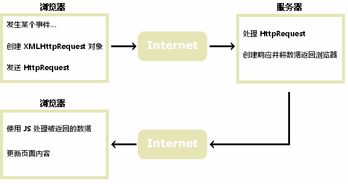
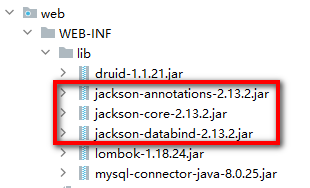

## 3.9 Review of the Previous Lesson

In the previous lesson, we mainly completed **Phase II of the Schedule Management System**.

First, we reviewed the **MVC architecture pattern**. MVC helps us divide a Java Web project into different layers with clear responsibilities:

- **View**: HTML pages, such as `login.html`, `regist.html`, and `showSchedule.html`.
- **Controller**: Servlet classes that receive browser requests and control the request flow.
- **Service**: Classes that process business logic.
- **DAO**: Classes that access the database.
- **POJO**: Entity classes used to store and transfer data.

The most important idea of MVC is:

> Do not put all code into one Servlet.  
> Put different responsibilities into different layers.

Then, we built the basic project structure for the schedule management system.

We created two database tables:

```text
sys_user
sys_schedule
~~~

The `sys_user` table is used to store user information, such as username and password.
The `sys_schedule` table is used to store schedule information, such as schedule title and completion status.

After that, we created the corresponding Java packages:

​```text
com.atguigu.schedule
 ├── controller
 ├── service
 ├── dao
 ├── pojo
 └── util
```

In the `pojo` package, we created entity classes such as `SysUser` and `SysSchedule`. These classes are mainly used to store data.

In the `dao` package, we created DAO interfaces and implementation classes. The DAO layer is responsible for database operations, such as inserting, deleting, updating, and querying data.

In the `service` package, we created service interfaces and implementation classes. The Service layer is responsible for business logic. For example, before saving a user password into the database, the Service layer encrypts the password first.

In the `controller` package, we created Servlet controllers such as `SysUserController`. The Controller layer receives requests from the browser, gets request parameters, calls the Service layer, and finally redirects the user to the correct page.

We also created a `BaseController`. It uses reflection to call different methods according to the request path. For example:

```text
/user/login  →  login(...)
```

This avoids writing many repeated `if-else` statements in the Servlet.

Finally, we implemented two important business functions:

### 1. User Registration

The registration workflow is:

```text
regist.html
   ↓
/user/regist
   ↓
SysUserController
   ↓
SysUserService
   ↓
SysUserDao
   ↓
sys_user table
```

When a user registers, the system receives the username and password, encrypts the password by using `MD5Util`, and then stores the user information in the database.

### 2. User Login

The login workflow is:

```text
login.html
   ↓
/user/login
   ↓
SysUserController
   ↓
SysUserService
   ↓
SysUserDao
   ↓
sys_user table
```

When a user logs in, the system queries the database according to the username. If the user exists, the password entered by the user is encrypted and compared with the encrypted password stored in the database.

If the username or password is wrong, the user is redirected to an error page.
If the login succeeds, the user is redirected to `showSchedule.html`.

However, there is still one important problem.

In the previous version, after login succeeds, the user can enter `showSchedule.html`. But if another user directly types the following URL in the browser:

```text
http://localhost:8080/showSchedule.html
```

or directly accesses:

```text
http://localhost:8080/schedule/xxx
```

the system may still allow access.

This is not safe.

So in this lesson, we need to solve a new problem:

> How can the server remember that a user has logged in?
> How can we prevent users who are not logged in from accessing protected resources?

To solve this problem, we will learn and use **Session** and **Filter**.

The Session is used to remember the login state of the user.
The Filter is used to intercept protected resources and check whether the user has logged in.

Now let us review three important Java Web mechanisms: **Session**, **Filter**, and **Listener**.

# IV. Case Development - Schedule Management - Phase 3

## 4.0 Review: Session, Filter, and Listener

Before implementing login verification, let us briefly review three important mechanisms in Java Web development: **Session**, **Filter**, and **Listener**.

### 1. Session

HTTP is a stateless protocol. This means that each request is independent, and the server does not automatically remember whether a user has logged in before.

For example, after a user logs in successfully, if the server does not store the login information, the next request to `showSchedule.html` will still look like a new request. The server will not know who the user is.

To solve this problem, we use **Session**.

A session is used to store user-related data on the server side. Each user has their own session. After login succeeds, we can store the current user object in the session:

```java
req.getSession().setAttribute("sysUser", loginUser);
~~~

Later, when the user visits other pages or sends other requests, we can get this value from the session:

​```java
Object sysUser = session.getAttribute("sysUser");
```

If `sysUser` is not `null`, it means the user has logged in. If it is `null`, it means the user has not logged in.

Therefore, in this project, **Session is used to remember the login state of the user**.

### 2. Filter

A filter is used to intercept requests before they reach the target resource, such as an HTML page or a Servlet.

In a web application, some pages should only be accessed after login. For example:

- `showSchedule.html`
- `/schedule/*`

If we check login status inside every Servlet method, the code will become repetitive and hard to maintain. For example, every add, delete, update, and query method would need to write the same login-checking code.

A better solution is to use a **Filter**.

The filter can check whether the user has logged in before the request reaches the target resource.

```java
@WebFilter(urlPatterns = {"/showSchedule.html", "/schedule/*"})
```

This means the filter will intercept requests to `showSchedule.html` and all requests under `/schedule/`.

Inside the filter, we check the session:

```java
Object sysUser = session.getAttribute("sysUser");
```

If the user exists in the session, the request is allowed to continue:

```java
filterChain.doFilter(servletRequest, servletResponse);
```

If the user does not exist in the session, the request is redirected to the login page:

```java
response.sendRedirect("/login.html");
```

Therefore, in this project, **Filter is used to protect pages and controller operations that require login**.

### 3. Listener

A listener is used to listen for important events in a web application.

For example, a listener can listen for:

- application startup and shutdown;
- session creation and destruction;
- request creation and destruction;
- changes to attributes in application, session, or request scopes.

In this login verification function, we mainly use **Session** and **Filter**. A listener is not necessary here, but it is still an important part of Java Web development.

For example, in larger systems, a listener may be used to count online users, initialize application resources, or release resources when the application stops.

### 4. Why Do We Need Session and Filter Here?

In this schedule management system, users should not be able to access schedule data before login.

So we need to solve two problems:

First, the system must remember whether the user has logged in.
This is handled by **Session**.

Second, the system must block unauthenticated users from accessing protected resources.
This is handled by **Filter**.

The basic workflow is:

1. The user submits the login form.
2. The server checks the username and password.
3. If login succeeds, the user object is stored in the session.
4. When the user visits `showSchedule.html` or `/schedule/*`, the filter checks the session.
5. If the session contains `sysUser`, the request is allowed.
6. If the session does not contain `sysUser`, the user is redirected to `login.html`.

In short:

- **Session remembers who has logged in.**
- **Filter decides whether the request can continue.**
- **Listener observes web application events, but it is not required in this function.**

After understanding these concepts, we can implement the login verification filter.

In this part, we should remember one key idea: login verification is not only about checking the username and password once. After login succeeds, the server must remember the user’s login state. This is why we use Session.

At the same time, we do not want to write login-checking code in every controller method. This is why we use Filter. The filter works like a security guard. Before the request enters the protected resource, it checks whether the user has already logged in.


## 4.1 Using a Filter to Control Login Verification

> Requirement: When the user is not logged in, access to `showSchedule.html` and the add, delete, update, and query operations related to `SysScheduleController` should not be allowed. The user should be redirected to `login.html`. After successful login, the user can access these resources normally.

+ Develop a login filter to filter requests for specified resources.

``` java
package com.atguigu.schedule.filters;

import jakarta.servlet.*;
import jakarta.servlet.annotation.WebFilter;
import jakarta.servlet.http.HttpServletRequest;
import jakarta.servlet.http.HttpServletResponse;
import jakarta.servlet.http.HttpSession;

import java.io.IOException;

@WebFilter(urlPatterns = {"/showSchedule.html","/schedule/*"})
public class LoginFilter  implements Filter {
    @Override
    public void doFilter(ServletRequest servletRequest, ServletResponse servletResponse, FilterChain filterChain) throws IOException, ServletException {
        HttpServletRequest request =(HttpServletRequest) servletRequest;
        HttpServletResponse response =(HttpServletResponse) servletResponse;
        HttpSession session = request.getSession();
        Object sysUser = session.getAttribute("sysUser");
        if(null != sysUser){
            // If the logged-in user exists in the session, it means the user has logged in, so allow the request to pass.
            filterChain.doFilter(servletRequest,servletResponse);

        }else{
            // The user is not logged in. Redirect to the login page.
            response.sendRedirect("/login.html");
        }
    }
}

```

+ Modify the `login` method of the user login request. When login succeeds, store the user information in the session.

``` java
 /**
     * Business interface for user login
     * @param req
     * @param resp
     * @throws ServletException
     * @throws IOException
     */
    protected void login(HttpServletRequest req, HttpServletResponse resp) throws ServletException, IOException {
        // Receive request parameters from the user.
        // Get the username and password to be registered/logged in.
        String username = req.getParameter("username");
        String userPwd = req.getParameter("userPwd");
        // Call the service-layer method to check whether a user exists in the database according to the username.
        SysUser loginUser =userService.findByUsername(username);
        if(null == loginUser){
            // No user is found by username, which means the username is incorrect.
            resp.sendRedirect("/loginUsernameError.html");
        }else if(! loginUser.getUserPwd().equals(MD5Util.encrypt(userPwd))){
            // The user password is incorrect.
            resp.sendRedirect("/loginUserPwdError.html");
        }else{
            // Login succeeds. Store the user information in the session.
            req.getSession().setAttribute("sysUser",loginUser);
            // Login succeeds. Redirect to the schedule display page.
            resp.sendRedirect("/showSchedule.html");
        }
    }
```


# V. Ajax

Before learning Ajax, let us first review the common ways to send requests in a Web application.

In the previous parts of this project, we mainly used the following request methods:

### 1. Sending a request by form submission

For example, when the user registers or logs in, the browser sends the form data to the server:

```html
<form method="post" action="/user/regist">
~~~

After the form is submitted, the browser usually jumps to a new page according to the server response.

For example:

​```text
regist.html  →  /user/regist  →  registSuccess.html
```

This method is suitable for complete business operations, such as registration, login, adding data, and submitting forms.

### 2. Sending a request by clicking a link

For example:

```html
<a href="/login.html">Go to Login</a>
```

When the user clicks the link, the browser sends a request to the specified URL and jumps to that page.

This method is often used for page navigation.

### 3. Sending a request by entering a URL in the address bar

For example, the user can directly enter:

```text
http://localhost:8080/showSchedule.html
```

The browser will send a request to the server and try to access this resource directly.

This is why we need Filter to protect some resources. Otherwise, users may bypass the normal login process and directly access protected pages.

However, these traditional request methods have one common feature:

> The browser usually reloads or jumps to a new page after sending the request.

Sometimes, this is not what we want.

For example, in the registration page, when the user enters a username, we want to check whether the username has already been used. If we use a normal form submission, the whole registration form will be submitted before the user finishes all input. This is not convenient.

A better solution is:

> When the username input box loses focus, the browser quietly sends a request to the server in the background.
> The server checks whether the username exists and returns a result.
> The current page does not refresh or jump.
> The result is displayed beside the username input box.

For example:

```text
User enters username
        ↓
The browser sends an Ajax request to /user/checkUsernameUsed
        ↓
The server checks the username in the database
        ↓
The server returns a JSON result
        ↓
The page displays “OK” or “Username already used”
```

This is the main use of Ajax in our project.

Ajax allows JavaScript to send requests to the server without refreshing the whole page. After receiving the server response, JavaScript can update only part of the page, such as a message beside the input box.

So, compared with traditional form submission, Ajax is more suitable for small, instant, and partial interactions, such as:

- checking whether a username is already used;
- loading part of the page data;
- updating a small area of the page;
- submitting data without refreshing the whole page.

In this phase, we will use Ajax to implement username availability checking before registration.


## 4.1 What Is Ajax?

+ AJAX = Asynchronous JavaScript and XML. Asynchronous 和同步的区别

+ AJAX is not a new programming language. It is a new way to use existing standards.

+ The biggest advantage of AJAX is that it can exchange data with the server and update part of a web page without reloading the whole page.

+ AJAX does not require any browser plug-ins, but it requires the user to allow JavaScript to run in the browser.

+ `XMLHttpRequest` is only one way to implement Ajax.

**How Ajax works:**



+ Simply speaking, the requests we sent before were usually triggered by elements such as `form` tags or `a` tags. Now, requests can be sent dynamically by running JavaScript code, which determines when and what kind of request should be sent.
+ Requests sent by JavaScript do not require the browser to jump to another page. We can decide in JavaScript whether the page should be redirected.
+ After receiving the response from a request sent by JavaScript, we can render the result into certain page elements through DOM programming, thus achieving partial page updates.

AJAX = Asynchronous JavaScript and XML.

Here, **asynchronous** means that the browser can send a request to the server without stopping the current page.

To understand this, we can compare **synchronous** and **asynchronous** requests.

### 1. Synchronous Request

A synchronous request means that the browser sends a request and then waits for the server response.

During this process, the user usually cannot continue the current operation. The page may refresh or jump to another page.

For example, when we submit a normal form:

```html
<form method="post" action="/user/regist">
~~~

The browser sends the request to the server.
Then it waits for the server to process the request and return a response.
After that, the browser refreshes or jumps to another page.

The process is like this:

​```text
Browser sends request
        ↓
Wait for server response
        ↓
Refresh or jump to a new page
```

This is simple, but the user experience is not always good.

### 2. Asynchronous Request

An asynchronous request means that the browser sends a request in the background.

The current page does not need to refresh or jump. The user can continue using the page while the request is being processed.

For example, when checking whether a username is already used:

```text
The user enters a username
        ↓
JavaScript sends an Ajax request in the background
        ↓
The user can still stay on the registration page
        ↓
The server returns the checking result
        ↓
JavaScript updates only the message beside the input box
```

So the key difference is:

```text
Synchronous request:
Send request → wait → refresh or jump

Asynchronous request:
Send request in the background → continue using the page → update part of the page after response
```

In short:

- **Synchronous**: the browser waits for the server, and the whole page may refresh.
- **Asynchronous**: the browser does not need to wait on the current page, and only part of the page is updated.

This is why Ajax is useful. It allows us to communicate with the server without refreshing the entire page.


This figure compares two ways of sending requests in a Web application: **synchronous requests** and **asynchronous requests (Ajax)**.

On the left side, it shows a **synchronous request**.

When the user submits a normal form, the browser sends the request to the server. Then the browser has to wait for the server response. During this waiting time, the current page is usually blocked. After the server returns the response, the whole page may refresh or jump to another page.

For example, when we submit a normal registration form:

```html
<form method="post" action="/user/regist">
```
the browser sends all form data to `/user/regist`. After the server finishes the registration logic, the page may jump to `registSuccess.html` or `registFail.html`.

So the synchronous request process is:

```text
Browser sends request
        ↓
Server processes request
        ↓
Browser waits
        ↓
Server returns response
        ↓
Whole page refreshes or jumps
```

The key point is:

> In a synchronous request, the browser usually waits, and the whole page may be refreshed.

On the right side, it shows an **asynchronous request**, which is also the main idea of Ajax.

With Ajax, JavaScript can send a request to the server in the background. The current page does not need to refresh or jump. The user can continue typing or using the page. After the server returns the response, JavaScript only updates part of the page.

For example, when the user enters a username on the registration page, we can use Ajax to check whether the username is already used:

```text
User enters a username
        ↓
JavaScript sends an Ajax request to /user/checkUsernameUsed
        ↓
Server checks the username in the database
        ↓
Server returns a JSON result
        ↓
JavaScript updates the message beside the username input box
```

For example, the page may show:

```text
Username available
```

or:

```text
Username already used
```

The important point is that the whole page does not refresh. Only the message beside the username input box changes.

So the asynchronous request process is:

```text
JavaScript sends request in the background
        ↓
User can still use the page
        ↓
Server returns response
        ↓
JavaScript updates part of the page
```

The key point is:

> In an asynchronous request, the browser does not block the current page, and only part of the page is updated.

Therefore, the main difference is:

```text
Synchronous request:
The browser sends a request and waits.
The whole page usually refreshes or jumps.

Asynchronous request / Ajax:
JavaScript sends a request in the background.
The page does not refresh.
Only part of the page is updated.
```

In our schedule management project, Ajax is useful for **username availability checking before registration**. The user does not need to submit the whole form first. The system can check the username immediately and give feedback on the same page.

Simply speaking, synchronous request is like asking a question and waiting without doing anything else. Ajax is like sending a message in the background. While waiting for the reply, the user can still continue using the page.


## 4.2 How to Implement an Ajax Request

Using native **JavaScript** to perform Ajax requests (for understanding):

``` html
<script>
  function loadXMLDoc(){
    var xmlhttp=new XMLHttpRequest();
      // Set the callback function to process the response result.
    xmlhttp.onreadystatechange=function(){
      if (xmlhttp.readyState==4 && xmlhttp.status==200)
      {
        document.getElementById("myDiv").innerHTML=xmlhttp.responseText;
      }
    }
      // Set the request method and the resource path.
    xmlhttp.open("GET","/try/ajax/ajax_info.txt",true);
      // Send the request.
    xmlhttp.send();
  }
</script> 
```


# VI. Case Development - Schedule Management - Phase 4

## 6.1 Checking Whether the Username Is Already Used Before Registration Submission

 Client-side code processing

+ Code of the `regist.html` page

``` html
<!DOCTYPE html>
<html lang="en">
<head>
    <meta charset="UTF-8">
    <title>Title</title>
    <style>

        .ht{
            text-align: center;
            color: cadetblue;
            font-family: 幼圆;
        }
        .tab{
            width: 500px;
            border: 5px solid cadetblue;
            margin: 0px auto;
            border-radius: 5px;
            font-family: 幼圆;
        }
        .ltr td{
            border: 1px solid  powderblue;
    
        }
        .ipt{
            border: 0px;
            width: 50%;
    
        }
        .btn1{
            border: 2px solid powderblue;
            border-radius: 4px;
            width:60px;
            background-color: antiquewhite;
    
        }
    
        .msg {
            color: gold;
        }
    
        .buttonContainer{
            text-align: center;
        }
    </style>
    
    <script>
    
        // Method for validating the username
        function checkUsername(){
            // Define the regular expression.
            var usernameReg=/^[a-zA-Z0-9]{5,10}$/
            var username =document.getElementById("usernameInput").value
            var usernameMsgSpan =document.getElementById("usernameMsg")
            if(!usernameReg.test(username)){
                usernameMsgSpan.innerText="Invalid"
                return false
            }
            // Send an Ajax request to check whether the username is already used.
            var request;
            if(window.XMLHttpRequest){
                request= new XMLHttpRequest();
            }else{
                request= new ActiveXObject("Microsoft.XMLHTTP");
            }
            request.onreadystatechange= function (){
                // request.readyState == 4 means the request has finished and the response has been received.
                // request.status == 200 means the backend response status code is 200.
                if(request.readyState == 4  && request.status== 200){
                    // Convert the JSON string returned by the backend into a frontend object.
                    var response =JSON.parse(request.responseText)
                    console.log(response)
                    // Check whether the business code is 200.
                    if (response.code != 200){
                        usernameMsgSpan.innerText="Already used"
                        return false
                    }
                }
            }
            // Set the request method, requested resource path, and whether it is an asynchronous request.
            request.open("GET",'/user/checkUsernameUsed?username='+username,true)
            // Send the request.
            request.send();
            // All previous validations have passed.
            // usernameMsgSpan.innerText="OK"
            // return true
    
        }


        // Method for validating the password
        function checkUserPwd(){
            // Define the regular expression.
            var passwordReg=/^[0-9]{6}$/
            var userPwd =document.getElementById("userPwdInput").value
            var userPwdMsgSpan =document.getElementById("userPwdMsg")
            if(!passwordReg.test(userPwd)){
                userPwdMsgSpan.innerText="Invalid"
                return false
            }
            userPwdMsgSpan.innerText="OK"
            return true
        }
    
        // Method for validating the confirmed password
        function checkReUserPwd(){
            // Define the regular expression.
            var passwordReg=/^[0-9]{6}$/
            var userPwd =document.getElementById("userPwdInput").value
            var reUserPwd =document.getElementById("reUserPwdInput").value
            var reUserPwdMsgSpan =document.getElementById("reUserPwdMsg")
            if(!passwordReg.test(userPwd)){
                reUserPwdMsgSpan.innerText="Invalid"
                return false
            }
            if(userPwd != reUserPwd){
                reUserPwdMsgSpan.innerText="Inconsistent"
                return false
    
            }
            reUserPwdMsgSpan.innerText="OK"
            return true
        }
    
        // Perform unified validation when the form is submitted.
        function checkForm(){
            return checkUsername() && checkUserPwd() && checkReUserPwd()
        }


    </script>
</head>
<body>
<h1 class="ht">Welcome to the Schedule Management System</h1>
<h3 class="ht">Please Register</h3>
<form method="post" action="/user/regist" onsubmit="return checkForm()">
    <table class="tab" cellspacing="0px">
        <tr class="ltr">
            <td>Please enter your account</td>
            <td>
                <input class="ipt" id="usernameInput" type="text" name="username" onblur="checkUsername()">
                <span id="usernameMsg" class="msg"></span>
            </td>
        </tr>
        <tr class="ltr">
            <td>Please enter your password</td>
            <td>
                <input class="ipt" id="userPwdInput" type="password" name="userPwd" onblur="checkUserPwd()">
                <span id="userPwdMsg" class="msg"></span>
            </td>
        </tr>
        <tr class="ltr">
            <td>Confirm password</td>
            <td>
                <input class="ipt" id="reUserPwdInput" type="password" onblur="checkReUserPwd()">
                <span id="reUserPwdMsg" class="msg"></span>
            </td>
        </tr>
        <tr class="ltr">
            <td colspan="2" class="buttonContainer">
                <input class="btn1" type="submit" value="Register">
                <input class="btn1" type="reset" value="Reset">
                <button class="btn1"><a  href="/login.html">Go to Login</a></button>
            </td>
        </tr>
    </table>
</form>
</body>
</html>
```


Server-side code processing

+ Add a common JSON response format class.

``` java
package com.atguigu.schedule.common;

/**
 * Enumeration of the relationship between business meanings and status codes
 *
 */
public enum ResultCodeEnum {

    SUCCESS(200,"success"),
    USERNAME_ERROR(501,"usernameError"),
    PASSWORD_ERROR(503,"passwordError"),
    NOTLOGIN(504,"notLogin"),
    USERNAME_USED(505,"userNameUsed")
    ;

    private Integer code;
    private String message;
    private ResultCodeEnum(Integer code, String message) {
        this.code = code;
        this.message = message;
    }
    public Integer getCode() {
        return code;
    }
    public String getMessage() {
        return message;
    }
}

```

``` java
package com.atguigu.schedule.common;


/**
 * Global unified JSON response format handling class
 *
 */
public class Result<T> {
    // Response code
    private Integer code;
    // Response message
    private String message;
    // Response data
    private T data;
    public Result(){}
    // Response data
    protected static <T> Result<T> build(T data) {
        Result<T> result = new Result<T>();
        if (data != null)
            result.setData(data);
        return result;
    }
    public static <T> Result<T> build(T body, Integer code, String message) {
        Result<T> result = build(body);
        result.setCode(code);
        result.setMessage(message);
        return result;
    }
    public static <T> Result<T> build(T body, ResultCodeEnum resultCodeEnum) {
        Result<T> result = build(body);
        result.setCode(resultCodeEnum.getCode());
        result.setMessage(resultCodeEnum.getMessage());
        return result;
    }
    /**
     * Operation succeeded
     * @param data  baseCategory1List
     * @param <T>
     * @return
     */
    public static<T> Result<T> ok(T data){
        Result<T> result = build(data);
        return build(data, ResultCodeEnum.SUCCESS);
    }
    public Result<T> message(String msg){
        this.setMessage(msg);
        return this;
    }
    public Result<T> code(Integer code){
        this.setCode(code);
        return this;
    }
    public Integer getCode() {
        return code;
    }
    public void setCode(Integer code) {
        this.code = code;
    }
    public String getMessage() {
        return message;
    }
    public void setMessage(String message) {
        this.message = message;
    }
    public T getData() {
        return data;
    }
    public void setData(T data) {
        this.data = data;
    }
}

```

+ Add the Jackson dependency.



+ Add the `WebUtil` utility class.

``` java
package com.atguigu.schedule.util;


import com.atguigu.schedule.common.Result;
import com.fasterxml.jackson.databind.ObjectMapper;
import jakarta.servlet.http.HttpServletRequest;
import jakarta.servlet.http.HttpServletResponse;

import java.io.BufferedReader;
import java.io.IOException;
import java.text.SimpleDateFormat;

public class WebUtil {
    private static ObjectMapper objectMapper;
    // Initialize objectMapper.
    static{
        objectMapper=new ObjectMapper();
        // Set the date and time format when converting between JSON and Object.
        objectMapper.setDateFormat(new SimpleDateFormat("yyyy-MM-dd HH:mm:ss"));
    }
    // Get the JSON string from the request and convert it into an Object.
    public static <T> T readJson(HttpServletRequest request,Class<T> clazz){
        T t =null;
        BufferedReader reader = null;
        try {
            reader = request.getReader();
            StringBuffer buffer =new StringBuffer();
            String line =null;
            while((line = reader.readLine())!= null){
                buffer.append(line);
            }

            t= objectMapper.readValue(buffer.toString(),clazz);
        } catch (IOException e) {
            throw new RuntimeException(e);
        }
        return t;
    }
    // Convert the Result object into a JSON string and write it into the response object.
    public static void writeJson(HttpServletResponse response, Result result){
        response.setContentType("application/json;charset=UTF-8");
        try {
            String json = objectMapper.writeValueAsString(result);
            response.getWriter().write(json);
        } catch (IOException e) {
            throw new RuntimeException(e);
        }
    }
}

```


+ Code of the business interface for username verification

``` java
  /** 
     * Business interface in SysUserController for checking whether the username is already used during registration
     * @param req
     * @param resp
     * @throws ServletException
     * @throws IOException
     */
    protected void checkUsernameUsed(HttpServletRequest req, HttpServletResponse resp) throws ServletException, IOException {
        String username = req.getParameter("username");
        SysUser registUser = userService.findByUsername(username);

        // Encapsulate the result object.
        Result result=null;
        if(null ==registUser){
            // Not used. Create an object with code 200.
            result= Result.ok(null);
        }else{
            // Used. Create an object with code 505.
            result= Result.build(null, ResultCodeEnum.USERNAME_USED);

        }
        // Convert the result object into JSON and respond to the client.
        WebUtil.writeJson(resp,result);

    }
```
